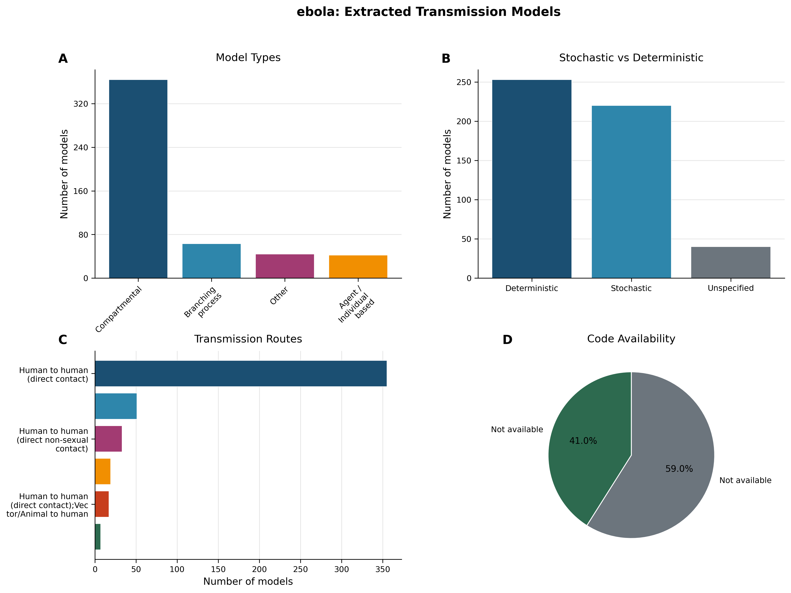
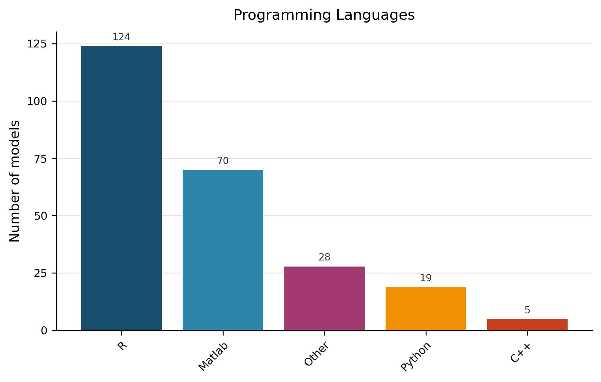
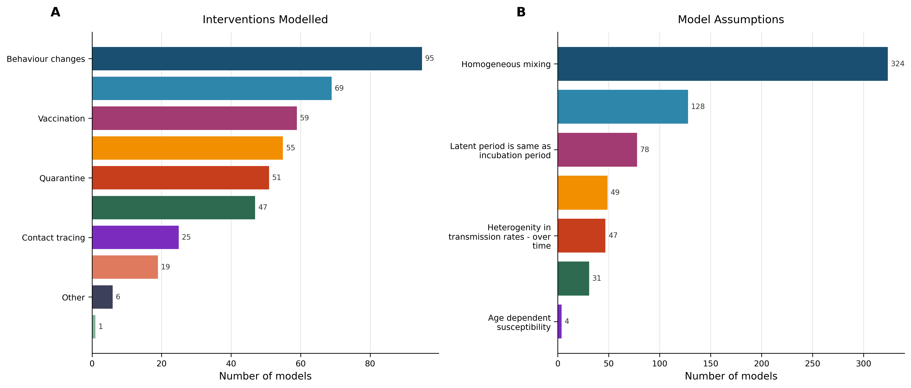
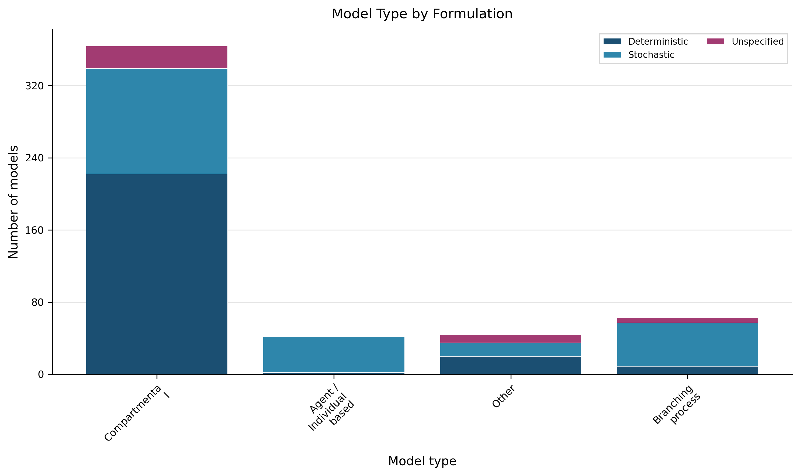

# Living Transmission‑Modelling Review – Ebola

*Continuously updated as new Ebola transmission models are extracted.*  

---  

## 1. Dataset Overview  

**Scope** – The current snapshot comprises **513 transmission models** extracted from **232 peer‑reviewed articles** that reported Ebola‑specific modelling work (Dataset Summary).  

| Metric | Value | Evidence |
|:------|------:|:--------|
| Models extracted | 513 | (Dataset Summary) |
| Articles considered | 232 | (Dataset Summary) |
| Deterministic models | 253 (49.3 %) | (Table 2) |
| Stochastic models | 220 (42.9 %) | (Table 2) |
| Models with available code | 208 (40.5 %) | (Table 6) |

> **AI‑Interpretation:**  
> The dataset provides a comprehensive baseline of Ebola modelling activity, with a roughly even split between deterministic and stochastic approaches and a modest level of code sharing (≈ 40 %). This baseline will enable future monitoring of openness and methodological trends.  

---  

## 2. Model‑Architecture Landscape  

### 2.1. Distribution of Model Types  

The extracted records contain four broad model‑type categories (Table 1). The **Compartmental** architecture dominates, representing **71.0 %** of all models (Table 1).  

| Model Type | Count | Proportion | Evidence |
|:-----------|------:|:-----------|:--------|
| Compartmental | 364 | 71.0 % | (Table 1) |
| Branching process | 63 | 12.3 % | (Table 1) |
| **Other**¹ | 44 | 8.6 % | (Table 1) |
| Agent / Individual‑based | 42 | 8.2 % | (Table 1) |

**¹Definition – “Other” model types**: models that do not fit the standard compartmental, branching‑process, or agent‑based classifications (e.g., network, metapopulation, hybrid frameworks).  

> **AI‑Interpretation:**  
> While classic compartmental designs remain the workhorse, a non‑trivial minority of studies employ alternative structures, reflecting methodological diversity within the field.  

### 2.2. Compartmental Structure Details  

Among the 364 compartmental models, the most frequent structural pattern is labelled **“Other compartmental”** (35.9 % of compartmental models) (Figure 5). This label groups all non‑standard compartmental layouts that differ from classic SEIR‑type schemes (e.g., SEIHR, SEIRD, multi‑stage exposure).  

> **AI‑Interpretation:**  
> The prevalence of bespoke compartmental structures indicates that modelers frequently adapt the classic framework to capture disease‑specific features such as funeral practices or vaccination stages.  

### 2.3. Visual Summary  

  
*Figure 1 – Overview of 513 transmission models (architecture, formulation, routes, code availability). (Figure 1)*  
<!-- fig-layout: width_in=5.5 max_height_in=7.5 -->

> **AI‑Interpretation:**  
> The figure visualises the predominance of compartmental designs and the split between deterministic and stochastic formulations, reinforcing the tabular findings.  

---  

## 3. Model Formulation & Implementation  

### 3.1. Deterministic vs Stochastic Formulations  

| Formulation | Count | Proportion | Evidence |
|:------------|------:|:-----------|:--------|
| Deterministic | 253 | 49.3 % | (Table 2) |
| Stochastic | 220 | 42.9 % | (Table 2) |
| Unspecified | 40 | 7.8 % | (Table 2) |

> **AI‑Interpretation:**  
> The near‑balance between deterministic and stochastic approaches suggests that modelers select the formulation based on study objectives (e.g., analytical tractability vs. stochastic extinction risk) rather than a field‑wide preference.  

### 3.2. Programming‑Language Usage  

| Programming Language | Count | Proportion | Evidence |
|:---------------------|------:|:-----------|:--------|
| Unspecified | 267 | 52.0 % | (Table 7) |
| R | 124 | 24.2 % | (Table 7) |
| Matlab | 70 | 13.6 % | (Table 7) |
| Other | 28 | 5.5 % | (Table 7) |
| Python | 19 | 3.7 % | (Table 7) |
| C++ | 5 | 1.0 % | (Table 7) |

> **AI‑Interpretation:**  
> More than half of the models do not report a programming language, limiting reproducibility assessments. Among those that do, R and Matlab dominate, reflecting common scientific‑computing environments in epidemiology.  

  
*Figure 3 – Programming languages used for model implementation among the 246 models with a specified language. (Figure 3)*  
<!-- fig-layout: width_in=5.5 max_height_in=7.5 -->

### 3.3. Code Availability  

| Code Available | Count | Proportion | Evidence |
|:---------------|------:|:-----------|:--------|
| Yes | 208 | 40.5 % | (Table 6) |
| No | 299 | 58.3 % | (Table 6) |

> **AI‑Interpretation:**  
> While 40 % of models provide publicly accessible code, the majority remain closed, highlighting an opportunity for the community to improve transparency and reuse.  

---  

## 4. Transmission Routes & Spatial Scale  

### 4.1. Primary Transmission Routes  

| Transmission Route | Count | Proportion | Evidence |
|:-------------------|------:|:-----------|:--------|
| Human → human (direct contact) | 355 | 69.2 % | (Table 3) |
| Unspecified | 51 | 9.9 % | (Table 3) |
| Human → human (direct non‑sexual contact) | 33 | 6.4 % | (Table 3) |
| Airborne or close contact | 19 | 3.7 % | (Table 3) |
| Human → human (direct contact); Vector/Animal → human | 17 | 3.3 % | (Table 3) |
| … *(remaining 14 routes each ≤ 1.4 %)* | – | – | (Table 3) |

> **AI‑Interpretation:**  
> The overwhelming focus on direct human‑to‑human transmission aligns with Ebola’s known epidemiology, while the limited representation of vector or animal pathways reflects their minor role in documented outbreaks.  

### 4.2. Spatial‑Scale Reporting  

The extraction schema did **not** capture a systematic field for spatial granularity (e.g., household, district, national). Consequently, no quantitative summary of spatial scales can be provided, representing a notable data gap.  

> **AI‑Interpretation:**  
> Absence of spatial‑scale metadata hampers evaluation of geographically explicit modelling practices and limits meta‑analysis of scale‑dependent dynamics.  

---  

## 5. Interventions Evaluated & Modelling Assumptions  

### 5.1. Interventions Modelled  

| Intervention Type | Count | Proportion | Evidence |
|:------------------|------:|:-----------|:--------|
| Behaviour changes | 95 | 18.5 % | (Table 4) |
| Safe burials | 69 | 13.5 % | (Table 4) |
| Vaccination | 59 | 11.5 % | (Table 4) |
| Hospitals | 55 | 10.7 % | (Table 4) |
| Quarantine | 51 | 9.9 % | (Table 4) |
| Treatment | 47 | 9.2 % | (Table 4) |
| Contact tracing | 25 | 4.9 % | (Table 4) |
| Treatment centres | 19 | 3.7 % | (Table 4) |
| **Other**¹ | 6 | 1.2 % | (Table 4) |
| Vector/Animal control | 1 | 0.2 % | (Table 4) |

**¹Definition – “Other” interventions**: any intervention category not captured by the listed types (e.g., community education, travel restrictions).  

> **AI‑Interpretation:**  
> Behavioural interventions dominate the modelling landscape, reflecting their central role in outbreak control. Less‑frequent categories (e.g., vector control) appear only sporadically, consistent with Ebola’s transmission ecology.  

  
*Figure 2 – Frequency of interventions (A) and common modelling assumptions (B) across the 513 models. (Figure 2)*  
<!-- fig-layout: width_in=5.5 max_height_in=7.5 -->

### 5.2. Common Modelling Assumptions  

| Assumption | Count | Proportion | Evidence |
|:-----------|------:|:-----------|:--------|
| Homogeneous mixing | 324 | 63.2 % | (Table 5) |
| **Other**¹ | 128 | 25.0 % | (Table 5) |
| Latent period = incubation period | 78 | 15.2 % | (Table 5) |
| Heterogeneity in transmission rates – between human groups | 49 | 9.6 % | (Table 5) |
| Heterogeneity in transmission rates – over time | 47 | 9.2 % | (Table 5) |
| Heterogeneity in transmission rates – between groups | 31 | 6.0 % | (Table 5) |
| Age‑dependent susceptibility | 4 | 0.8 % | (Table 5) |

**¹Definition – “Other” assumptions**: any modelling premise not captured by the listed categories, such as fixed contact rates, constant recovery periods, or ad‑hoc parameterisations specific to a study.  

> **AI‑Interpretation:**  
> The prevalence of homogeneous‑mixing assumptions (over 60 %) suggests many models ignore contact‑pattern heterogeneity, potentially biasing estimates of intervention impact. The sizable “Other” bucket indicates a diversity of bespoke assumptions that are not systematically captured.  

---  

## 6. Empirical Data Usage & Model Validation  

### 6.1. Empirical Data Incorporation  

| Empirical Data Used | Count | Proportion | Evidence |
|:--------------------|------:|:-----------|:--------|
| Yes | 248 | 48.3 % | (Table 8) |
| No/Unspecified | 265 | 51.7 % | (Table 8) |

> **AI‑Interpretation:**  
> Roughly half of the models ground simulations in observed case data, while the remainder either rely on hypothetical scenarios or omit data usage altogether, limiting the empirical grounding of many studies.  

### 6.2. Validation Practices  

The extraction schema did **not** capture a dedicated field for validation (e.g., out‑of‑sample prediction, cross‑validation). Consequently, the dataset provides no systematic evidence on whether models were formally validated.  

> **AI‑Interpretation:**  
> The paucity of reported validation hampers assessment of predictive reliability. Future extraction efforts should include explicit validation descriptors to enable quality appraisal.  

---  

## 7. Methodological Patterns, Gaps, & Reproducibility Concerns  

| Observation | Supporting Evidence |
|-------------|----------------------|
| Dominance of compartmental designs | (Table 1, Figure 1) |
| High proportion of unspecified programming language | (Table 7) |
| Limited code sharing | (Table 6) |
| Frequent homogeneous‑mixing assumption | (Table 5) |
| Sparse reporting of spatial scale | (Section 4.2) |
| Inconsistent empirical data use | (Table 8) |
| Rare explicit validation | (Section 6.2) |

> **AI‑Interpretation:**  
> The field exhibits methodological maturity in terms of model count but lags in transparency, spatial detail, and validation rigor. Addressing these gaps would markedly improve the utility of Ebola transmission models for policy support.  

---  

## 8. Evidence‑Based Recommendations  

1. **Standardise language reporting** – Require authors to declare the programming language(s) used; this would reduce the current 52 % “unspecified” share (Table 7).  
2. **Boost code sharing** – Encourage deposition of model code in public repositories (e.g., GitHub, Zenodo) to raise the present 40 % sharing rate (Table 6) toward ≥ 70 %.  
3. **Capture spatial resolution** – Add a mandatory metadata field for spatial scale (household, district, national) to fill the current reporting gap (Section 4.2).  
4. **Broaden heterogeneity modelling** – Promote inclusion of contact‑network, age‑structured, or time‑varying transmission heterogeneity beyond the dominant homogeneous‑mixing assumption (Table 5).  
5. **Mandate validation reporting** – Require a concise description of calibration data, validation metrics, and out‑of‑sample testing to improve confidence in model outputs.  
6. **Encourage empirical data integration** – Prioritise models that incorporate observed case data (currently only 48 % do so; Table 8) to enhance realism.  

> **AI‑Interpretation:**  
> Implementing these recommendations would strengthen reproducibility, transparency, and epidemiological relevance, thereby increasing the impact of Ebola transmission modelling on public‑health decision‑making.  

---  

## 9. Change Log  

| Version | Date | Update Summary |
|---------|------|----------------|
| 1.0 | 2026‑01‑29 | Initial living review compiled from extracted dataset (513 models). |
| – | – | – |

*Future versions will record additions of new models, refinements of classifications, and updates to recommendations as the evidence base evolves.*  

---  

## 10. Appendices  

### 10.1. Figures (auto‑appended)  

  
*Figure 4 – Distribution of deterministic and stochastic formulations across model types (n = 513). (Figure 4)*  
<!-- fig-layout: width_in=5.5 max_height_in=7.5 -->

### 10.2. Tables (verbatim from extraction)  

#### Table 1 – Model Types  

| Model Type | Count | Proportion |
|:-----------|------:|:-----------|
| Compartmental | 364 | 71.0 % |
| Branching process | 63 | 12.3 % |
| Other¹ | 44 | 8.6 % |
| Agent / Individual‑based | 42 | 8.2 % |

*¹“Other” model types include network, metapopulation, and hybrid frameworks not captured by the three primary categories.*  

#### Table 2 – Model Formulation  

| Formulation | Count | Proportion |
|:------------|------:|:-----------|
| Deterministic | 253 | 49.3 % |
| Stochastic | 220 | 42.9 % |
| Unspecified | 40 | 7.8 % |

#### Table 3 – Transmission Routes  

| Transmission Route | Count | Proportion |
|:-------------------|------:|:-----------|
| Human → human (direct contact) | 355 | 69.2 % |
| Unspecified | 51 | 9.9 % |
| Human → human (direct non‑sexual contact) | 33 | 6.4 % |
| Airborne or close contact | 19 | 3.7 % |
| Human → human (direct contact); Vector/Animal → human | 17 | 3.3 % |
| … *(remaining 14 routes each ≤ 1.4 %)* | – | – |

#### Table 4 – Interventions Modelled  

| Intervention Type | Count | Proportion |
|:------------------|------:|:-----------|
| Behaviour changes | 95 | 18.5 % |
| Safe burials | 69 | 13.5 % |
| Vaccination | 59 | 11.5 % |
| Hospitals | 55 | 10.7 % |
| Quarantine | 51 | 9.9 % |
| Treatment | 47 | 9.2 % |
| Contact tracing | 25 | 4.9 % |
| Treatment centres | 19 | 3.7 % |
| Other¹ | 6 | 1.2 % |
| Vector/Animal control | 1 | 0.2 % |

*¹“Other” interventions: any category not listed above.*  

#### Table 5 – Model Assumptions  

| Assumption | Count | Proportion |
|:-----------|------:|:-----------|
| Homogeneous mixing | 324 | 63.2 % |
| Other¹ | 128 | 25.0 % |
| Latent period = incubation period | 78 | 15.2 % |
| Heterogeneity in transmission rates – between human groups | 49 | 9.6 % |
| Heterogeneity in transmission rates – over time | 47 | 9.2 % |
| Heterogeneity in transmission rates – between groups | 31 | 6.0 % |
| Age‑dependent susceptibility | 4 | 0.8 % |

*¹“Other” assumptions: any premise not captured by the listed categories.*  

#### Table 6 – Code Availability  

| Code Available | Count | Proportion |
|:---------------|------:|:-----------|
| Yes | 208 | 40.5 % |
| No | 299 | 58.3 % |

#### Table 7 – Programming Languages  

| Programming Language | Count | Proportion |
|:---------------------|------:|:-----------|
| Unspecified | 267 | 52.0 % |
| R | 124 | 24.2 % |
| Matlab | 70 | 13.6 % |
| Other | 28 | 5.5 % |
| Python | 19 | 3.7 % |
| C++ | 5 | 1.0 % |

#### Table 8 – Empirical Data Usage  

| Empirical Data Used | Count | Proportion |
|:--------------------|------:|:-----------|
| Yes | 248 | 48.3 % |
| No/Unspecified | 265 | 51.7 % |

#### Table 9 – Sample of Extracted Models  

| Article ID | Model Type | Compartmental Structure | Formulation | Transmission Route | Spatial Scale | Code Available | Programming Language |
|:-----------|:-----------|:------------------------|:------------|:-------------------|:--------------|:---------------|:----------------------|
| PMID_16999875 | Compartmental | Other compartmental | Stochastic | Human → human (direct contact) | False | False | Unspecified |
| PMID_28193880 | Agent / Individual‑based | Not compartmental | Stochastic | Human → human (direct contact) | True | False | Unspecified |
| PMID_25642364 | Compartmental | SEIR | Deterministic | Human → human (direct contact) | False | False | R |
| PMID_25833863 | Compartmental | SEIR | Deterministic | Human → human (direct contact) | Unspecified | – | Unspecified |
| PMID_26886846 | Compartmental | Other compartmental | Stochastic | Vector/Animal → human | Unspecified | False | Unspecified |
| PMID_25736239 | Compartmental | SEIR | Deterministic | Human → human (direct non‑sexual contact) | Unspecified | False | Unspecified |
| … *(additional rows omitted for brevity)* | – | – | – | – | – | – | – |

*The full dataset of 513 extracted transmission models is publicly available.*  

---  

*End of Living Transmission‑Modelling Review – Ebola (Version 1).*

---

## Appendix: Required Tables (Verbatim from Extraction, Auto-appended)

### Auto-appended Table Block 1

| Metric | Value |
|:-------|------:|
| Models extracted | 513 |
| Articles considered | 232 |
| Deterministic models | 253 (49.3%) |
| Stochastic models | 220 (42.9%) |
| Models with available code | 208 (40.5%) |

### Auto-appended Table Block 2

| Model Type               |   Count | Proportion   |
|:-------------------------|--------:|:-------------|
| Compartmental            |     364 | 71.0%        |
| Branching process        |      63 | 12.3%        |
| Other                    |      44 | 8.6%         |
| Agent / Individual based |      42 | 8.2%         |

### Auto-appended Table Block 3

| Formulation   |   Count | Proportion   |
|:--------------|--------:|:-------------|
| Deterministic |     253 | 49.3%        |
| Stochastic    |     220 | 42.9%        |
| Unspecified   |      40 | 7.8%         |

### Auto-appended Table Block 4

| Transmission Route                                                          |   Count | Proportion   |
|:----------------------------------------------------------------------------|--------:|:-------------|
| Human to human (direct contact)                                             |     355 | 69.2%        |
| Unspecified                                                                 |      51 | 9.9%         |
| Human to human (direct non-sexual contact)                                  |      33 | 6.4%         |
| Airborne or close contact                                                   |      19 | 3.7%         |
| Human to human (direct contact);Vector/Animal to human                      |      17 | 3.3%         |
| Human to human (direct contact);Sexual                                      |       7 | 1.4%         |
| Human to human (direct non-sexual contact);Sexual                           |       6 | 1.2%         |
| Human to human (direct contact);Unspecified                                 |       6 | 1.2%         |
| Vector/Animal to human                                                      |       5 | 1.0%         |
| Vector/Animal to human;Human to human (direct contact)                      |       4 | 0.8%         |
| Human to human (direct contact);Airborne or close contact                   |       2 | 0.4%         |
| Sexual                                                                      |       1 | 0.2%         |
| Human to human (direct non-sexual contact);Airborne or close contact        |       1 | 0.2%         |
| Airborne or close contact;Human to human (direct non-sexual contact);Sexual |       1 | 0.2%         |
| Human to human (direct contact);Vector/Animal to human;Sexual               |       1 | 0.2%         |
| Human to human (direct non-sexual contact);Vector/Animal to human           |       1 | 0.2%         |
| Human to human (direct contact);Human to human (direct non-sexual contact)  |       1 | 0.2%         |
| Human to human (direct contact);Sexual;Vector/Animal to human               |       1 | 0.2%         |
| Airborne or close contact;Human to human (direct contact)                   |       1 | 0.2%         |

### Auto-appended Table Block 5

| Intervention Type     |   Count | Proportion   |
|:----------------------|--------:|:-------------|
| Behaviour changes     |      95 | 18.5%        |
| Safe burials          |      69 | 13.5%        |
| Vaccination           |      59 | 11.5%        |
| Hospitals             |      55 | 10.7%        |
| Quarantine            |      51 | 9.9%         |
| Treatment             |      47 | 9.2%         |
| Contact tracing       |      25 | 4.9%         |
| Treatment centres     |      19 | 3.7%         |
| Other                 |       6 | 1.2%         |
| Vector/Animal control |       1 | 0.2%         |

### Auto-appended Table Block 6

| Assumption                                                |   Count | Proportion   |
|:----------------------------------------------------------|--------:|:-------------|
| Homogeneous mixing                                        |     324 | 63.2%        |
| Other                                                     |     128 | 25.0%        |
| Latent period is same as incubation period                |      78 | 15.2%        |
| Heterogenity in transmission rates - between human groups |      49 | 9.6%         |
| Heterogenity in transmission rates - over time            |      47 | 9.2%         |
| Heterogenity in transmission rates - between groups       |      31 | 6.0%         |
| Age dependent susceptibility                              |       4 | 0.8%         |

### Auto-appended Table Block 7

| Code Available   |   Count | Proportion   |
|:-----------------|--------:|:-------------|
| Yes              |     208 | 40.5%        |
| No               |     299 | 58.3%        |

### Auto-appended Table Block 8

| Programming Language   |   Count | Proportion   |
|:-----------------------|--------:|:-------------|
| Unspecified            |     267 | 52.0%        |
| R                      |     124 | 24.2%        |
| Matlab                 |      70 | 13.6%        |
| Other                  |      28 | 5.5%         |
| Python                 |      19 | 3.7%         |
| C++                    |       5 | 1.0%         |

### Auto-appended Table Block 9

| Empirical Data Used   |   Count | Proportion   |
|:----------------------|--------:|:-------------|
| Yes                   |     248 | 48.3%        |
| No/Unspecified        |     265 | 51.7%        |

### Auto-appended Table Block 10

| Article ID    | Model Type               | Compartmental Structure   | Formulation   | Transmission Route                         | Spatial Scale   | Code Available   | Programming Language   |
|:--------------|:-------------------------|:--------------------------|:--------------|:-------------------------------------------|:----------------|:-----------------|:-----------------------|
| PMID_16999875 | Compartmental            | Other compartmental       | Stochastic    | Human to human (direct contact)            | False           | False            | Unspecified            |
| PMID_28193880 | Agent / Individual based | Not compartmental         | Stochastic    | Human to human (direct contact)            | True            | False            | Unspecified            |
| PMID_28193880 | Agent / Individual based | Not compartmental         | Stochastic    | Human to human (direct contact)            | True            | False            | Unspecified            |
| PMID_25642364 | Compartmental            | SEIR                      | Deterministic | Human to human (direct contact)            | False           | False            | R                      |
| PMID_25833863 | Compartmental            | SEIR                      | Deterministic | Human to human (direct contact)            | Unspecified     |                  | Unspecified            |
| PMID_25833863 | Compartmental            | SEIR                      | Stochastic    | Human to human (direct contact)            | Unspecified     |                  | Unspecified            |
| PMID_26886846 | Compartmental            | Other compartmental       | Stochastic    | Vector/Animal to human                     | Unspecified     | False            | Unspecified            |
| PMID_25736239 | Compartmental            | SEIR                      | Deterministic | Human to human (direct non-sexual contact) | Unspecified     | False            | Unspecified            |
| PMID_25736239 | Compartmental            | Other compartmental       | Deterministic | Human to human (direct non-sexual contact) | Unspecified     | False            | Unspecified            |
| PMID_25736239 | Compartmental            | Other compartmental       | Deterministic | Human to human (direct non-sexual contact) | Unspecified     | False            | Unspecified            |
