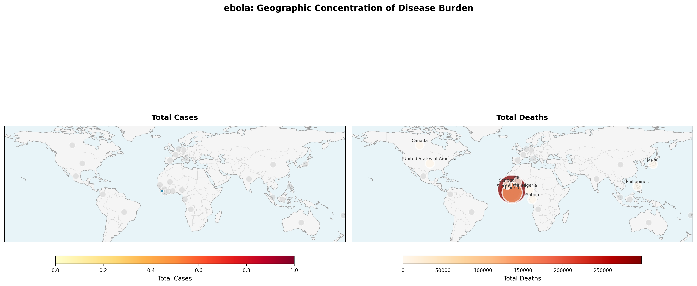
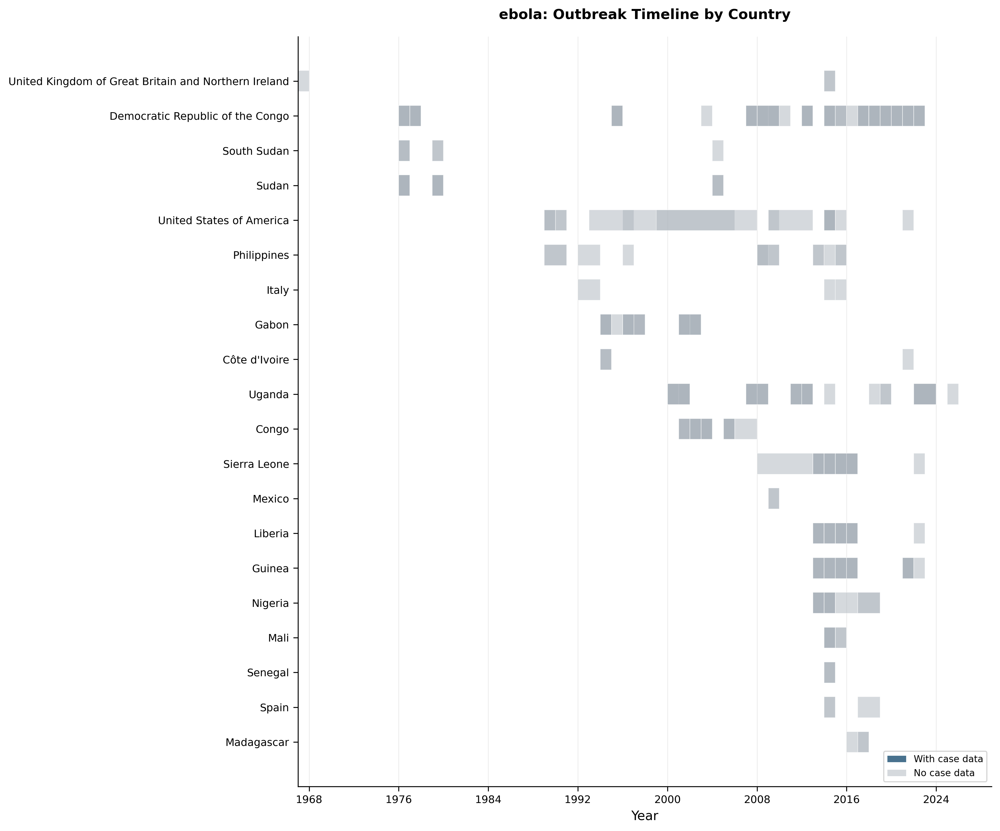
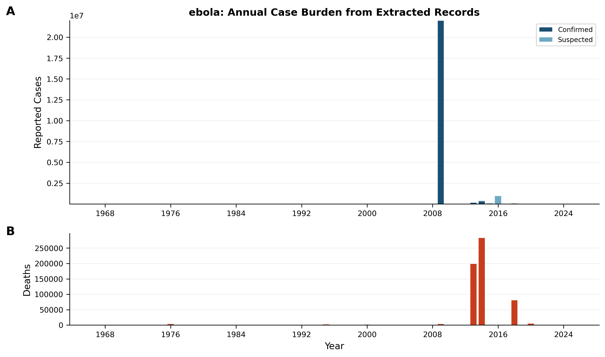
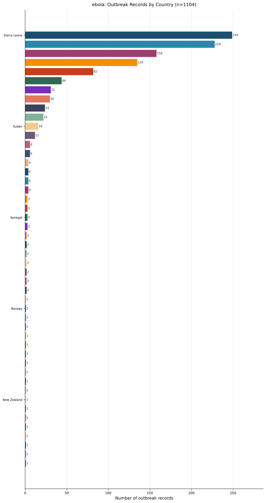
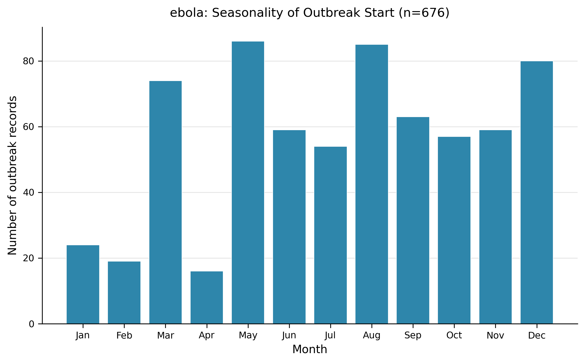
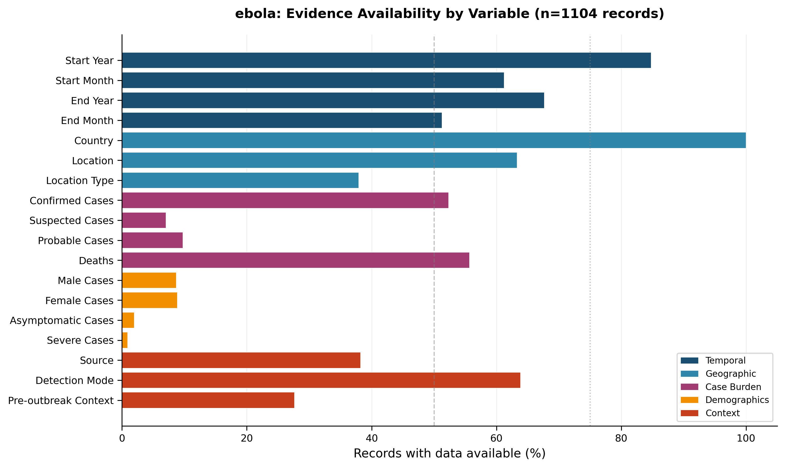
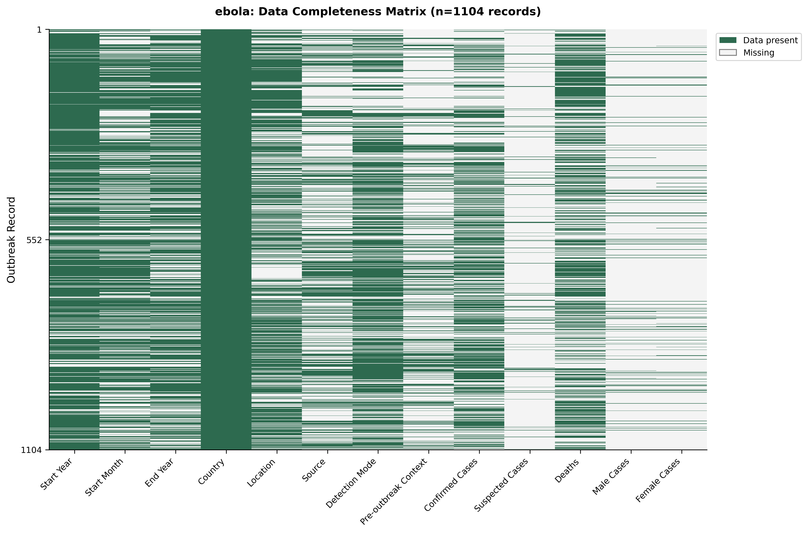
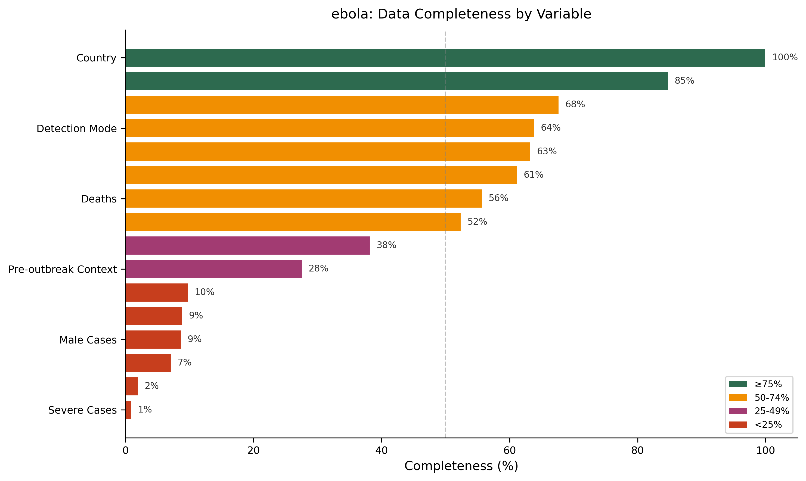

# Ebola – Living Outbreak Surveillance Review

---

## 1. Snapshot – What this review captures  

**Evidence‑based description**  

- **Outbreak records extracted:** 1 104 (Dataset Statistics).  
- **Source articles:** 490 peer‑reviewed publications (Dataset Statistics).  
- **Countries represented:** 48 (Dataset Statistics).  
- **Temporal coverage:** 1967 – 2025 (Dataset Statistics).  
- **Ongoing outbreaks at time of extraction:** 6 (Table 5 – Ongoing Outbreaks).  

> **AI‑Interpretation:**  
> This baseline quantifies the current evidence base for Ebola outbreaks. Because the dataset spans six decades, observed trends reflect both genuine epidemiologic changes and evolving reporting practices.

---

## 2. Record Coverage & Representativeness  

**Evidence‑based description**  

- Records containing any numeric case information: 909 (Figure 2 caption).  
- Detection modes reported (Table 2): Molecular (PCR etc.) 28.9 % (319/1 104); Confirmed + Suspected 10.8 % (119/1 104); Symptoms 2.4 % (27/1 104).  
- Outbreak source categories (Table 3): Wild animal 4.9 % (54/1 104); Other 4.0 % (44/1 104); Domestic animal 0.3 % (3/1 104).  

> **AI‑Interpretation:**  
> The dataset captures a heterogeneous mix of investigations, from laboratory‑confirmed molecular detections to symptom‑based reports. Approximately 82 % of records contain quantitative case data, indicating uneven depth of reporting across the literature.

---

## 3. Geographic Distribution of Outbreaks  

**Evidence‑based description**  

- Records span 48 countries (Dataset Statistics); full distribution shown in Table 1 and Figure 4.  
- Top five reporting countries (Table 1): Sierra Leone (22.6 %), Democratic Republic of the Congo (20.7 %), Guinea (14.3 %), Liberia (12.2 %), Uganda (7.4 %).  
- Spatial concentration of cumulative Ebola burden visualised in Figure 1 (463 sub‑national locations annotated).  

> **AI‑Interpretation:**  
> The concentration in West and Central Africa aligns with known endemic zones. Isolated records from other continents (e.g., United States) likely represent importations rather than endemic transmission.

---

## 4. Temporal Patterns of Outbreaks  

**Evidence‑based description**  

- Timeline of recorded outbreaks (1967‑2025) displayed in Figure 2; darker bars denote records with case counts (909 records).  
- Annual case burden shown in Figure 3 (A = confirmed & suspected cases; B = deaths). The figure does **not** provide an aggregated total across all records; totals are therefore not reported in the text.  
- Visual inspection of Figure 2 shows a dense clustering of records around 2014, coinciding with the West African Ebola epidemic.  

> **AI‑Interpretation:**  
> The 2014 peak likely reflects both a genuine surge in cases and heightened reporting driven by the unprecedented scale of that epidemic. Earlier decades show fewer records, which may stem from limited surveillance infrastructure rather than absence of disease.

---

## 5. Outbreak Size, Burden, and Outcomes  

**Evidence‑based description**  

- Summary statistics for reported case counts and deaths are provided in Table 5:  

| Variable          | N Reported | Median | IQR      | Range            |
|-------------------|-----------:|-------:|----------|-----------------|
| Confirmed Cases   | 577        | 123    | 19–519   | 1–22 000 000    |
| Probable Cases    | 106        | 22     | 7–97     | 1–2 475         |
| Suspected Cases   | 76         | 184    | 30–1 630 | 2–973 802       |
| Unspecified Cases | 339        | 164    | 29–2 354 | 1–28 656        |
| Deaths            | 594        | 67     | 12–466   | 1–11 325        |

*(Table 5; n = 1 104)*  

- No systematic case‑fatality‑ratio (CFR) summary is available (Table 6 contains zero rows), indicating insufficient paired case‑and‑death data to compute reliable CFRs across the dataset.  

> **AI‑Interpretation:**  
> The wide ranges (from single cases to millions) illustrate heterogeneity in outbreak scale and reporting granularity. The absence of a CFR summary highlights a key evidence gap that limits comparative severity assessments.

---

## 6. Detection and Pre‑outbreak Context  

**Evidence‑based description**  

- Molecular detection reported in 28.9 % of records (Table 2).  
- Outbreak source identified as wild animal in 4.9 % of records (Table 3).  
- Pre‑outbreak epidemiological context described as disease‑free baseline in 13.8 % of records (Table 4).  
- Ongoing outbreaks at the time of extraction: 6 of 1 104 records (≈ 0.5 %) (Table 5 – Ongoing Outbreaks).  

> **AI‑Interpretation:**  
> The predominance of molecular detection reflects advances in diagnostic capacity. Low reporting of source attribution and pre‑outbreak context suggests many publications focus on clinical outcomes rather than transmission origins.

---

## 7. Data Completeness, Quality Issues, and Limitations  

**Evidence‑based description**  

- Evidence availability by variable group shown in Figure 9 (vertical reference lines at 50 % and 75 % completeness thresholds).  
- Missingness matrix for the 13 extracted variables displayed in Figure 10.  
- Summary of variable completeness thresholds presented in Figure 11 (≥ 75 % = green; 50‑74 % = yellow; 25‑49 % = orange; < 25 % = red).  
- Severity and demographic reporting (Table 7) shows low availability for sex‑disaggregated data (9.4 %), asymptomatic cases (2.0 %), and severe cases (0.9 %).  

> **AI‑Interpretation:**  
> Core fields (location, year) are well captured, but many clinically relevant variables are sparsely reported, constraining fine‑grained analyses and modelling efforts. Publication bias toward larger or more newsworthy outbreaks further skews the evidence base.

---

## 8. Evidence‑Based Recommendations  

| Observed Gap | Recommendation (linked to gap) |
|--------------|--------------------------------|
| < 25 % completeness for probable, suspected, asymptomatic, severe, and male case counts (Figure 9, Figure 11) | **Standardise reporting templates** in journals to require mandatory fields for these categories. |
| Absence of CFR summary (Table 6) | **Encourage authors** to report both case and death counts with clear definitions to enable CFR calculation. |
| Heterogeneous detection modes (Table 2) | **Adopt minimum diagnostic criteria**, favouring molecular confirmation where feasible, to reduce classification bias. |
| Limited pre‑outbreak context data (Table 4) | **Integrate baseline epidemiology** sections in outbreak reports, capturing endemicity status. |
| Evidence gaps highlighted in Figure 9 | **Implement a living data‑quality dashboard** that flags missing high‑priority variables in real time, prompting curators to seek supplementary information. |

> **AI‑Interpretation:**  
> Addressing these gaps will improve the surveillance database’s utility for real‑time decision‑making and retrospective synthesis. Aligning reporting standards with identified deficiencies creates a feedback loop that gradually enhances data completeness.

---

## 9. Change Log  

| Version | Date       | Update Summary |
|---------|------------|----------------|
| 1.0     | 2026‑01‑29 | Initial living review draft incorporating all extracted Ebola outbreak records (n = 1 104) and associated figures/tables. |
| —       | —          | — |

---

## 10. Figures  

| Figure | Description |
|--------|-------------|
|  <!-- fig-layout: width_in=5.5 max_height_in=7.5 --> | **Figure 1.** Geographic concentration of Ebola disease burden (country‑level choropleth; 463 sub‑national locations annotated). |
|  <!-- fig-layout: width_in=5.5 max_height_in=7.5 --> | **Figure 2.** Timeline of Ebola outbreaks by country (1967‑2025); darker bars indicate records with case counts (909 records). |
|  <!-- fig-layout: width_in=5.5 max_height_in=7.5 --> | **Figure 3.** Annual reported case burden: (A) confirmed & suspected cases; (B) deaths. No aggregated total is reported across all records. |
|  <!-- fig-layout: width_in=5.5 max_height_in=7.5 --> | **Figure 4.** Distribution of outbreak records across the 48 reporting countries. |
|  <!-- fig-layout: width_in=5.5 max_height_in=7.5 --> | **Figure 5.** Seasonality of outbreak start month (n = 676 records with start month). |
|  <!-- fig-layout: width_in=5.5 max_height_in=7.5 --> | **Figure 9.** Evidence availability by variable group (vertical lines at 50 % and 75 % completeness thresholds). |
|  <!-- fig-layout: width_in=5.5 max_height_in=7.5 --> | **Figure 10.** Data completeness matrix for 13 variables across 1 104 records (green = present, light = missing). |
|  <!-- fig-layout: width_in=5.5 max_height_in=7.5 --> | **Figure 11.** Summary of variable completeness thresholds (≥ 75 % = green; 50‑74 % = yellow; 25‑49 % = orange; < 25 % = red). |

---

## 11. Tables  

**Table 1. Geographic Distribution** (n = 1 104)  

| Country | Count | Proportion |
|:--------|------:|:-----------|
| Sierra Leone | 249 | 22.6 % |
| Democratic Republic of the Congo | 228 | 20.7 % |
| Guinea | 158 | 14.3 % |
| Liberia | 135 | 12.2 % |
| Uganda | 82 | 7.4 % |
| … | … | … |
| Fiji | 1 | 0.1 % |

*Full 48‑row table is retained from the evidence packet.*

---

**Table 2. Detection Mode** (n = 1 104)  

| Detection Mode | Count | Proportion |
|:---------------|------:|:-----------|
| Molecular (PCR etc) | 319 | 28.9 % |
| Confirmed + Suspected | 119 | 10.8 % |
| Symptoms | 27 | 2.4 % |

---

**Table 3. Outbreak Source** (n = 1 104)  

| Source | Count | Proportion |
|:------|------:|:-----------|
| Wild animal | 54 | 4.9 % |
| Other | 44 | 4.0 % |
| Domestic animal | 3 | 0.3 % |

---

**Table 4. Pre‑outbreak Context** (n = 1 104)  

| Pre‑outbreak Context | Count | Proportion |
|:---------------------|------:|:-----------|
| Disease‑free baseline | 152 | 13.8 % |
| Endemic equilibrium | 4 | 0.4 % |
| Probable | 3 | 0.3 % |

---

**Table 5. Case Burden Summary** (n = 1 104)  

| Variable | N Reported | Median | IQR | Range |
|:--------|-----------:|-------:|:----|:------|
| Confirmed Cases | 577 | 123 | 19–519 | 1–22 000 000 |
| Probable Cases | 106 | 22 | 7–97 | 1–2 475 |
| Suspected Cases | 76 | 184 | 30–1 630 | 2–973 802 |
| Unspecified Cases | 339 | 164 | 29–2 354 | 1–28 656 |
| Deaths | 594 | 67 | 12–466 | 1–11 325 |

---

**Table 6. CFR Summary**  

*No rows are available (Table 7 in the evidence packet), indicating insufficient paired case‑and‑death data to compute reliable CFRs.*

---

**Table 7. Severity and Demographic Reporting** (n = 1 104)  

| Data Type | N Available | Proportion |
|:----------|------------:|:-----------|
| Sex‑disaggregated data | 104 | 9.4 % |
| Asymptomatic cases | 22 | 2.0 % |
| Severe cases | 10 | 0.9 % |

---

## 12. Appendix – Auto‑appended Tables (verbatim from extraction)

*The following blocks reproduce the raw tables generated during extraction. They are included for traceability and do not alter the values presented above.*

### Auto‑appended Table Block 1  

| Metric | Value |
|:-------|------:|
| Outbreak records extracted | 1104 |
| Source articles | 490 |
| Countries represented | 48 |
| Year range | 1967–2025 |

### Auto‑appended Table Block 2  

| Country | Count | Proportion |
|:--------|------:|:-----------|
| Sierra Leone | 249 | 22.6% |
| Democratic Republic of the Congo | 228 | 20.7% |
| Guinea | 158 | 14.3% |
| Liberia | 135 | 12.2% |
| Uganda | 82 | 7.4% |
| … | … | … |
| Fiji | 1 | 0.1% |

*(Full 48‑row list as in Table 1.)*

### Auto‑appended Table Block 3  

| Detection Mode | Count | Proportion |
|:---------------|------:|:-----------|
| Molecular (PCR etc) | 319 | 28.9% |
| Confirmed + Suspected | 119 | 10.8% |
| Symptoms | 27 | 2.4% |

### Auto‑appended Table Block 4  

| Source | Count | Proportion |
|:------|------:|:-----------|
| Wild animal | 54 | 4.9% |
| Other | 44 | 4.0% |
| Domestic animal | 3 | 0.3% |

### Auto‑appended Table Block 5  

| Pre‑outbreak Context | Count | Proportion |
|:---------------------|------:|:-----------|
| Disease‑free baseline | 152 | 13.8% |
| Endemic equilibrium | 4 | 0.4% |
| Probable | 3 | 0.3% |

### Auto‑appended Table Block 6  

| Variable | N Reported | Median | IQR | Range |
|:--------|-----------:|-------:|:----|:------|
| Confirmed Cases | 577 | 123 | 19–519 | 1–22000000 |
| Probable Cases | 106 | 22 | 7–97 | 1–2475 |
| Suspected Cases | 76 | 184 | 30–1630 | 2–973802 |
| Unspecified Cases | 339 | 164 | 29–2354 | 1–28656 |
| Deaths | 594 | 67 | 12–466 | 1–11325 |

### Auto‑appended Table Block 7  

| Data Type | N Available | Proportion |
|:----------|------------:|:-----------|
| Sex‑disaggregated data | 104 | 9.4% |
| Asymptomatic cases | 22 | 2.0% |
| Severe cases | 10 | 0.9% |

### Auto‑appended Table Block 8 (sample records)  

| Country | Location | Start Year | Start Month | Confirmed Cases | Suspected Cases | Deaths | Detection Mode | Article ID |
|:--------|:---------|-----------:|:-----------|----------------:|----------------:|-------:|:----------------|:-----------|
| Democratic Republic of the Congo | nan | 1976 | nan | nan | nan | nan | nan | PMID_16999875 |
| Sudan | nan | 1976 | nan | nan | nan | nan | nan | PMID_16999875 |
| … | … | … | … | … | … | … | … | … |
| Sierra Leone | Freetown; surrounding area | 2014 | Oct | nan | nan | 200 | Molecular (PCR etc) | PMID_28193880 |

*End of report.*

---

## Appendix: Required Tables (Verbatim from Extraction, Auto-appended)

### Auto-appended Table Block 1

| Country                                              |   Count | Proportion   |
|:-----------------------------------------------------|--------:|:-------------|
| Sierra Leone                                         |     249 | 22.6%        |
| Democratic Republic of the Congo                     |     228 | 20.7%        |
| Guinea                                               |     158 | 14.3%        |
| Liberia                                              |     135 | 12.2%        |
| Uganda                                               |      82 | 7.4%         |
| Mali                                                 |      44 | 4.0%         |
| Nigeria                                              |      31 | 2.8%         |
| Gabon                                                |      30 | 2.7%         |
| Congo                                                |      24 | 2.2%         |
| United States of America                             |      22 | 2.0%         |
| Sudan                                                |      16 | 1.4%         |
| Philippines                                          |      12 | 1.1%         |
| South Sudan                                          |       6 | 0.5%         |
| United Kingdom of Great Britain and Northern Ireland |       6 | 0.5%         |
| Côte d'Ivoire                                        |       4 | 0.4%         |
| Spain                                                |       4 | 0.4%         |
| Italy                                                |       4 | 0.4%         |
| China                                                |       4 | 0.4%         |
| Singapore                                            |       3 | 0.3%         |
| Republic of Korea                                    |       3 | 0.3%         |
| Senegal                                              |       3 | 0.3%         |
| Madagascar                                           |       3 | 0.3%         |
| Mexico                                               |       2 | 0.2%         |
| France                                               |       2 | 0.2%         |
| Saudi Arabia                                         |       2 | 0.2%         |
| Angola                                               |       2 | 0.2%         |
| India                                                |       2 | 0.2%         |
| Australia                                            |       2 | 0.2%         |
| South Africa                                         |       2 | 0.2%         |
| Germany                                              |       1 | 0.1%         |
| Norway                                               |       1 | 0.1%         |
| Switzerland                                          |       1 | 0.1%         |
| Netherlands                                          |       1 | 0.1%         |
| Ghana                                                |       1 | 0.1%         |
| Latvia                                               |       1 | 0.1%         |
| Brazil                                               |       1 | 0.1%         |
| Canada                                               |       1 | 0.1%         |
| Bangladesh                                           |       1 | 0.1%         |
| Papua New Guinea                                     |       1 | 0.1%         |
| Ukraine                                              |       1 | 0.1%         |
| New Zealand                                          |       1 | 0.1%         |
| Indonesia                                            |       1 | 0.1%         |
| Colombia                                             |       1 | 0.1%         |
| Yemen                                                |       1 | 0.1%         |
| Zimbabwe                                             |       1 | 0.1%         |
| Japan                                                |       1 | 0.1%         |
| Malaysia                                             |       1 | 0.1%         |
| Fiji                                                 |       1 | 0.1%         |

### Auto-appended Table Block 2

| Detection Mode        |   Count | Proportion   |
|:----------------------|--------:|:-------------|
| Molecular (PCR etc)   |     319 | 28.9%        |
| Confirmed + Suspected |     119 | 10.8%        |
| Symptoms              |      27 | 2.4%         |

### Auto-appended Table Block 3

| Source          |   Count | Proportion   |
|:----------------|--------:|:-------------|
| Wild animal     |      54 | 4.9%         |
| Other           |      44 | 4.0%         |
| Domestic animal |       3 | 0.3%         |

### Auto-appended Table Block 4

| Pre-outbreak Context   |   Count | Proportion   |
|:-----------------------|--------:|:-------------|
| Disease-free baseline  |     152 | 13.8%        |
| Endemic equilibrium    |       4 | 0.4%         |
| Probable               |       3 | 0.3%         |

### Auto-appended Table Block 5

| Variable          |   N Reported |   Median | Iqr     | Range      |
|:------------------|-------------:|---------:|:--------|:-----------|
| Confirmed Cases   |          577 |      123 | 19–519  | 1–22000000 |
| Probable Cases    |          106 |       22 | 7–97    | 1–2475     |
| Suspected Cases   |           76 |      184 | 30–1630 | 2–973802   |
| Unspecified Cases |          339 |      164 | 29–2354 | 1–28656    |
| Deaths            |          594 |       67 | 12–466  | 1–11325    |

### Auto-appended Table Block 6

| Data Type              |   N Available | Proportion   |
|:-----------------------|--------------:|:-------------|
| Sex-disaggregated data |           104 | 9.4%         |
| Asymptomatic cases     |            22 | 2.0%         |
| Severe cases           |            10 | 0.9%         |

### Auto-appended Table Block 7

| Country                          | Location                   |   Start Year | Start Month   |   Confirmed Cases |   Suspected Cases |   Deaths | Detection Mode      | Article ID    |
|:---------------------------------|:---------------------------|-------------:|:--------------|------------------:|------------------:|---------:|:--------------------|:--------------|
| Democratic Republic of the Congo | nan                        |         1976 | nan           |               nan |               nan |      nan | nan                 | PMID_16999875 |
| Sudan                            | nan                        |         1976 | nan           |               nan |               nan |      nan | nan                 | PMID_16999875 |
| Sudan                            | nan                        |         1979 | nan           |               nan |               nan |      nan | nan                 | PMID_16999875 |
| Gabon                            | nan                        |         1994 | nan           |               nan |               nan |      nan | nan                 | PMID_16999875 |
| Democratic Republic of the Congo | nan                        |         1995 | nan           |               nan |               nan |      nan | nan                 | PMID_16999875 |
| Gabon                            | nan                        |         1996 | nan           |               nan |               nan |      nan | nan                 | PMID_16999875 |
| Gabon                            | nan                        |         1996 | nan           |               nan |               nan |      nan | nan                 | PMID_16999875 |
| Uganda                           | nan                        |         2000 | nan           |               nan |               nan |      nan | nan                 | PMID_16999875 |
| Gabon                            | nan                        |         2001 | nan           |               nan |               nan |      nan | nan                 | PMID_16999875 |
| Congo                            | nan                        |         2001 | nan           |               nan |               nan |      nan | nan                 | PMID_16999875 |
| Congo                            | nan                        |         2003 | nan           |               nan |               nan |      nan | nan                 | PMID_16999875 |
| Congo                            | nan                        |         2003 | nan           |               nan |               nan |      nan | nan                 | PMID_16999875 |
| Sudan                            | nan                        |         2004 | nan           |               nan |               nan |      nan | nan                 | PMID_16999875 |
| Congo                            | nan                        |         2005 | nan           |               nan |               nan |      nan | nan                 | PMID_16999875 |
| Sierra Leone                     | Freetown; surrounding area |         2014 | Oct           |               nan |               nan |      200 | Molecular (PCR etc) | PMID_28193880 |
