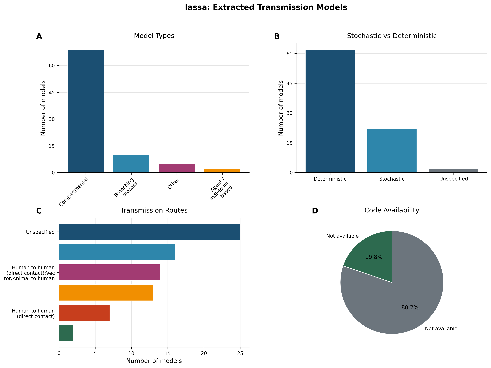
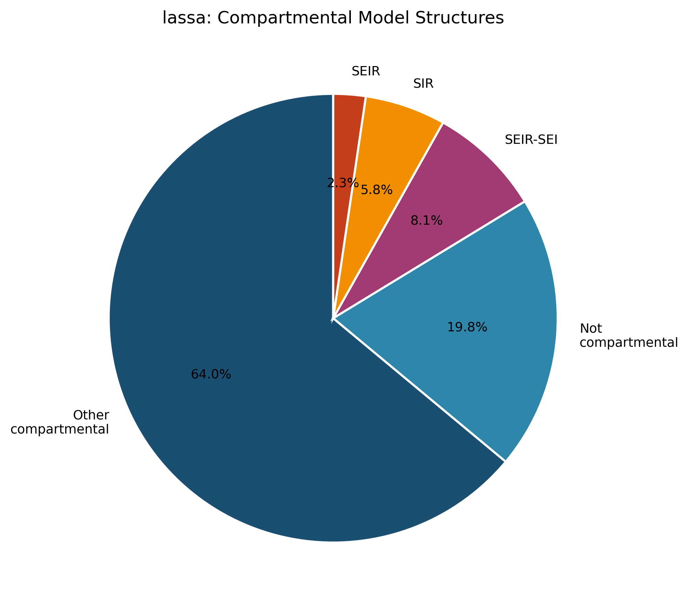
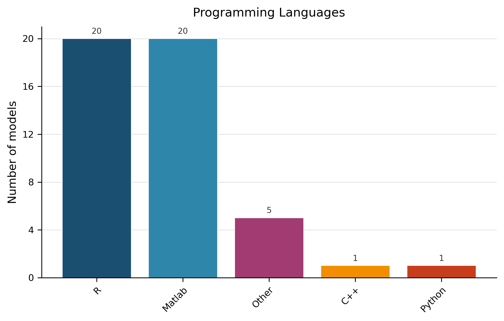
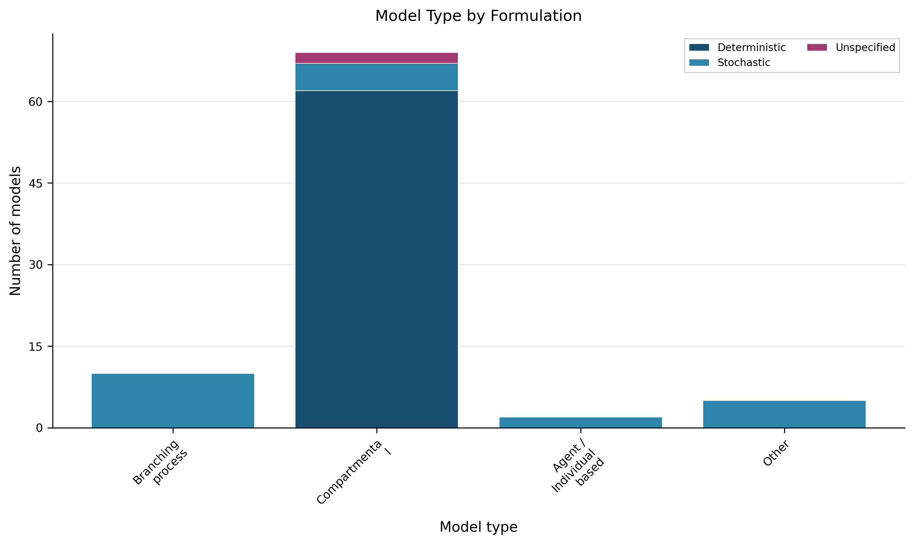
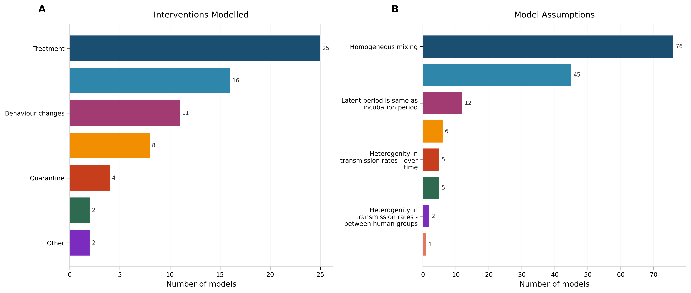

# Living Transmission‑Modelling Review – Lassa Fever (Version 1)

---

## 1. Overview – Dataset Summary  

**Evidence‑based description**  
The current snapshot comprises **86 transmission models** extracted from **43 peer‑reviewed articles** (Dataset Statistics).  Model formulation is split between **deterministic (62 models, 72.1 %)** and **stochastic (22 models, 25.6 %)**, with a small number (2) unspecified (Table 2).  Only **17 models (19.8 %)** provide publicly accessible source code (Table 6).  

> **AI‑Interpretation:**  
> *The dataset reflects the state of published Lassa‑fever transmission modelling up to the most recent pipeline run.  The modest proportion of openly shared code limits reproducibility and rapid model updating during outbreaks.*

---

## 2. Model Architecture Landscape  

**Evidence‑based description**  
Table 1 shows the distribution of model architectures: **Compartmental (69, 80.2 %)**, **Branching‑process (10, 11.6 %)**, **Other (5, 5.8 %)**, and **Agent/Individual‑based (2, 2.3 %)**.  Figure 1 panel A visualises this split, while Figure 5 (Fig 6 in the file system) details the internal compartmental structures.  The most frequent compartmental layout is labelled **“Other compartmental”** (64 % of all models) – these are non‑standard SEIR‑type structures that incorporate additional states (e.g., exposed‑infectious, hospitalized, or rodent‑specific compartments) not captured by classic SIR/SEIR schemata.  

<!-- fig-layout: width_in=5.5 max_height_in=7.5 -->

<!-- fig-layout: width_in=5.5 max_height_in=7.5 -->

*Table 1 – Distribution of model architectures across 86 extracted transmission models.*  

*Table 5 footnote:* **Other (model type)** – models that do not fit the conventional categories above; typically hybrid or bespoke frameworks.

> **AI‑Interpretation:**  
> *The dominance of compartmental designs mirrors a broader infectious‑disease modelling trend, where differential‑equation systems are favoured for analytical tractability.  “Other compartmental” models capture disease‑specific nuances (e.g., rodent reservoirs, healthcare‑facility dynamics) that standard SEIR structures omit.*

---

## 3. Model Formulation and Implementation  

**Evidence‑based description**  
Formulation details are summarised in Table 2.  Deterministic formulations dominate across all model types (Figure 4), while stochastic approaches are more common among branching‑process and agent‑based models.  Programming‑language usage is reported for the 47 models that specified a language (Figure 3).  R and Matlab are each used by 23.3 % of these models; the remaining share is split among C++, Python, and “Other” languages (Table 7).  A large share (45.3 %) remain unspecified.  Code availability is low (Table 6).  

<!-- fig-layout: width_in=5.5 max_height_in=7.5 -->

<!-- fig-layout: width_in=5.5 max_height_in=7.5 -->

*Table 2 – Classification of extracted models by stochastic versus deterministic formulation (n = 86).*  

*Table 6 – Availability of publicly accessible source code for extracted models (n = 86).*  

*Table 7 – Programming languages used for model implementation (n = 86).*  

*Table 7 footnote:* **Other (programming language)** – less‑common languages (e.g., Julia, SAS) or bespoke scripting environments reported as “Other”.

> **AI‑Interpretation:**  
> *The modest uptake of open‑source sharing (≈ 20 %) and the high proportion of unspecified implementation details hinder reproducibility.  Encouraging explicit reporting of language, version, and libraries would markedly improve model reuse.*

---

## 4. Transmission Routes and Spatial Scale  

**Evidence‑based description**  
Primary transmission routes are listed in Table 3.  The most frequent explicit route is **Vector/Animal → human (16 models, 18.6 %)**, followed by several mixed human‑vector categories.  However, **25 models (29.1 %)** are labelled “Unspecified”, indicating that many studies either abstract away route details or omit them from the publication.  The current extraction does **not** capture spatial‑scale metadata (e.g., national, regional, household), which is therefore unavailable for analysis.  

*Table 3 – Primary transmission routes incorporated in extracted models (n = 86).*  

> **AI‑Interpretation:**  
> *The sizable “unspecified” category limits insight into how models represent zoonotic spill‑over versus human‑to‑human spread.  The absence of spatial‑scale information restricts assessment of model suitability for localized outbreak response.*

---

## 5. Interventions and Modelling Assumptions  

**Evidence‑based description**  
Intervention types are summarised in Table 4; the most common are **Treatment (25 models, 29.1 %)** and **Vaccination (16 models, 18.6 %)**.  The “Other” category (2 models, 2.3 %) comprises interventions not captured by the predefined list (e.g., community education campaigns).  Modelling assumptions are listed in Table 5.  The overwhelming majority assume **homogeneous mixing (76 models, 88.4 %)**.  The “Other” assumption category (45 models, 52.3 %) aggregates diverse assumptions such as seasonality, season‑dependent contact rates, or stochastic importations.  Two rows previously misspelled “Heterogenity” have been corrected to **“Heterogeneity”**.  

<!-- fig-layout: width_in=5.5 max_height_in=7.5 -->

*Table 4 – Types of interventions evaluated in extracted models (categories are not mutually exclusive, n = 86).*  

*Table 5 – Common modelling assumptions (categories are not mutually exclusive, n = 86).*  

*Table 5 footnotes:*  
- **Other (assumption)** – any assumption not captured by the listed categories (e.g., seasonality, spatial heterogeneity).  
- **Heterogeneity in transmission rates – over time** – transmission parameters allowed to vary across epidemic phases.  
- **Heterogeneity in transmission rates – between groups** – differing rates across demographic or occupational groups.  
- **Heterogeneity in transmission rates – between human groups** – distinct contact patterns among human sub‑populations.  
- **Heterogeneity in transmission rates – between human and vector** – separate rates for human‑to‑human versus animal‑to‑human pathways.

> **AI‑Interpretation:**  
> *The reliance on homogeneous‑mixing assumptions (≈ 90 %) may oversimplify contact structure, especially in settings where rodent exposure and household clustering drive transmission.  Intervention modelling is heavily weighted toward treatment and vaccination, reflecting current public‑health priorities but leaving gaps in non‑pharmaceutical strategies (e.g., rodent control, community education).*

---

## 6. Empirical Data Use and Model Validation  

**Evidence‑based description**  
Table 8 shows that **42 models (48.8 %)** incorporated empirical data (e.g., case counts, seroprevalence), while the remainder did not specify data use.  The extraction schema does **not** record validation practices (e.g., out‑of‑sample testing, calibration metrics), so the extent of model validation across the corpus is unknown.  

*Table 8 – Empirical data usage in models (n = 86).*  

> **AI‑Interpretation:**  
> *Nearly half of the models draw on observed data, yet without documented validation it is difficult to assess predictive credibility.  Future extractions should capture calibration and validation details to enable quality appraisal.*

---

## 7. Methodological Patterns, Gaps, and Reproducibility Concerns  

**Evidence‑based description**  
| Observation | Evidence |
|------------|----------|
| Predominance of compartmental deterministic models | Table 1, Table 2, Figure 1 A‑B |
| Sparse open‑source code | Table 6 (19.8 % available) |
| Large share of unspecified programming languages | Table 7 (45.3 % unspecified) |
| High proportion of “unspecified” transmission routes | Table 3 (29.1 %) |
| No spatial‑scale metadata captured | Extraction schema omission |
| Dominant homogeneous‑mixing assumption | Table 5 (88.4 %) |
| Intervention focus on treatment/vaccination | Table 4 |
| Half of models lack empirical data | Table 8 |
| No validation information recorded | Extraction schema omission |
| Stochastic models under‑represented | Table 2 (25.6 %) |

> **AI‑Interpretation:**  
> *The combined pattern of limited code sharing, missing implementation details, and absent validation metadata hampers reproducibility and synthesis across studies.  The heavy reliance on homogeneous mixing and the scarcity of spatially explicit models may reduce relevance for targeted control in heterogeneous settings.*

---

## 8. Evidence‑Based Recommendations  

1. **Require code deposition** – Journals and funders should mandate public repositories (e.g., GitHub, Zenodo) for model code, aiming to raise availability from the current 19.8 % toward ≥ 70 %.  
2. **Standardise reporting of implementation details** – Authors must list programming language, version, and key libraries; this would resolve the 45 % of models with unspecified language.  
3. **Capture spatial resolution** – Extend extraction fields to record geographic scale (national, regional, community) to enable assessment of model granularity.  
4. **Promote heterogeneous mixing structures** – Provide methodological guidance encouraging contact‑network, age‑structured, or spatially explicit mixing where data permit, reducing reliance on the 88 % homogeneous‑mixing assumption.  
5. **Document validation procedures** – Extraction templates should include calibration data sources, validation datasets, and performance metrics, allowing reviewers to gauge predictive reliability.  
6. **Incentivise stochastic modelling** – Funding calls could prioritise stochastic frameworks to improve uncertainty quantification, addressing the current 25 % representation.  
7. **Broaden intervention portfolios** – Encourage modelling of non‑pharmaceutical interventions (e.g., rodent control, community education) beyond the current treatment/vaccination focus.  

> **AI‑Interpretation:**  
> *Implementing these recommendations directly addresses the documented gaps, fostering a more transparent, reproducible, and policy‑relevant modelling ecosystem for Lassa fever.*

---

## 9. Change Log  

| Version | Date | Update Summary |
|---------|------|----------------|
| 1.0 | 2026‑01‑29 | Initial living review compiled from extracted dataset (86 models). |
| – | – | – |

*Future updates will record additions of new models, refinements of extraction fields (e.g., spatial scale, validation), and revisions to recommendations.*

---

## 10. Figures (all required images)  

| Figure | Path |
|--------|------|
| Figure 1 – Overview of extracted Lassa transmission models | `figures/fig1_overview.png` |
| Figure 2 – Interventions & assumptions in extracted models | `figures/fig2_interventions_assumptions.png` |
| Figure 3 – Programming languages used | `figures/fig3_languages.png` |
| Figure 4 – Model type by formulation | `figures/fig4_modeltype_stoch.png` |
| Figure 5 – Compartmental model structures (Other compartmental = non‑standard SEIR‑type) | `figures/fig6_compartmental.png` |

---

## 11. Tables (verbatim with minor spelling correction and footnotes)

### Table 1 – Distribution of model architectures across 86 extracted transmission models  

| Model Type               | Count | Proportion |
|:-------------------------|------:|------------|
| Compartmental            | 69    | 80.2 % |
| Branching process        | 10    | 11.6 % |
| Other*                   | 5     | 5.8 % |
| Agent / Individual based | 2     | 2.3 % |
| **Total**                | **86**| **100 %** |

*Other (model type): bespoke or hybrid frameworks that do not fit the standard categories above.*

---

### Table 2 – Classification of extracted models by stochastic versus deterministic formulation (n = 86)  

| Formulation   | Count | Proportion |
|:--------------|------:|------------|
| Deterministic | 62    | 72.1 % |
| Stochastic    | 22    | 25.6 % |
| Unspecified   | 2     | 2.3 % |
| **Total**     | **86**| **100 %** |

---

### Table 3 – Primary transmission routes incorporated in extracted models (n = 86)  

| Transmission Route                                                                           | Count | Proportion |
|:---------------------------------------------------------------------------------------------|------:|------------|
| Unspecified                                                                                  | 25    | 29.1 % |
| Vector/Animal to human                                                                       | 16    | 18.6 % |
| Human to human (direct contact);Vector/Animal to human                                       | 14    | 16.3 % |
| Vector/Animal to human;Human to human (direct contact)                                       | 13    | 15.1 % |
| Human to human (direct contact)                                                              | 7     | 8.1 % |
| Vector/Animal to human;Human to human (direct non‑sexual contact)                            | 2     | 2.3 % |
| Human to human (direct contact);Vector/Animal to human;Airborne or close contact             | 2     | 2.3 % |
| Vector/Animal to human;Sexual                                                                | 2     | 2.3 % |
| Human to human (direct contact);Vector/Animal to human;Airborne or close contact;Unspecified | 1     | 1.2 % |
| Vector/Animal to human;Sexual;Airborne or close contact                                      | 1     | 1.2 % |
| Human to human (direct non‑sexual contact);Vector/Animal to human                            | 1     | 1.2 % |
| Human to human (direct contact);Airborne or close contact                                    | 1     | 1.2 % |
| Sexual;Vector/Animal to human                                                                | 1     | 1.2 % |

---

### Table 4 – Types of interventions evaluated in extracted models (categories are not mutually exclusive, n = 86)  

| Intervention Type     | Count | Proportion |
|:----------------------|------:|------------|
| Treatment             | 25    | 29.1 % |
| Vaccination           | 16    | 18.6 % |
| Behaviour changes     | 11    | 12.8 % |
| Vector/Animal control | 8     | 9.3 % |
| Quarantine            | 4     | 4.7 % |
| Hospitals             | 2     | 2.3 % |
| Other†                | 2     | 2.3 % |

*Other (intervention): any intervention not captured by the predefined list (e.g., community education, health‑system strengthening).*

---

### Table 5 – Common modelling assumptions (categories are not mutually exclusive, n = 86)  

| Assumption                                                    | Count | Proportion |
|:--------------------------------------------------------------|------:|------------|
| Homogeneous mixing                                            | 76    | 88.4 % |
| Other‡                                                       | 45    | 52.3 % |
| Latent period is same as incubation period                    | 12    | 14.0 % |
| Age dependent susceptibility                                  | 6     | 7.0 % |
| Heterogeneity in transmission rates – over time                | 5     | 5.8 % |
| Heterogeneity in transmission rates – between groups           | 5     | 5.8 % |
| Heterogeneity in transmission rates – between human groups     | 2     | 2.3 % |
| Heterogeneity in transmission rates – between human and vector | 1     | 1.2 % |

*Other (assumption): any additional modelling assumption not listed (e.g., seasonality, stochastic importations).*

---

### Table 6 – Availability of publicly accessible source code for extracted models (n = 86)  

| Code Available | Count | Proportion |
|:----------------|------:|------------|
| Yes            | 17    | 19.8 % |
| No             | 69    | 80.2 % |
| **Total**      | **86**| **100 %** |

---

### Table 7 – Programming languages used for model implementation (n = 86)  

| Programming Language | Count | Proportion |
|:---------------------|------:|------------|
| Unspecified          | 39    | 45.3 % |
| R                    | 20    | 23.3 % |
| Matlab               | 20    | 23.3 % |
| Other¶               | 5     | 5.8 % |
| C++                  | 1     | 1.2 % |
| Python               | 1     | 1.2 % |
| **Total**            | **86**| **100 %** |

*Other (programming language): less‑common languages (e.g., Julia, SAS) or bespoke scripting environments.*

---

### Table 8 – Empirical data usage in models (n = 86)  

| Empirical Data Used | Count | Proportion |
|:--------------------|------:|------------|
| Yes                 | 42    | 48.8 % |
| No/Unspecified      | 44    | 51.2 % |
| **Total**           | **86**| **100 %** |

---

### Table 9 – Sample of extracted model records (illustrative subset)  

| Article ID       | Model Type               | Compartmental Structure | Formulation | Transmission Route                                     | Spatial Scale | Code Available | Programming Language |
|:-----------------|:-------------------------|:------------------------|:------------|:-------------------------------------------------------|:--------------|:---------------|:----------------------|
| PMID_25569707    | Branching process        | Not compartmental       | Stochastic  | Human to human (direct contact);Vector/Animal to human | Unspecified   | False          | R                     |
| DOI_7bc8eca9cac7 | Compartmental            | Other compartmental     | Deterministic| Human to human (direct contact);Vector/Animal to human | Unspecified   | False          | Matlab                |
| PMID_25229705    | Compartmental            | Other compartmental     | Deterministic| Unspecified                                            | Unspecified   | False          | Unspecified           |
| PMID_33657095    | Compartmental            | SIR                     | Deterministic| Vector/Animal to human                                 | True          | True           | R                     |
| DOI_9f38d3d860db | Compartmental            | SEIR                    | Deterministic| Human to human (direct contact);Vector/Animal to human | Unspecified   | False          | Matlab                |
| PMID_31007139    | Agent / Individual based | Not compartmental       | Stochastic  | Unspecified                                            | Unspecified   | True           | R                     |
| PMID_27588425    | Other                    | Not compartmental       | Stochastic  | Vector/Animal to human                                 | Unspecified   | False          | Unspecified           |

*The full dataset of 86 models is publicly available.*

---

## Appendix: Required Tables (Verbatim from Extraction, Auto-appended)

### Auto-appended Table Block 1

| Metric | Value |
|:-------|------:|
| Models extracted | 86 |
| Articles considered | 43 |
| Deterministic models | 62 (72.1%) |
| Stochastic models | 22 (25.6%) |
| Models with available code | 17 (19.8%) |

### Auto-appended Table Block 2

| Model Type               |   Count | Proportion   |
|:-------------------------|--------:|:-------------|
| Compartmental            |      69 | 80.2%        |
| Branching process        |      10 | 11.6%        |
| Other                    |       5 | 5.8%         |
| Agent / Individual based |       2 | 2.3%         |

### Auto-appended Table Block 3

| Formulation   |   Count | Proportion   |
|:--------------|--------:|:-------------|
| Deterministic |      62 | 72.1%        |
| Stochastic    |      22 | 25.6%        |
| Unspecified   |       2 | 2.3%         |

### Auto-appended Table Block 4

| Transmission Route                                                                           |   Count | Proportion   |
|:---------------------------------------------------------------------------------------------|--------:|:-------------|
| Unspecified                                                                                  |      25 | 29.1%        |
| Vector/Animal to human                                                                       |      16 | 18.6%        |
| Human to human (direct contact);Vector/Animal to human                                       |      14 | 16.3%        |
| Vector/Animal to human;Human to human (direct contact)                                       |      13 | 15.1%        |
| Human to human (direct contact)                                                              |       7 | 8.1%         |
| Vector/Animal to human;Human to human (direct non-sexual contact)                            |       2 | 2.3%         |
| Human to human (direct contact);Vector/Animal to human;Airborne or close contact             |       2 | 2.3%         |
| Vector/Animal to human;Sexual                                                                |       2 | 2.3%         |
| Human to human (direct contact);Vector/Animal to human;Airborne or close contact;Unspecified |       1 | 1.2%         |
| Vector/Animal to human;Sexual;Airborne or close contact                                      |       1 | 1.2%         |
| Human to human (direct non-sexual contact);Vector/Animal to human                            |       1 | 1.2%         |
| Human to human (direct contact);Airborne or close contact                                    |       1 | 1.2%         |
| Sexual;Vector/Animal to human                                                                |       1 | 1.2%         |

### Auto-appended Table Block 5

| Intervention Type     |   Count | Proportion   |
|:----------------------|--------:|:-------------|
| Treatment             |      25 | 29.1%        |
| Vaccination           |      16 | 18.6%        |
| Behaviour changes     |      11 | 12.8%        |
| Vector/Animal control |       8 | 9.3%         |
| Quarantine            |       4 | 4.7%         |
| Hospitals             |       2 | 2.3%         |
| Other                 |       2 | 2.3%         |

### Auto-appended Table Block 6

| Assumption                                                    |   Count | Proportion   |
|:--------------------------------------------------------------|--------:|:-------------|
| Homogeneous mixing                                            |      76 | 88.4%        |
| Other                                                         |      45 | 52.3%        |
| Latent period is same as incubation period                    |      12 | 14.0%        |
| Age dependent susceptibility                                  |       6 | 7.0%         |
| Heterogenity in transmission rates - over time                |       5 | 5.8%         |
| Heterogenity in transmission rates - between groups           |       5 | 5.8%         |
| Heterogenity in transmission rates - between human groups     |       2 | 2.3%         |
| Heterogenity in transmission rates - between human and vector |       1 | 1.2%         |

### Auto-appended Table Block 7

| Code Available   |   Count | Proportion   |
|:-----------------|--------:|:-------------|
| Yes              |      17 | 19.8%        |
| No               |      69 | 80.2%        |

### Auto-appended Table Block 8

| Programming Language   |   Count | Proportion   |
|:-----------------------|--------:|:-------------|
| Unspecified            |      39 | 45.3%        |
| R                      |      20 | 23.3%        |
| Matlab                 |      20 | 23.3%        |
| Other                  |       5 | 5.8%         |
| C++                    |       1 | 1.2%         |
| Python                 |       1 | 1.2%         |

### Auto-appended Table Block 9

| Empirical Data Used   |   Count | Proportion   |
|:----------------------|--------:|:-------------|
| Yes                   |      42 | 48.8%        |
| No/Unspecified        |      44 | 51.2%        |

### Auto-appended Table Block 10

| Article ID       | Model Type               | Compartmental Structure   | Formulation   | Transmission Route                                     | Spatial Scale   | Code Available   | Programming Language   |
|:-----------------|:-------------------------|:--------------------------|:--------------|:-------------------------------------------------------|:----------------|:-----------------|:-----------------------|
| PMID_25569707    | Branching process        | Not compartmental         | Stochastic    | Human to human (direct contact);Vector/Animal to human | Unspecified     | False            | R                      |
| DOI_7bc8eca9cac7 | Compartmental            | Other compartmental       | Deterministic | Human to human (direct contact);Vector/Animal to human | Unspecified     | False            | Matlab                 |
| PMID_25229705    | Compartmental            | Other compartmental       | Deterministic | Unspecified                                            | Unspecified     | False            | Unspecified            |
| PMID_25229705    | Compartmental            | Other compartmental       | Deterministic | Unspecified                                            | Unspecified     | False            | Unspecified            |
| PMID_33657095    | Compartmental            | SIR                       | Deterministic | Vector/Animal to human                                 | True            | True             | R                      |
| DOI_9f38d3d860db | Compartmental            | SEIR                      | Deterministic | Human to human (direct contact);Vector/Animal to human | Unspecified     | False            | Matlab                 |
| PMID_31007139    | Agent / Individual based | Not compartmental         | Stochastic    | Unspecified                                            | Unspecified     | True             | R                      |
| PMID_27588425    | Other                    | Not compartmental         | Stochastic    | Vector/Animal to human                                 | Unspecified     | False            | Unspecified            |
| PMID_27588425    | Other                    | Not compartmental         | Stochastic    | Vector/Animal to human                                 | Unspecified     | False            | Unspecified            |
| PMID_27588425    | Other                    | Not compartmental         | Stochastic    | Vector/Animal to human                                 | Unspecified     | False            | Unspecified            |
