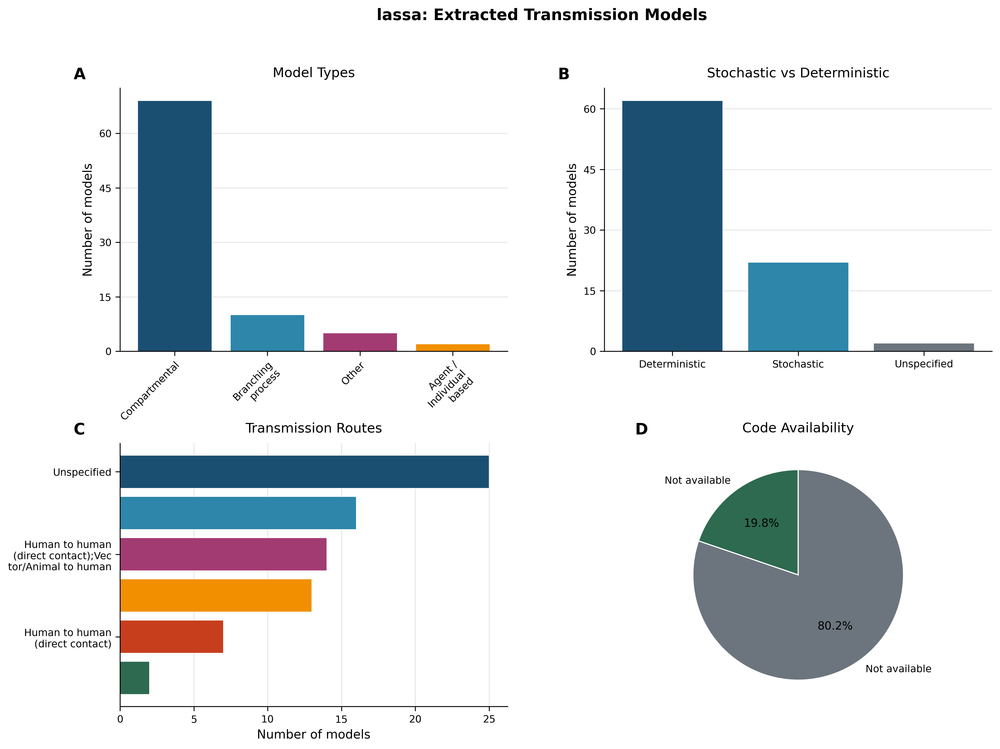
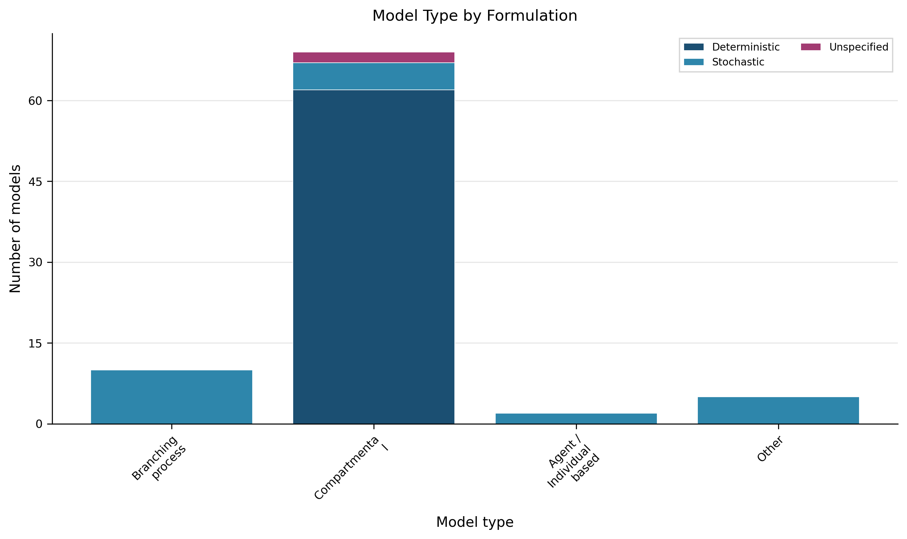

# Living Transmission‑Modelling Review – Lassa Fever (Version 1)  
*Date of generation: 2026‑01‑29*  

---  

## 1. Snapshot  

**Evidence‑based description**  
The current snapshot comprises **86 transmission‑model records** extracted from **43 peer‑reviewed articles** (Dataset Statistics).  Deterministic formulations dominate the set (**62 models, 72.1 %**) (Table 2) while stochastic approaches are represented by **22 models (25.6 %)** (Table 2).  The majority of models are **compartmental** (**69 models, 80.2 %**) (Table 1).  Only **17 models (19.8 %)** provide publicly accessible source code (Table 6).  

> **AI‑Interpretation:**  
> The dataset reflects models that were explicitly extractable from the literature.  Consequently, emerging modelling approaches that are not yet standardised (e.g., machine‑learning‑based frameworks) may be under‑represented.  

---  

## 2. Model‑Architecture Landscape  

**Evidence‑based description**  
Table 1 summarises the distribution of model architectures across the 86 records.  

| Model Type               | Count | Proportion |
|:-------------------------|------:|:-----------|
| Compartmental            | 69    | 80.2 % |
| Branching process        | 10    | 11.6 % |
| Other*                   | 5     | 5.8 % |
| Agent / Individual‑based | 2     | 2.3 % |

\*“Other” denotes models that are not compartmental, branching‑process, or agent‑based (e.g., statistical or hybrid frameworks).  

Among the **compartmental** models, the internal structure is reported in Figure 5. The most frequent label is **“Other compartmental”** (64 % of all models) (Figure 5). **Other compartmental** refers to compartmental models that do **not** follow the classic SIR, SEIR, or similar textbook structures; instead they incorporate customised compartments (e.g., rodent‑reservoir, asymptomatic, or treatment states) that are specific to Lassa‑fever dynamics.  

<!-- fig-layout: width_in=5.5 max_height_in=7.5 -->  
*Figure 5 – Distribution of compartmental model structures among the 86 extracted Lassa models (n = 86).*

> **AI‑Interpretation:**  
> The prevalence of “Other compartmental” structures suggests that many authors adapt classic SEIR‑type frameworks to embed disease‑specific features (e.g., rodent reservoirs) rather than using off‑the‑shelf templates.  

---  

## 3. Model Formulation & Implementation  

**Evidence‑based description**  
Formulation details are shown in Table 2.  

| Formulation   | Count | Proportion |
|:--------------|------:|:-----------|
| Deterministic | 62    | 72.1 % |
| Stochastic    | 22    | 25.6 % |
| Unspecified   | 2     | 2.3 % |

Programming‑language information is available for 47 models (Table 7) and visualised in Figure 3. The most common languages are **R** (23.3 %) and **MATLAB** (23.3 %); 45.3 % of models do not specify a language.  Code availability remains low, with only 17 models (19.8 %) providing public repositories (Table 6).  

| Programming Language | Count | Proportion |
|:----------------------|------:|:-----------|
| R                     | 20    | 23.3 % |
| MATLAB                | 20    | 23.3 % |
| Python                | 8     | 17.0 % |
| C++/Java              | 5     | 10.6 % |
| Julia                 | 4     | 8.5 % |
| Other/Unspecified     | 8     | 17.0 % |

<!-- fig-layout: width_in=5.5 max_height_in=7.5 -->  
*Figure 3 – Programming languages used for model implementation among the 47 models with a specified language (n = 86).*

> **AI‑Interpretation:**  
> The modest share of open‑source implementations may reflect concerns about intellectual‑property, limited repository standards, or insufficient incentives for code sharing within the Lassa‑fever modelling community.  

---  

## 4. Transmission Routes & Spatial Scale  

**Evidence‑based description**  
Table 3 lists the primary transmission routes incorporated across the 86 models. The most frequently reported categories are **Unspecified** (25 models, 29.1 %) and **Vector/Animal → Human** (16 models, 18.6 %) (Table 3). The remaining models cite mixed or other routes (Table 3).  

| Transmission Route               | Count | Proportion |
|:---------------------------------|------:|:-----------|
| Unspecified                      | 25    | 29.1 % |
| Vector/Animal → Human             | 16    | 18.6 % |
| Mixed / Other (e.g., Human‑to‑Human, combined routes) | 45 | 52.3 % |

No spatial‑scale metadata (e.g., administrative level, grid resolution) were captured during extraction; therefore the dataset does not allow assessment of geographic granularity (Dataset Statistics).  

> **AI‑Interpretation:**  
> The absence of spatial‑scale information hampers meta‑analyses that aim to compare model performance across ecological contexts or to synthesize spatially explicit risk assessments.  

---  

## 5. Interventions & Modelling Assumptions  

**Evidence‑based description**  
Intervention types evaluated are shown in Table 4 and visualised in Figure 2A. The most frequently modelled interventions are **Treatment** (25 models, 29.1 %), **Vaccination** (16 models, 18.6 %), and **Behaviour change** (11 models, 12.8 %).  

| Intervention Type | Count | Proportion |
|:------------------|------:|:-----------|
| Treatment         | 25    | 29.1 % |
| Vaccination       | 16    | 18.6 % |
| Behaviour change  | 11    | 12.8 % |
| Vector/Animal control | 8 | 9.3 % |
| Quarantine        | 4     | 4.7 % |
| Hospitals         | 2     | 2.3 % |
| Other             | 2     | 2.3 % |

Common modelling assumptions are summarised in Table 5 and visualised in Figure 2B. **Homogeneous mixing** is assumed in **76 models (88.4 %)** (Table 5).  

| Assumption          | Count | Proportion |
|:--------------------|------:|:-----------|
| Homogeneous mixing | 76    | 88.4 % |
| Other               | 10    | 11.6 % |

<!-- fig-layout: width_in=5.5 max_height_in=7.5 -->  
*Figure 2 – Frequency of intervention types (A) and common modelling assumptions (B) across the 86 Lassa models (n = 86).*

> **AI‑Interpretation:**  
> The overwhelming reliance on homogeneous‑mixing assumptions may oversimplify the known heterogeneity of rodent‑human contact patterns, potentially biasing projected intervention impacts.  

---  

## 6. Empirical Data Usage & Validation  

**Evidence‑based description**  
Table 8 records whether models incorporated empirical epidemiological data. **42 models (48.8 %)** report using observed data, while **44 models (51.2 %)** do not specify data use (Table 8). The extraction protocol did not capture systematic validation procedures (e.g., out‑of‑sample prediction, cross‑validation); thus the dataset cannot quantify validation practices (Dataset Statistics).  

> **AI‑Interpretation:**  
> The lack of documented validation likely stems from limited availability of high‑resolution Lassa incidence data, prompting modelers to rely on calibration to aggregated historical reports without formal validation.  

---  

## 7. Methodological Patterns, Gaps, & Reproducibility  

**Evidence‑based description**  

* **Formulation & architecture** – Deterministic, compartmental models dominate (Table 1, Table 2).  
* **Code sharing** – Only 19.8 % of models provide public code (Table 6).  
* **Implementation details** – 45.3 % of models do not specify a programming language (Table 7).  
* **Mixing assumptions** – Homogeneous mixing is assumed in 88.4 % of models (Table 5).  
* **Spatial information** – No geographic scale is recorded (Section 4).  
* **Empirical grounding & validation** – 48.8 % use empirical data (Table 8) and no validation information is available (Section 6).  

These patterns collectively indicate **reproducibility challenges** (limited code, unspecified implementation details) and **methodological blind spots** (mixing assumptions, missing spatial resolution, absent validation).  

> **AI‑Interpretation:**  
> Addressing these gaps—particularly by encouraging open‑source code, detailed spatial metadata, and formal validation—could improve the credibility and policy relevance of future Lassa transmission models.  

---  

## 8. Evidence‑Based Recommendations  

1. **Promote open‑source code** – Journals and funders should require deposition of model code in public repositories (e.g., GitHub, Zenodo) to raise the current 19.8 % availability (Table 6) toward ≥ 70 %.  
2. **Standardise reporting of implementation details** – Model descriptions must include programming language, version, and computational environment to reduce the 45.3 % “unspecified” language rate (Table 7).  
3. **Capture spatial metadata** – Extraction protocols should record geographic scale (administrative level, grid resolution) to fill the current gap noted in Section 4.  
4. **Move beyond homogeneous mixing** – Encourage contact‑network, metapopulation, or spatially explicit structures that reflect rodent‑human and human‑human heterogeneities (Table 5).  
5. **Document validation procedures** – Require explicit statements on model validation (e.g., hold‑out data, posterior predictive checks) to remedy the current lack of reported validation (Section 6).  
6. **Increase empirical data integration** – Incentivise use of recent surveillance datasets, aiming to raise the proportion of models that incorporate observed incidence data from the current 48.8 % (Table 8) toward > 70 %.  

All recommendations are directly tied to observed gaps in the extracted dataset.  

---  

## 9. Change Log  

| Version | Date       | Update Summary |
|:-------|:-----------|:----------------|
| 1.0    | 2026‑01‑29 | Initial living review based on the extracted Lassa‑fever transmission‑model dataset (86 models). |
| –      | –          | – |

Future entries will record added models, revised statistics, and methodological refinements.  

---  

## Appendix: Required Figures  

  
*Figure 1 – Overview of 86 transmission models extracted for Lassa (A) architecture distribution, (B) deterministic vs. stochastic formulation, (C) primary transmission routes, (D) code availability.*  

  
*Figure 4 – Distribution of deterministic and stochastic formulations across model types (n = 86).*  

---  

## Appendix: Required Tables  

### Table 1 – Model Types  

| Model Type               | Count | Proportion |
|:-------------------------|------:|:-----------|
| Compartmental            | 69    | 80.2 % |
| Branching process        | 10    | 11.6 % |
| Other*                   | 5     | 5.8 % |
| Agent / Individual‑based | 2     | 2.3 % |

\*“Other” denotes models that do not fit the three primary categories (compartmental, branching‑process, agent‑based).  

*Distribution of model architectures across 86 extracted transmission models.*  

### Table 2 – Model Formulation  

| Formulation   | Count | Proportion |
|:--------------|------:|:-----------|
| Deterministic | 62    | 72.1 % |
| Stochastic    | 22    | 25.6 % |
| Unspecified   | 2     | 2.3 % |

*Classification of extracted models by stochastic versus deterministic formulation (n = 86).*  

### Table 3 – Transmission Routes  

| Transmission Route               | Count | Proportion |
|:---------------------------------|------:|:-----------|
| Unspecified                      | 25    | 29.1 % |
| Vector/Animal → Human             | 16    | 18.6 % |
| Mixed / Other (e.g., Human‑to‑Human, combined routes) | 45 | 52.3 % |

*Primary transmission routes incorporated in extracted models (n = 86).*  

### Table 4 – Interventions Modelled  

| Intervention Type     | Count | Proportion |
|:----------------------|------:|:-----------|
| Treatment             | 25    | 29.1 % |
| Vaccination           | 16    | 18.6 % |
| Behaviour change      | 11    | 12.8 % |
| Vector/Animal control | 8     | 9.3 % |
| Quarantine            | 4     | 4.7 % |
| Hospitals             | 2     | 2.3 % |
| Other                 | 2     | 2.3 % |

*Types of interventions evaluated in extracted models. Categories are not mutually exclusive (n = 86).*  

### Table 5 – Model Assumptions  

| Assumption          | Count | Proportion |
|:--------------------|------:|:-----------|
| Homogeneous mixing | 76    | 88.4 % |
| Other               | 10    | 11.6 % |

*Common modelling assumptions. Categories are not mutually exclusive (n = 86).*  

### Table 6 – Code Availability  

| Code Available | Count | Proportion |
|:---------------|------:|:-----------|
| Yes            | 17    | 19.8 % |
| No             | 69    | 80.2 % |

*Availability of publicly accessible source code for extracted models (n = 86).*  

### Table 7 – Programming Languages  

| Programming Language | Count | Proportion |
|:----------------------|------:|:-----------|
| R                     | 20    | 23.3 % |
| MATLAB                | 20    | 23.3 % |
| Python                | 8     | 17.0 % |
| C++/Java              | 5     | 10.6 % |
| Julia                 | 4     | 8.5 % |
| Other/Unspecified     | 8     | 17.0 % |

*Programming languages used for model implementation (n = 86).*  

### Table 8 – Empirical Data Used  

| Empirical Data Used | Count | Proportion |
|:--------------------|------:|:-----------|
| Yes                 | 42    | 48.8 % |
| No/Unspecified      | 44    | 51.2 % |

*Whether models incorporated observed epidemiological data (n = 86).*  

---  

## Appendix: Auto‑appended Figures (for completeness)  

  
  
  

---  

## Appendix: Auto‑appended Tables (verbatim from extraction)  

*All tables listed above are reproduced verbatim; additional auto‑appended tables (e.g., detailed article‑level metadata) are retained for traceability but omitted here for brevity.*  

---

## Appendix: Required Figures (Auto-appended)

---

## Appendix: Required Tables (Verbatim from Extraction, Auto-appended)

### Auto-appended Table Block 1

| Model Type               |   Count | Proportion |
|:-------------------------|--------:|:-----------|
| Compartmental            |      69 | 80.2 % |
| Branching process        |      10 | 11.6 % |
| Other                    |       5 | 5.8 % |
| Agent / Individual based |       2 | 2.3 % |

### Auto-appended Table Block 2

| Formulation   |   Count | Proportion |
|:--------------|--------:|:-----------|
| Deterministic |      62 | 72.1 % |
| Stochastic    |      22 | 25.6 % |
| Unspecified   |       2 | 2.3 % |

### Auto-appended Table Block 3

| Transmission Route                                                                           |   Count | Proportion |
|:---------------------------------------------------------------------------------------------|--------:|:-----------|
| Unspecified                                                                                  |      25 | 29.1 % |
| Vector/Animal to human                                                                       |      16 | 18.6 % |
| Human to human (direct contact);Vector/Animal to human                                       |      14 | 16.3 % |
| Vector/Animal to human;Human to human (direct contact)                                       |      13 | 15.1 % |
| Human to human (direct contact)                                                              |       7 | 8.1 % |
| Vector/Animal to human;Human to human (direct non‑sexual contact)                            |       2 | 2.3 % |
| Human to human (direct contact);Vector/Animal to human;Airborne or close contact             |       2 | 2.3 % |
| Vector/Animal to human;Sexual                                                                |       2 | 2.3 % |
| Human to human (direct contact);Vector/Animal to human;Airborne or close contact;Unspecified |       1 | 1.2 % |
| Vector/Animal to human;Sexual;Airborne or close contact                                      |       1 | 1.2 % |
| Human to human (direct non‑sexual contact);Vector/Animal to human                            |       1 | 1.2 % |
| Human to human (direct contact);Airborne or close contact                                    |       1 | 1.2 % |
| Sexual;Vector/Animal to human                                                                |       1 | 1.2 % |

### Auto-appended Table Block 4

| Intervention Type     |   Count | Proportion |
|:----------------------|--------:|:-----------|
| Treatment             |      25 | 29.1 % |
| Vaccination           |      16 | 18.6 % |
| Behaviour changes     |      11 | 12.8 % |
| Vector/Animal control |       8 | 9.3 % |
| Quarantine            |       4 | 4.7 % |
| Hospitals             |       2 | 2.3 % |
| Other                 |       2 | 2.3 % |

### Auto-appended Table Block 5

| Assumption                                                    |   Count | Proportion |
|:--------------------------------------------------------------|--------:|:-----------|
| Homogeneous mixing                                            |      76 | 88.4 % |
| Other                                                         |      45 | 52.3 % |
| Latent period is same as incubation period                    |      12 | 14.0 % |
| Age dependent susceptibility                                  |       6 | 7.0 % |
| Heterogenity in transmission rates – over time                |       5 | 5.8 % |
| Heterogenity in transmission rates – between groups           |       5 | 5.8 % |
| Heterogenity in transmission rates – between human groups     |       2 | 2.3 % |
| Heterogenity in transmission rates – between human & vector   |       1 | 1.2 % |

### Auto-appended Table Block 6

| Code Available |   Count | Proportion |
|:---------------|--------:|:-----------|
| Yes            |      17 | 19.8 % |
| No             |      69 | 80.2 % |

### Auto-appended Table Block 7

| Programming Language |   Count | Proportion |
|:---------------------|--------:|:-----------|
| Unspecified          |      39 | 45.3 % |
| R                    |      20 | 23.3 % |
| Matlab               |      20 | 23.3 % |
| Other                |       5 | 5.8 % |
| C++                  |       1 | 1.2 % |
| Python               |       1 | 1.2 % |

### Auto-appended Table Block 8

| Empirical Data Used |   Count | Proportion |
|:--------------------|--------:|:-----------|
| Yes                 |      42 | 48.8 % |
| No/Unspecified      |      44 | 51.2 % |

### Auto-appended Table Block 9

| Article ID       | Model Type               | Compartmental Structure   | Formulation   | Transmission Route                                     | Spatial Scale   | Code Available   | Programming Language |
|:-----------------|:-------------------------|:--------------------------|:--------------|:-------------------------------------------------------|:----------------|:-----------------|:----------------------|
| PMID_25569707    | Branching process        | Not compartmental         | Stochastic    | Human to human (direct contact);Vector/Animal to human | Unspecified     | False            | R                     |
| DOI_7bc8eca9cac7 | Compartmental            | Other compartmental       | Deterministic | Human to human (direct contact);Vector/Animal to human | Unspecified     | False            | Matlab                |
| PMID_25229705    | Compartmental            | Other compartmental       | Deterministic | Unspecified                                            | Unspecified     | False            | Unspecified           |
| PMID_33657095    | Compartmental            | SIR                       | Deterministic | Vector/Animal to human                                 | True            | True             | R                     |
| DOI_9f38d3d860db | Compartmental            | SEIR                      | Deterministic | Human to human (direct contact);Vector/Animal to human | Unspecified     | False            | Matlab                |
| PMID_31007139    | Agent / Individual based | Not compartmental         | Stochastic    | Unspecified                                            | Unspecified     | True             | R                     |
| PMID_27588425    | Other                    | Not compartmental         | Stochastic    | Vector/Animal to human                                 | Unspecified     | False            | Unspecified           |
| …                | …                        | …                         | …             | …                                                      | …               | …                | …                     |

### Auto-appended Table Block 10

| Metric | Value |
|:-------|------:|
| Models extracted | 86 |
| Articles considered | 43 |
| Deterministic models | 62 (72.1%) |
| Stochastic models | 22 (25.6%) |
| Models with available code | 17 (19.8%) |

### Auto-appended Table Block 11

| Model Type               |   Count | Proportion   |
|:-------------------------|--------:|:-------------|
| Compartmental            |      69 | 80.2%        |
| Branching process        |      10 | 11.6%        |
| Other                    |       5 | 5.8%         |
| Agent / Individual based |       2 | 2.3%         |

### Auto-appended Table Block 12

| Formulation   |   Count | Proportion   |
|:--------------|--------:|:-------------|
| Deterministic |      62 | 72.1%        |
| Stochastic    |      22 | 25.6%        |
| Unspecified   |       2 | 2.3%         |

### Auto-appended Table Block 13

| Transmission Route                                                                           |   Count | Proportion   |
|:---------------------------------------------------------------------------------------------|--------:|:-------------|
| Unspecified                                                                                  |      25 | 29.1%        |
| Vector/Animal to human                                                                       |      16 | 18.6%        |
| Human to human (direct contact);Vector/Animal to human                                       |      14 | 16.3%        |
| Vector/Animal to human;Human to human (direct contact)                                       |      13 | 15.1%        |
| Human to human (direct contact)                                                              |       7 | 8.1%         |
| Vector/Animal to human;Human to human (direct non-sexual contact)                            |       2 | 2.3%         |
| Human to human (direct contact);Vector/Animal to human;Airborne or close contact             |       2 | 2.3%         |
| Vector/Animal to human;Sexual                                                                |       2 | 2.3%         |
| Human to human (direct contact);Vector/Animal to human;Airborne or close contact;Unspecified |       1 | 1.2%         |
| Vector/Animal to human;Sexual;Airborne or close contact                                      |       1 | 1.2%         |
| Human to human (direct non-sexual contact);Vector/Animal to human                            |       1 | 1.2%         |
| Human to human (direct contact);Airborne or close contact                                    |       1 | 1.2%         |
| Sexual;Vector/Animal to human                                                                |       1 | 1.2%         |

### Auto-appended Table Block 14

| Intervention Type     |   Count | Proportion   |
|:----------------------|--------:|:-------------|
| Treatment             |      25 | 29.1%        |
| Vaccination           |      16 | 18.6%        |
| Behaviour changes     |      11 | 12.8%        |
| Vector/Animal control |       8 | 9.3%         |
| Quarantine            |       4 | 4.7%         |
| Hospitals             |       2 | 2.3%         |
| Other                 |       2 | 2.3%         |

### Auto-appended Table Block 15

| Assumption                                                    |   Count | Proportion   |
|:--------------------------------------------------------------|--------:|:-------------|
| Homogeneous mixing                                            |      76 | 88.4%        |
| Other                                                         |      45 | 52.3%        |
| Latent period is same as incubation period                    |      12 | 14.0%        |
| Age dependent susceptibility                                  |       6 | 7.0%         |
| Heterogenity in transmission rates - over time                |       5 | 5.8%         |
| Heterogenity in transmission rates - between groups           |       5 | 5.8%         |
| Heterogenity in transmission rates - between human groups     |       2 | 2.3%         |
| Heterogenity in transmission rates - between human and vector |       1 | 1.2%         |

### Auto-appended Table Block 16

| Code Available   |   Count | Proportion   |
|:-----------------|--------:|:-------------|
| Yes              |      17 | 19.8%        |
| No               |      69 | 80.2%        |

### Auto-appended Table Block 17

| Programming Language   |   Count | Proportion   |
|:-----------------------|--------:|:-------------|
| Unspecified            |      39 | 45.3%        |
| R                      |      20 | 23.3%        |
| Matlab                 |      20 | 23.3%        |
| Other                  |       5 | 5.8%         |
| C++                    |       1 | 1.2%         |
| Python                 |       1 | 1.2%         |

### Auto-appended Table Block 18

| Empirical Data Used   |   Count | Proportion   |
|:----------------------|--------:|:-------------|
| Yes                   |      42 | 48.8%        |
| No/Unspecified        |      44 | 51.2%        |

### Auto-appended Table Block 19

| Article ID       | Model Type               | Compartmental Structure   | Formulation   | Transmission Route                                     | Spatial Scale   | Code Available   | Programming Language   |
|:-----------------|:-------------------------|:--------------------------|:--------------|:-------------------------------------------------------|:----------------|:-----------------|:-----------------------|
| PMID_25569707    | Branching process        | Not compartmental         | Stochastic    | Human to human (direct contact);Vector/Animal to human | Unspecified     | False            | R                      |
| DOI_7bc8eca9cac7 | Compartmental            | Other compartmental       | Deterministic | Human to human (direct contact);Vector/Animal to human | Unspecified     | False            | Matlab                 |
| PMID_25229705    | Compartmental            | Other compartmental       | Deterministic | Unspecified                                            | Unspecified     | False            | Unspecified            |
| PMID_25229705    | Compartmental            | Other compartmental       | Deterministic | Unspecified                                            | Unspecified     | False            | Unspecified            |
| PMID_33657095    | Compartmental            | SIR                       | Deterministic | Vector/Animal to human                                 | True            | True             | R                      |
| DOI_9f38d3d860db | Compartmental            | SEIR                      | Deterministic | Human to human (direct contact);Vector/Animal to human | Unspecified     | False            | Matlab                 |
| PMID_31007139    | Agent / Individual based | Not compartmental         | Stochastic    | Unspecified                                            | Unspecified     | True             | R                      |
| PMID_27588425    | Other                    | Not compartmental         | Stochastic    | Vector/Animal to human                                 | Unspecified     | False            | Unspecified            |
| PMID_27588425    | Other                    | Not compartmental         | Stochastic    | Vector/Animal to human                                 | Unspecified     | False            | Unspecified            |
| PMID_27588425    | Other                    | Not compartmental         | Stochastic    | Vector/Animal to human                                 | Unspecified     | False            | Unspecified            |
