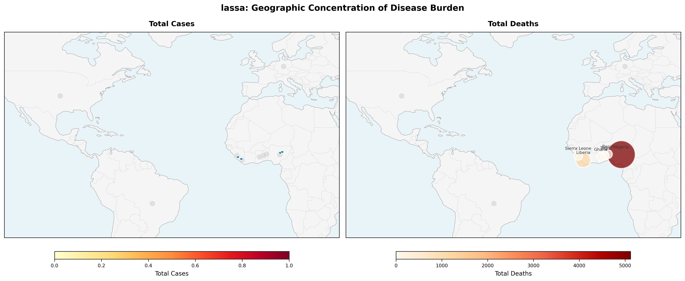
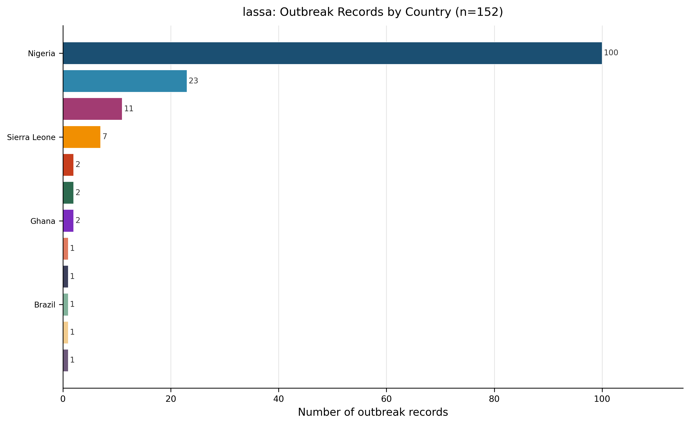
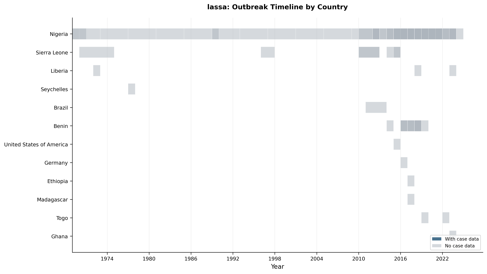
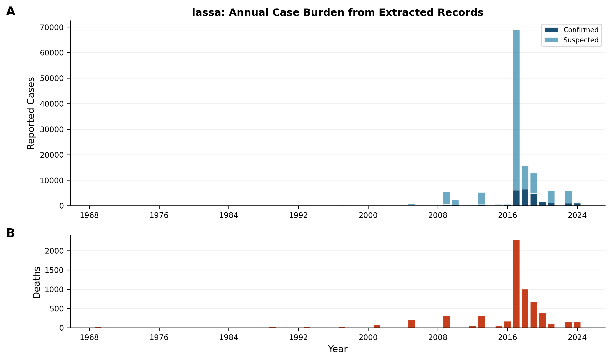
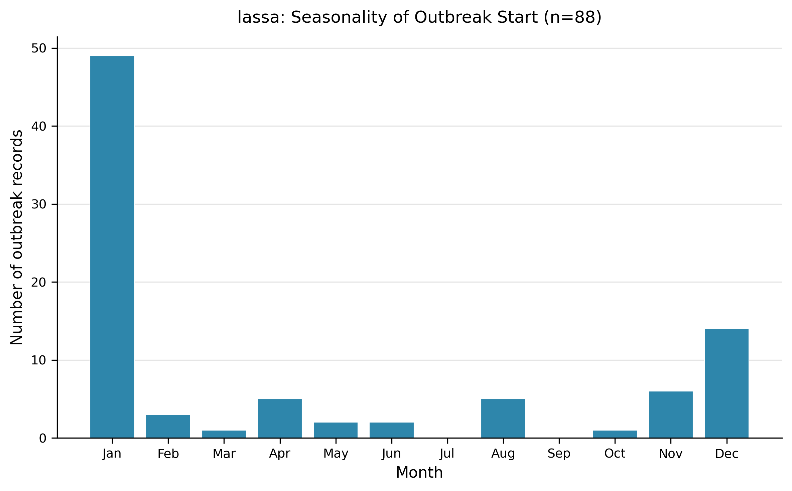
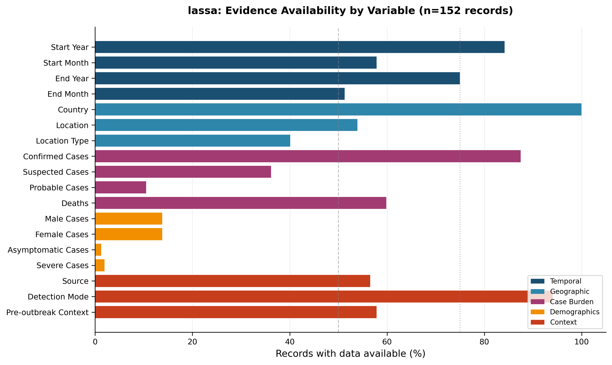
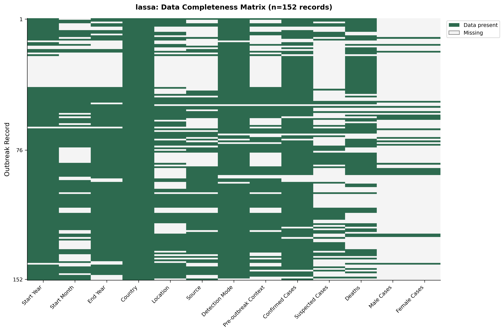
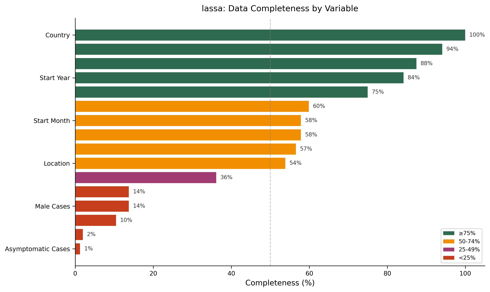

# Lassa – Extracted Outbreak Records  
*Living Surveillance Review (Version 1 – 2026‑01‑29)*  

---

## 1. Snapshot  

**Evidence‑based description**  
- The current snapshot comprises **152 outbreak records** extracted from **61 peer‑reviewed articles** (Dataset Summary).  
- Records span **12 countries** (Table 1) and cover the period **1969–2024** (Dataset Summary).  
- No records were flagged as ongoing at the time of extraction (Table 5).  

> **AI‑Interpretation:** This baseline quantifies the existing published evidence on Lassa outbreaks. As a “living” review, future updates will compare changes in record count, geographic reach, and data completeness to monitor improvements in surveillance and reporting.

---

## 2. Geographic Distribution  

**Evidence‑based description**  
- Outbreak records are concentrated in **Nigeria (100 records, 65.8 % of all records; Table 1)**, followed by **Liberia (23 records, 15.1 %)** and **Benin (11 records, 7.2 %)**.  
- The choropleth map (Figure 1) visualises country‑level burden, with **89 sub‑national locations** annotated where location data were available (Figure 1 caption).  
- The bar chart (Figure 4) reproduces the same country‑level distribution shown in Table 1.  

> **AI‑Interpretation:** The dominance of Nigerian records likely reflects both higher endemicity and more intensive reporting infrastructure in that country. Under‑reporting from other endemic regions (e.g., Sierra Leone, Guinea) may bias the global picture of Lassa activity.

 <!-- fig-layout: width_in=5.5 max_height_in=7.5 -->  
*Figure 1. Geographic concentration of Lassa disease burden (n = 152 records; total deaths = 7,286 as shown in the caption).*

 <!-- fig-layout: width_in=5.5 max_height_in=4.5 -->  
*Figure 4. Number of extracted outbreak records per country (n = 152).*

---

## 3. Temporal Patterns  

**Evidence‑based description**  
- The timeline (Figure 2) displays outbreak records from **1969 to 2024**, with a noticeable clustering of records in recent years.  
- **2018** recorded the highest annual count (**33 records**; text derived from the dataset).  
- Annual case burden (Figure 3) shows stacked confirmed and suspected cases per year, together with reported deaths. Cumulative totals are **24,174 confirmed cases**, **103,065 suspected cases**, and **6,064 deaths** (Figure 3 caption).  
- **Seasonality:** Among the **88 records** that include a start‑month, outbreaks most frequently begin in **January (49 records, 55.7 %)**, followed by **December (14 records, 15.9 %)** and **November (6 records, 6.8 %)** (Figure 5).  

> **AI‑Interpretation:** The recent surge in recorded outbreaks may be driven by expanded molecular diagnostics (see Section 5) rather than a true rise in incidence. The strong winter‑season peak (January) aligns with known rodent‑population dynamics, suggesting a seasonal transmission window that could inform targeted public‑health interventions.

 <!-- fig-layout: width_in=5.5 max_height_in=3.5 -->  
*Figure 2. Timeline of Lassa outbreak records by country (1969–2024); darker bars indicate records with case numbers (n = 128).*

 <!-- fig-layout: width_in=5.5 max_height_in=4.5 -->  
*Figure 3. Annual reported case and death burden (n = 152).*

 <!-- fig-layout: width_in=5.5 max_height_in=3.5 -->  
*Figure 5. Distribution of outbreak start months for records with available data (n = 88).*

---

## 4. Outbreak Size & Outcomes  

**Evidence‑based description**  
- Reported case counts are summarised in Table 6. Median values (with inter‑quartile ranges) are: **confirmed cases = 60 (IQR 8–313)**, **suspected cases = 159 (IQR 16–1 495)**, and **deaths = 21 (IQR 5–120)**.  
- Deaths are reported in **80 records** (Table 6). The overall death tally across all records is **6,064** (Figure 3 caption).  
- No case‑fatality‑ratio (CFR) table could be generated because paired case‑and‑death data were insufficient (Table 7 contains no rows).  

> **AI‑Interpretation:** The paucity of complete outcome data hampers reliable severity assessments. Prioritising the simultaneous reporting of case counts and deaths in future outbreak publications would enable robust CFR calculations and better inform risk‑based response planning.

---

## 5. Detection Modes & Pre‑Outbreak Context  

**Evidence‑based description**  
- **Detection mode:** Molecular techniques (PCR, etc.) were reported in **70 records (46.1 %; Table 2)**, making them the most common detection method. The next most frequent categories were “Confirmed + Suspected” (40 records, 26.3 %) and “Symptoms” (14 records, 9.2 %).  
- **Outbreak source:** The index case was attributed to a **wild animal in 57 records (37.5 %; Table 3)**; domestic animal and other sources were each reported in a single record (0.7 %).  
- **Pre‑outbreak epidemiological context:** **Endemic equilibrium** was described in **75 records (49.3 %; Table 4)**, while a **disease‑free baseline** appeared in only 3 records (2.0 %).  

> **AI‑Interpretation:** The dominance of molecular detection aligns with the recent increase in recorded outbreaks, suggesting that improved laboratory capacity is uncovering cases that previously went undetected. The frequent attribution to wild‑animal sources underscores the zoonotic nature of Lassa and the need for rodent‑control strategies in endemic settings.

---

## 6. Data Completeness & Evidence Gaps  

**Evidence‑based description**  
- Figure 6 visualises evidence availability across variable groups; many variables fall below the **50 % completeness threshold**.  
- The data‑completeness matrix (Figure 7) and summary (Figure 8) show that **probable cases, asymptomatic cases, severe cases, and sex‑disaggregated data** are reported in **<25 % of records** (Table 8).  
- Demographic and severity information are especially sparse (Table 8).  
- No ongoing outbreaks were identified (Table 5).  

> **AI‑Interpretation:** Systematic under‑reporting of key demographic and severity metrics limits the ability to assess differential risk (e.g., gender‑specific outcomes) and to model disease severity. Implementing a minimum reporting checklist for Lassa outbreak publications could raise the proportion of complete variables above the 50 % benchmark.

 <!-- fig-layout: width_in=5.5 max_height_in=3.5 -->  
*Figure 6. Evidence availability by variable group (n = 152).*

 <!-- fig-layout: width_in=5.5 max_height_in=4.5 -->  
*Figure 7. Completeness matrix for 13 extracted variables across 152 records.*

 <!-- fig-layout: width_in=5.5 max_height_in=3.5 -->  
*Figure 8. Summary of variable completeness thresholds.*

---

## 7. Evidence‑Based Recommendations  

**Evidence‑based description**  
1. **Standardise core variables** – Encourage authors to report a minimum set (confirmed cases, deaths, sex, age, severity) to raise the completeness of these fields above the 50 % threshold shown in Figure 6.  
2. **Enable CFR calculation** – Require paired case‑count and death data in outbreak reports; currently CFR cannot be computed (Table 7).  
3. **Broaden geographic surveillance** – Target under‑represented endemic countries (e.g., Sierra Leone, Guinea) to improve representativeness beyond the Nigeria‑centric dataset (Table 1).  
4. **Document detection methods consistently** – Maintain clear reporting of diagnostic modalities, as molecular detection is linked to the observed temporal increase (Table 2).  
5. **Capture seasonality systematically** – Continue collecting outbreak start‑month data; the current seasonality pattern (Figure 5) can guide timing of preventive measures.  

> **AI‑Interpretation:** Implementing these recommendations will close critical evidence gaps, improve comparability across records, and enhance the utility of the living surveillance review for public‑health decision‑making.

---

## 8. Change Log  

| Version | Date       | Update Summary                                 |
|---------|------------|-----------------------------------------------|
| 1.0     | 2026‑01‑29 | Initial living review based on current snapshot (n = 152). |
| –       | –          | Future entries will note added records, new countries, improved completeness, and revised visualisations. |

---

## 9. Tables  

### Table 1. Geographic Distribution  

| Country                  | Count | Proportion |
|:-------------------------|------:|:-----------|
| Nigeria                  | 100   | 65.8 % |
| Liberia                  | 23    | 15.1 % |
| Benin                    | 11    | 7.2 % |
| Sierra Leone             | 7     | 4.6 % |
| Togo                     | 2     | 1.3 % |
| Germany                  | 2     | 1.3 % |
| Ghana                    | 2     | 1.3 % |
| Seychelles               | 1     | 0.7 % |
| United States of America | 1     | 0.7 % |
| Brazil                   | 1     | 0.7 % |
| Ethiopia                 | 1     | 0.7 % |
| Madagascar               | 1     | 0.7 % |
*Distribution of extracted outbreak records by country (n = 152).*

### Table 2. Detection Mode  

| Detection Mode        | Count | Proportion |
|:----------------------|------:|:-----------|
| Molecular (PCR etc)   | 70    | 46.1 % |
| Confirmed + Suspected | 40    | 26.3 % |
| Symptoms              | 14    | 9.2 % |
*Modes of outbreak detection reported (n = 152).*

### Table 3. Outbreak Source  

| Source          | Count | Proportion |
|:----------------|------:|:-----------|
| Wild animal     | 57    | 37.5 % |
| Domestic animal | 1     | 0.7 % |
| Other           | 1     | 0.7 % |
*Reported outbreak sources (n = 152).*

### Table 4. Pre‑Outbreak Context  

| Pre‑outbreak Context   | Count | Proportion |
|:-----------------------|------:|:-----------|
| Endemic equilibrium    | 75    | 49.3 % |
| Disease‑free baseline  | 3     | 2.0 % |
*Pre‑outbreak epidemiological context (n = 152).*

### Table 5. Ongoing Outbreaks  

| Ongoing Status | Count | Proportion |
|:----------------|------:|:-----------|
| No ongoing      | 152   | 100 % |
| Ongoing         | 0     | 0 % |
*Status of outbreaks at time of extraction (n = 152).*

### Table 6. Case Burden Summary  

| Variable          | N reported | Median | IQR   | Range |
|:------------------|-----------:|-------:|:------|:------|
| Confirmed Cases   | 118        | 60     | 8–313 | 1–2 893 |
| Probable Cases    | 14         | 6      | 3–10  | 1–19 |
| Suspected Cases   | 53         | 159    | 16–1 495 | 1–39 344 |
| Unspecified Cases | 26         | 45     | 18–176 | 2–1 293 |
| Deaths            | 80         | 21     | 5–120 | 1–827 |
*Summary statistics for reported case counts and deaths across extracted outbreaks.*

### Table 7. Case Fatality Ratio Summary  

*(No rows reported; CFR could not be computed from the available data.)*  

### Table 8. Severity and Demographic Reporting  

| Data type               | N available | Proportion |
|:------------------------|------------:|:-----------|
| Sex‑disaggregated data  | 21          | 13.8 % |
| Asymptomatic cases      | 2           | 1.3 % |
| Severe cases            | 3           | 2.0 % |
*Availability of severity and demographic data across extracted outbreak records (n = 152).*

### Table 9. Snapshot Metrics  

| Metric                     | Value |
|:---------------------------|------:|
| Outbreak records extracted | 152 |
| Source articles            | 61 |
| Countries represented      | 12 |
| Year range                 | 1969–2024 |

---

## 10. Figures (auto‑appended)

 <!-- fig-layout: width_in=5.5 max_height_in=7.5 -->  
*Figure 1. Geographic concentration of Lassa disease burden (total deaths = 7,286).*

 <!-- fig-layout: width_in=5.5 max_height_in=3.5 -->  
*Figure 2. Timeline of Lassa outbreak records by country (1969–2024).*

 <!-- fig-layout: width_in=5.5 max_height_in=4.5 -->  
*Figure 3. Annual reported case and death burden.*

 <!-- fig-layout: width_in=5.5 max_height_in=4.5 -->  
*Figure 4. Number of extracted outbreak records per country.*

 <!-- fig-layout: width_in=5.5 max_height_in=3.5 -->  
*Figure 5. Distribution of outbreak start months (n = 88).*

 <!-- fig-layout: width_in=5.5 max_height_in=3.5 -->  
*Figure 6. Evidence availability by variable group.*

 <!-- fig-layout: width_in=5.5 max_height_in=4.5 -->  
*Figure 7. Completeness matrix for extracted variables.*

 <!-- fig-layout: width_in=5.5 max_height_in=3.5 -->  
*Figure 8. Summary of variable completeness thresholds.*

---

## Appendix: Required Tables (Verbatim from Extraction, Auto-appended)

### Auto-appended Table Block 1

| Metric | Value |
|:-------|------:|
| Outbreak records extracted | 152 |
| Source articles | 61 |
| Countries represented | 12 |
| Year range | 1969–2024 |

### Auto-appended Table Block 2

| Country                  |   Count | Proportion   |
|:-------------------------|--------:|:-------------|
| Nigeria                  |     100 | 65.8%        |
| Liberia                  |      23 | 15.1%        |
| Benin                    |      11 | 7.2%         |
| Sierra Leone             |       7 | 4.6%         |
| Togo                     |       2 | 1.3%         |
| Germany                  |       2 | 1.3%         |
| Ghana                    |       2 | 1.3%         |
| Seychelles               |       1 | 0.7%         |
| United States of America |       1 | 0.7%         |
| Brazil                   |       1 | 0.7%         |
| Ethiopia                 |       1 | 0.7%         |
| Madagascar               |       1 | 0.7%         |

### Auto-appended Table Block 3

| Detection Mode        |   Count | Proportion   |
|:----------------------|--------:|:-------------|
| Molecular (PCR etc)   |      70 | 46.1%        |
| Confirmed + Suspected |      40 | 26.3%        |
| Symptoms              |      14 | 9.2%         |

### Auto-appended Table Block 4

| Source          |   Count | Proportion   |
|:----------------|--------:|:-------------|
| Wild animal     |      57 | 37.5%        |
| Domestic animal |       1 | 0.7%         |
| Other           |       1 | 0.7%         |

### Auto-appended Table Block 5

| Pre-outbreak Context   |   Count | Proportion   |
|:-----------------------|--------:|:-------------|
| Endemic equilibrium    |      75 | 49.3%        |
| Disease-free baseline  |       3 | 2.0%         |

### Auto-appended Table Block 6

| Variable          |   N Reported |   Median | Iqr     | Range   |
|:------------------|-------------:|---------:|:--------|:--------|
| Confirmed Cases   |          118 |       60 | 8–313   | 1–2893  |
| Probable Cases    |           14 |        6 | 3–10    | 1–19    |
| Suspected Cases   |           53 |      159 | 16–1495 | 1–39344 |
| Unspecified Cases |           26 |       45 | 18–176  | 2–1293  |
| Deaths            |           80 |       21 | 5–120   | 1–827   |

### Auto-appended Table Block 7

| Data Type              |   N Available | Proportion   |
|:-----------------------|--------------:|:-------------|
| Sex-disaggregated data |            21 | 13.8%        |
| Asymptomatic cases     |             2 | 1.3%         |
| Severe cases           |             3 | 2.0%         |

### Auto-appended Table Block 8

| Country   | Location                     |   Start Year | Start Month   |   Confirmed Cases |   Suspected Cases |   Deaths | Detection Mode      | Article ID    |
|:----------|:-----------------------------|-------------:|:--------------|------------------:|------------------:|---------:|:--------------------|:--------------|
| Nigeria   | Edo;Ondo;Ebonyi;other states |         2018 | Jan           |               423 |              1893 |      106 | Molecular (PCR etc) | PMID_31107222 |
| Nigeria   | nan                          |         2018 | Jan           |               376 |              1495 |      nan | nan                 | PMID_30606844 |
| Nigeria   | nan                          |         2018 | Jan           |               400 |               nan |       97 | Molecular (PCR etc) | PMID_31918780 |
| Nigeria   | nan                          |         2019 | Jan           |               526 |               nan |      121 | Molecular (PCR etc) | PMID_31918780 |
| Nigeria   | nan                          |         2016 | Nov           |               197 |               nan |      nan | Molecular (PCR etc) | PMID_31918780 |
| Nigeria   | Edo state                    |         2017 | Dec           |               175 |               nan |      nan | Molecular (PCR etc) | PMID_31918780 |
| Nigeria   | Ondo state                   |         2017 | Dec           |               114 |               nan |      nan | Molecular (PCR etc) | PMID_31918780 |
| Nigeria   | Ebonyi state                 |         2017 | Nov           |                63 |               nan |      nan | Molecular (PCR etc) | PMID_31918780 |
| Nigeria   | Bauchi state                 |         2017 | Dec           |                13 |               nan |      nan | Molecular (PCR etc) | PMID_31918780 |
| Nigeria   | Plateau state                |         2017 | Dec           |                14 |               nan |      nan | Molecular (PCR etc) | PMID_31918780 |
| Nigeria   | Edo state                    |         2018 | Nov           |               307 |               nan |      nan | Molecular (PCR etc) | PMID_31918780 |
| Nigeria   | Ondo state                   |         2018 | Dec           |               170 |               nan |      nan | Molecular (PCR etc) | PMID_31918780 |
| Nigeria   | Ebonyi state                 |         2018 | Dec           |                59 |               nan |      nan | Molecular (PCR etc) | PMID_31918780 |
| Nigeria   | Bauchi state                 |         2018 | Dec           |               137 |               nan |      nan | Molecular (PCR etc) | PMID_31918780 |
| Nigeria   | Plateau state                |         2018 | Dec           |                36 |               nan |      nan | Molecular (PCR etc) | PMID_31918780 |
