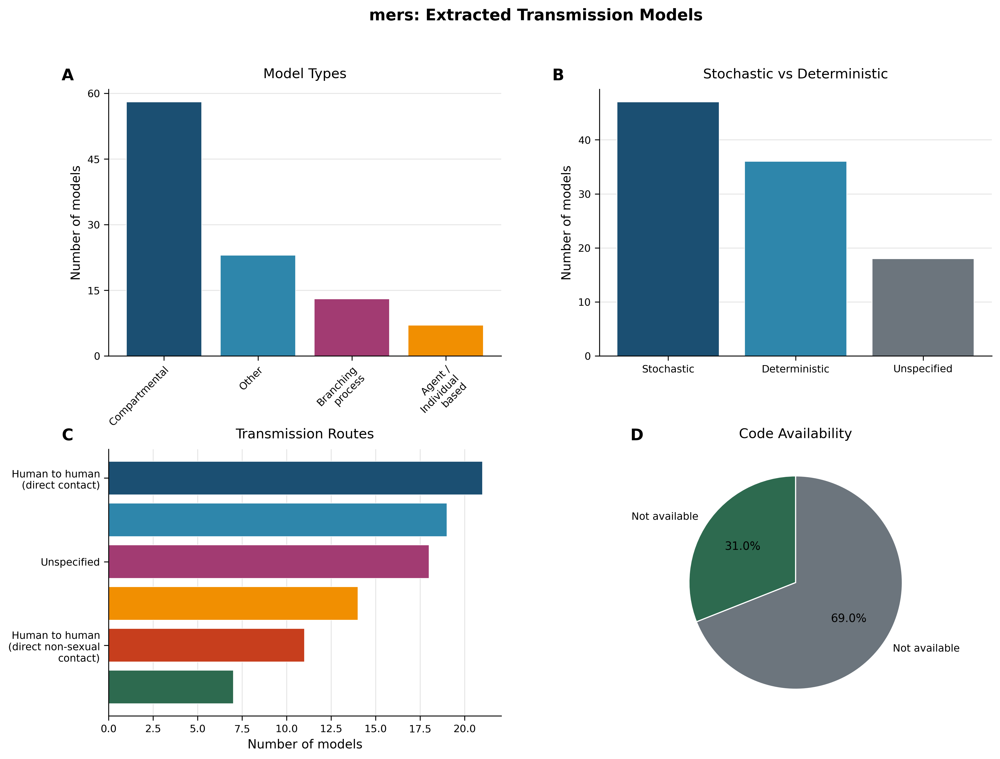
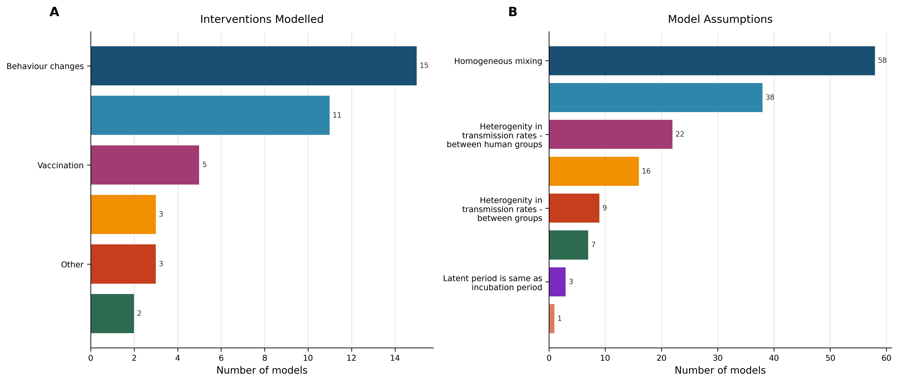
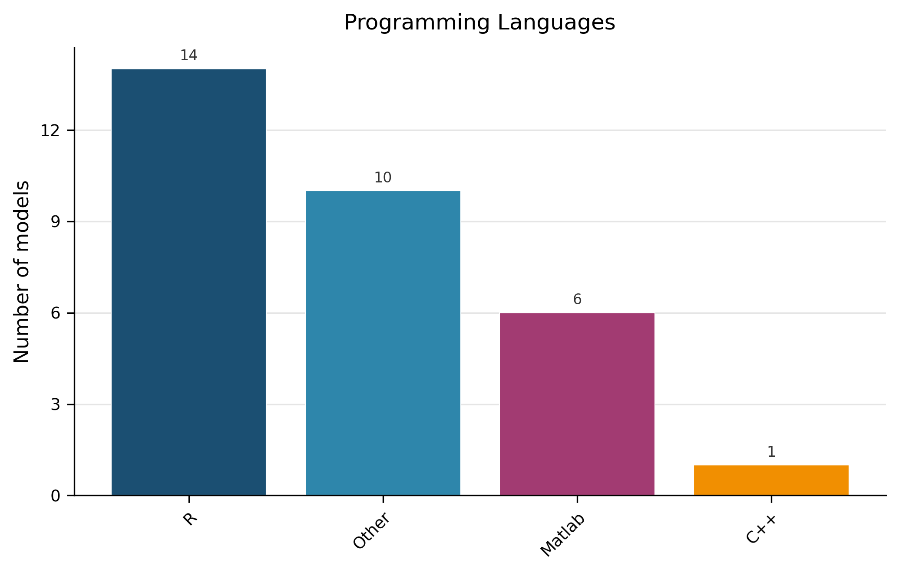
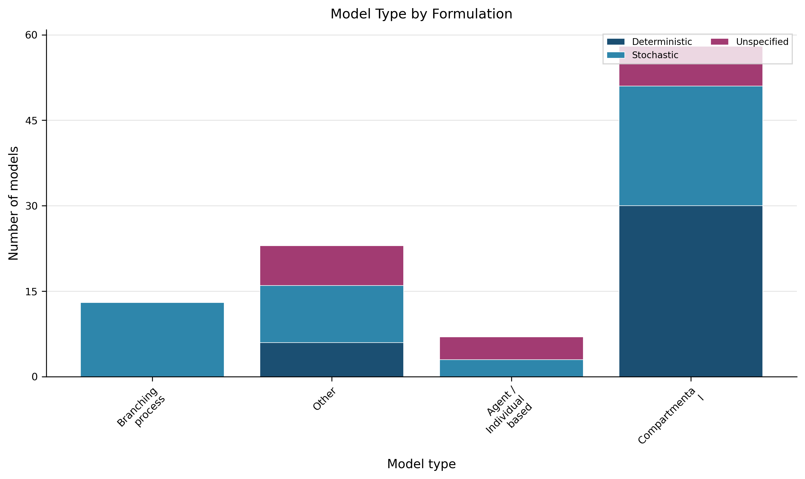

# Living Transmission‑Modelling Review – MERS (Version 1)

---

## 1. Snapshot  

**Dataset overview** – The current extraction comprises **101** transmission models drawn from **46** peer‑reviewed articles (Dataset Statistics). Model formulation is split between **36** deterministic (35.6 %) and **47** stochastic (46.5 %) models, with **18** (17.8 %) unspecified (Table 2, Figure 1 B). Publicly available source code is reported for **31** models (30.7 %) (Table 6, Figure 1 D).

> **AI‑Interpretation:**  
> This snapshot provides a baseline description of the MERS transmission‑modelling landscape captured to date. Because the dataset is limited to extractable models from published articles, future updates that incorporate pre‑prints or additional sources may shift these proportions.

---

## 2. Model Architecture Landscape  

**Evidence‑based description** – The distribution of model architectures is shown in Table 1 and visualised in Figure 1 A. **Compartmental** models are the most common (58 models, 57.4 %). The **Other** category (23 models, 22.8 %) aggregates models that do not fit the predefined structural types (e.g., statistical or phenomenological frameworks). **Branching‑process** (13 models, 12.9 %) and **Agent/Individual‑based** (7 models, 6.9 %) models complete the landscape.

> **AI‑Interpretation:**  
> The predominance of compartmental structures suggests a community preference for parsimonious, analytically tractable frameworks when modelling MERS spread. The presence of branching‑process and agent‑based models indicates niche interest in stochastic extinction events or fine‑grained heterogeneity.

---

## 3. Model Formulation and Implementation  

### 3.1 Deterministic vs. Stochastic Formulation  

**Evidence‑based description** – Table 2 reports 47 stochastic (46.5 %) and 36 deterministic (35.6 %) models, with 18 unspecified (17.8 %). This split is also displayed in Figure 1 B and Figure 4.

> **AI‑Interpretation:**  
> The near‑equal share of stochastic and deterministic formulations reflects diverse methodological preferences, possibly driven by data availability and research questions.

### 3.2 Programming‑Language Reporting  

**Evidence‑based description** – Among the 31 models that specify an implementation language (Figure 3), the majority are listed as **Unspecified** (70 models, 69.3 %). The remaining languages are **R** (14 models, 13.9 %), **Other** (10 models, 9.9 %), **Matlab** (6 models, 5.9 %), and **C++** (1 model, 1.0 %) (Table 7).  

**Definition of “Other”** – The “Other” category groups languages that are not captured by the predefined list (e.g., Python, Julia, Java, or bespoke scripting environments).

> **AI‑Interpretation:**  
> The high proportion of unspecified language entries hampers reproducibility. Explicitly reporting the programming language and version should become a standard element of model documentation.

### 3.3 Code Availability  

**Evidence‑based description** – Publicly accessible source code is reported for 31 models (30.7 %) (Table 6, Figure 1 D). The remaining 69 models (68.3 %) do not provide code.

> **AI‑Interpretation:**  
> While a third of models share code, the majority remain closed, limiting independent verification and reuse. Journals could encourage or require deposition of code in open repositories.

---

## 4. Transmission Routes and Spatial Scales  

**Evidence‑based description** – Primary transmission routes are summarised in Table 3 and Figure 1 C. The most frequently modelled route is **Human‑to‑human (direct contact)** (21 models, 20.8 %). Other notable routes include **Airborne or close contact** (19 models, 18.8 %) and **Vector/Animal to human** (7 models, 6.9 %).  

**Spatial‑scale reporting** – The extracted records rarely specify spatial granularity; most entries are labelled “Unspecified”. Consequently, the current snapshot cannot quantify the distribution of spatial scales.

> **AI‑Interpretation:**  
> The lack of spatial‑scale data represents a clear gap. We propose adding a standard reporting field “Spatial Scale” with predefined categories (e.g., household, community, regional, national, international) to future extractions. This would enable more precise assessment of geographic scope and facilitate spatially explicit policy analyses.

---

## 5. Interventions Evaluated and Key Assumptions  

### 5.1 Interventions  

**Evidence‑based description** – Table 4 and Figure 2 A list the intervention types modelled. The most common are **Behaviour changes** (15 models, 14.9 %) and **Quarantine** (11 models, 10.9 %). Less frequently modelled interventions include **Vaccination** (5 models, 5.0 %) and **Hospitals** (3 models, 3.0 %).  

> **AI‑Interpretation:**  
> Intervention diversity is modest, reflecting perhaps limited data on the effectiveness of many control measures for MERS. Expanding the range of evaluated interventions could improve the relevance of modelling outputs for policymakers.

### 5.2 Modelling Assumptions  

**Evidence‑based description** – Table 5 and Figure 2 B summarise common assumptions. **Homogeneous mixing** dominates (58 models, 57.4 %). The “Other” category (38 models, 37.6 %) aggregates assorted assumptions not captured elsewhere. Heterogeneity in transmission rates—between human groups (22 models, 21.8 %) and over time (16 models, 15.8 %) also appears.

> **AI‑Interpretation:**  
> The prevalence of homogeneous‑mixing assumptions suggests potential oversimplification of contact patterns, which may bias projected intervention impacts. Incorporating heterogeneous mixing (e.g., age‑structured or setting‑specific contact matrices) would likely yield more realistic scenario analyses.

---

## 6. Data Usage and Model Validation  

**Evidence‑based description** – Empirical data are incorporated in 57 models (56.4 %) (Table 8). The remaining 44 models (43.6 %) either do not use data or do not specify data sources. The extraction did not capture systematic information on validation methods (e.g., out‑of‑sample testing), so the current snapshot cannot assess model calibration or validation practices.

> **AI‑Interpretation:**  
> The absence of reported validation is a notable limitation. Even when empirical data are used, explicit validation steps are essential for confidence in policy‑relevant predictions. Future extraction protocols should include fields for validation methodology and performance metrics.

---

## 7. Methodological Patterns, Gaps, and Reproducibility Concerns  

| Observation | Evidence |
|-------------|----------|
| Dominance of compartmental models | Table 1, Figure 1 A |
| High proportion of homogeneous‑mixing assumptions | Table 5 |
| Limited reporting of programming language | Table 7 (69 % unspecified) |
| Modest code‑sharing rate | Table 6, Figure 1 D |
| Sparse spatial‑scale details | Section 4 note; no explicit entries |
| No systematic validation reporting | Section 6 statement |
| Intervention diversity modest | Table 4 |

> **AI‑Interpretation:**  
> These patterns highlight reproducibility‑related shortcomings: under‑reporting of implementation details, limited code availability, and insufficient validation documentation. Addressing these gaps would enhance the utility of MERS transmission models for decision‑making and enable more robust meta‑analyses.

---

## 8. Evidence‑Based Recommendations  

1. **Require explicit software reporting** – Journals should mandate a “Programming Language” field (including version) in the methods section, reducing the current 69 % unspecified rate.  

2. **Encourage open‑source code deposition** – Adopt a default policy of depositing model code in public repositories (e.g., GitHub, Zenodo) to raise the current 30.7 % sharing rate.  

3. **Standardise validation reporting** – Authors should describe calibration data, validation datasets, and performance metrics; extraction templates must capture these details.  

4. **Promote heterogeneous mixing structures** – Given the 57 % reliance on homogeneous mixing, methodological guidelines could recommend age‑ or setting‑stratified contact matrices, especially for interventions like quarantine or contact tracing.  

5. **Introduce a “Spatial Scale” reporting field** – Predefine categories (household, community, regional, national, international) to address the current lack of spatial granularity.  

6. **Broaden intervention modelling** – Encourage exploration of additional control measures (e.g., travel restrictions, environmental decontamination) to diversify the intervention portfolio beyond behaviour change and quarantine.  

These recommendations directly address the gaps identified in Sections 3–7 and are grounded in the observed evidence.

> **AI‑Interpretation:**  
> Implementing the above actions would likely increase transparency, reproducibility, and policy relevance of future MERS transmission‑modelling studies, facilitating more effective public‑health responses.

---

## 9. Change Log  

| Version | Date | Update Summary |
|---------|------|----------------|
| 1.0 | 2026‑01‑29 | Initial living review based on extracted dataset of 101 MERS transmission models. |
| – | – | – |

Future updates will record additions of new models, revisions to extracted fields, and modifications to recommendations.

---

## 10. Figures  

  
<!-- fig-layout: width_in=5.5 max_height_in=7.5 -->

  
<!-- fig-layout: width_in=5.5 max_height_in=7.5 -->

  
<!-- fig-layout: width_in=5.5 max_height_in=7.5 -->

  
<!-- fig-layout: width_in=5.5 max_height_in=7.5 -->

---

## 11. Appendix – Auto‑appended Tables (verbatim from extraction)

### Table 1. Model Types  

| Model Type               |   Count | Proportion   |
|:-------------------------|--------:|:-------------|
| Compartmental            |      58 | 57.4%        |
| Other                    |      23 | 22.8%        |
| Branching process        |      13 | 12.9%        |
| Agent / Individual based |       7 | 6.9%         |

*Distribution of model architectures across 101 extracted transmission models.*

### Table 2. Model Formulation  

| Formulation   |   Count | Proportion   |
|:--------------|--------:|:-------------|
| Stochastic    |      47 | 46.5%        |
| Deterministic |      36 | 35.6%        |
| Unspecified   |      18 | 17.8%        |

*Classification of extracted models by stochastic versus deterministic formulation (n=101).*

### Table 3. Transmission Routes  

| Transmission Route                                                   |   Count | Proportion   |
|:---------------------------------------------------------------------|--------:|:-------------|
| Human to human (direct contact)                                      |      21 | 20.8%        |
| Airborne or close contact                                            |      19 | 18.8%        |
| Unspecified                                                          |      18 | 17.8%        |
| Human to human (direct contact);Vector/Animal to human               |      14 | 13.9%        |
| Human to human (direct non‑sexual contact)                           |      11 | 10.9%        |
| Vector/Animal to human                                               |       7 | 6.9%         |
| Human to human (direct contact);Airborne or close contact            |       4 | 4.0%         |
| Airborne or close contact;Human to human (direct contact)            |       3 | 3.0%         |
| Human to human (direct non‑sexual contact);Vector/Animal to human    |       2 | 2.0%         |
| Airborne or close contact;Human to human (direct non‑sexual contact) |       1 | 1.0%         |
| Airborne or close contact;Vector/Animal to human                     |       1 | 1.0%         |

*Primary transmission routes incorporated in extracted models (n=101).*

### Table 4. Interventions Modelled  

| Intervention Type   |   Count | Proportion   |
|:--------------------|--------:|:-------------|
| Behaviour changes   |      15 | 14.9%        |
| Quarantine          |      11 | 10.9%        |
| Vaccination         |       5 | 5.0%         |
| Hospitals           |       3 | 3.0%         |
| Other               |       3 | 3.0%         |
| Contact tracing     |       2 | 2.0%         |

*Types of interventions evaluated in extracted models. Categories are not mutually exclusive (n=101).*

### Table 5. Model Assumptions  

| Assumption                                                    |   Count | Proportion   |
|:--------------------------------------------------------------|--------:|:-------------|
| Homogeneous mixing                                            |      58 | 57.4%        |
| Other                                                         |      38 | 37.6%        |
| Heterogenity in transmission rates - between human groups     |      22 | 21.8%        |
| Heterogenity in transmission rates - over time                |      16 | 15.8%        |
| Heterogenity in transmission rates - between groups           |       9 | 8.9%         |
| Age dependent susceptibility                                  |       7 | 6.9%         |
| Latent period is same as incubation period                    |       3 | 3.0%         |
| Heterogenity in transmission rates - between human and vector |       1 | 1.0%         |

*Common modelling assumptions. Categories are not mutually exclusive (n=101).*

### Table 6. Code Availability  

| Code Available   |   Count | Proportion   |
|:-----------------|--------:|:-------------|
| Yes              |      31 | 30.7%        |
| No               |      69 | 68.3%        |

*Availability of publicly accessible source code for extracted models (n=101).*

### Table 7. Programming Languages  

| Programming Language   |   Count | Proportion   |
|:-----------------------|--------:|:-------------|
| Unspecified            |      70 | 69.3%        |
| R                      |      14 | 13.9%        |
| Other                  |      10 | 9.9%         |
| Matlab                 |       6 | 5.9%         |
| C++                    |       1 | 1.0%         |

*Programming languages used for model implementation (n=101). “Other” groups languages not captured by the predefined list (e.g., Python, Julia, Java).*

### Table 8. Empirical Data Usage  

| Empirical Data Used   |   Count | Proportion   |
|:----------------------|--------:|:-------------|
| Yes                   |      57 | 56.4%        |
| No/Unspecified        |      44 | 43.6%        |

*Use of empirical data in extracted models (n=101).*

### Table 9. Sample of Extracted Models  

| Article ID    | Model Type               | Compartmental Structure   | Formulation   | Transmission Route                                     | Spatial Scale   | Code Available   | Programming Language   |
|:--------------|:-------------------------|:--------------------------|:--------------|:-------------------------------------------------------|:----------------|:-----------------|:-----------------------|
| PMID_23787162 | Branching process        | Not compartmental         | Stochastic    | Human to human (direct contact);Vector/Animal to human | Unspecified     | False            | Unspecified            |
| PMID_26713252 | Other                    | Not compartmental         | Deterministic | Unspecified                                            | Unspecified     | False            | Other                  |
| PMID_28960494 | Agent / Individual based | Not compartmental         | Unspecified   | Airborne or close contact                              | True            | False            | Unspecified            |
| PMID_29336306 | Other                    | Not compartmental         | Stochastic    | Vector/Animal to human                                 | Unspecified     | True             | Other                  |
| PMID_29336306 | Other                    | Not compartmental         | Stochastic    | Vector/Animal to human                                 | Unspecified     | True             | Other                  |
| PMID_29336306 | Other                    | Not compartmental         | Stochastic    | Vector/Animal to human                                 | Unspecified     | True             | Other                  |
| PMID_29336306 | Other                    | Not compartmental         | Stochastic    | Vector/Animal to human                                 | Unspecified     | True             | Other                  |
| PMID_29336306 | Other                    | Not compartmental         | Stochastic    | Vector/Animal to human                                 | Unspecified     | True             | Other                  |
| PMID_29336306 | Other                    | Not compartmental         | Stochastic    | Vector/Animal to human                                 | Unspecified     | True             | Other                  |
| PMID_29336306 | Branching process        | Not compartmental         | Stochastic    | Human to human (direct contact)                        | Unspecified     | True             | Unspecified            |

*Sample of 10 extracted model records; the full dataset of 101 models is publicly available.*

---

## Appendix: Required Tables (Verbatim from Extraction, Auto-appended)

### Auto-appended Table Block 1

| Metric | Value |
|:-------|------:|
| Models extracted | 101 |
| Articles considered | 46 |
| Deterministic models | 36 (35.6%) |
| Stochastic models | 47 (46.5%) |
| Models with available code | 31 (30.7%) |

### Auto-appended Table Block 2

| Transmission Route                                                   |   Count | Proportion   |
|:---------------------------------------------------------------------|--------:|:-------------|
| Human to human (direct contact)                                      |      21 | 20.8%        |
| Airborne or close contact                                            |      19 | 18.8%        |
| Unspecified                                                          |      18 | 17.8%        |
| Human to human (direct contact);Vector/Animal to human               |      14 | 13.9%        |
| Human to human (direct non-sexual contact)                           |      11 | 10.9%        |
| Vector/Animal to human                                               |       7 | 6.9%         |
| Human to human (direct contact);Airborne or close contact            |       4 | 4.0%         |
| Airborne or close contact;Human to human (direct contact)            |       3 | 3.0%         |
| Human to human (direct non-sexual contact);Vector/Animal to human    |       2 | 2.0%         |
| Airborne or close contact;Human to human (direct non-sexual contact) |       1 | 1.0%         |
| Airborne or close contact;Vector/Animal to human                     |       1 | 1.0%         |
