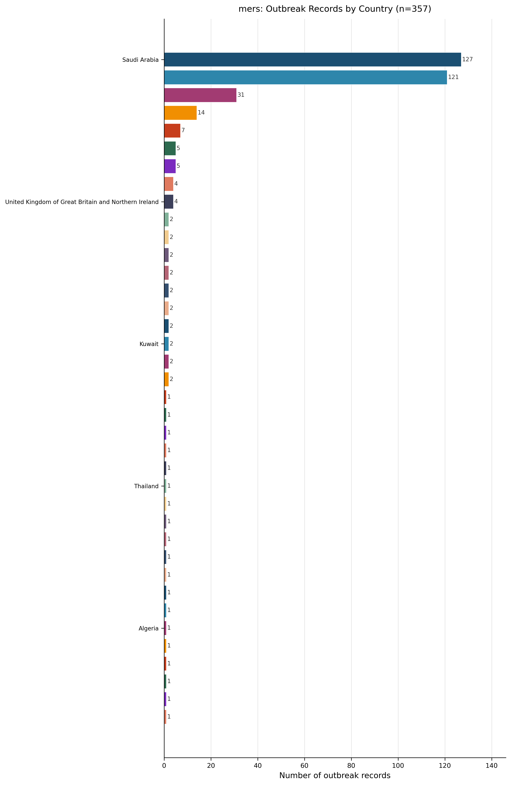
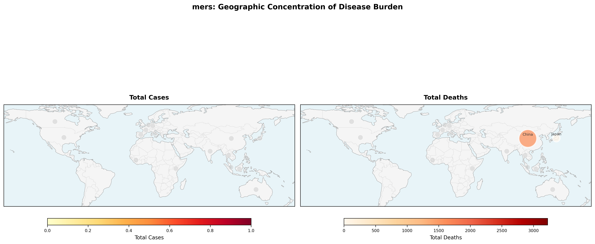
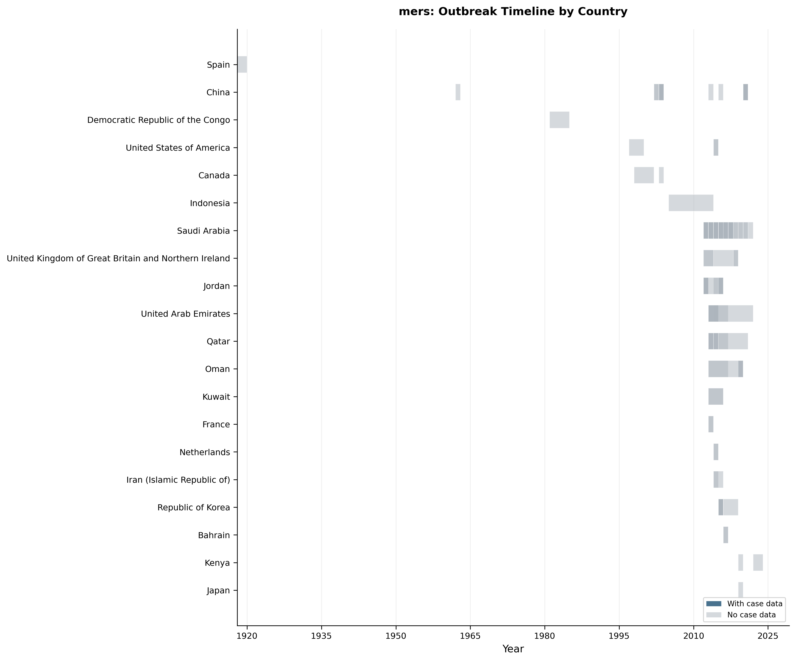
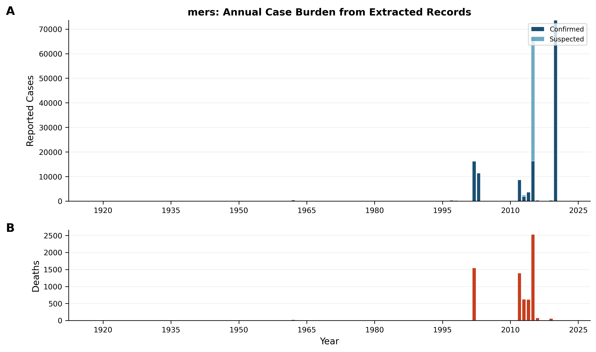
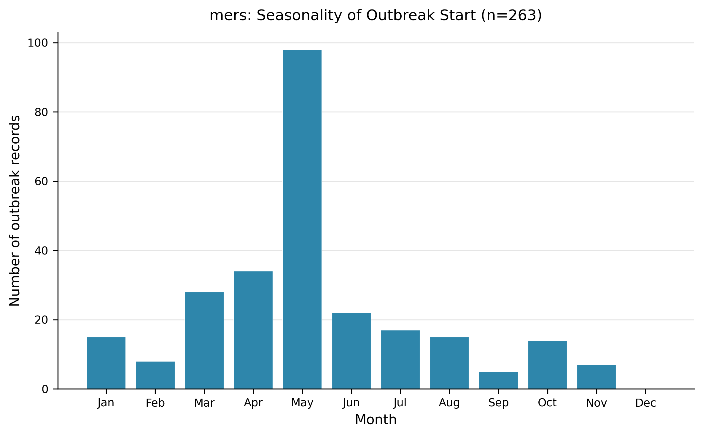
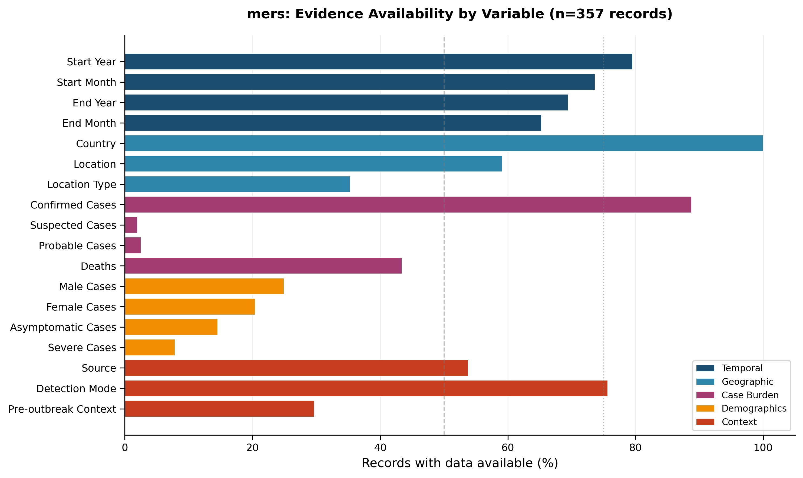
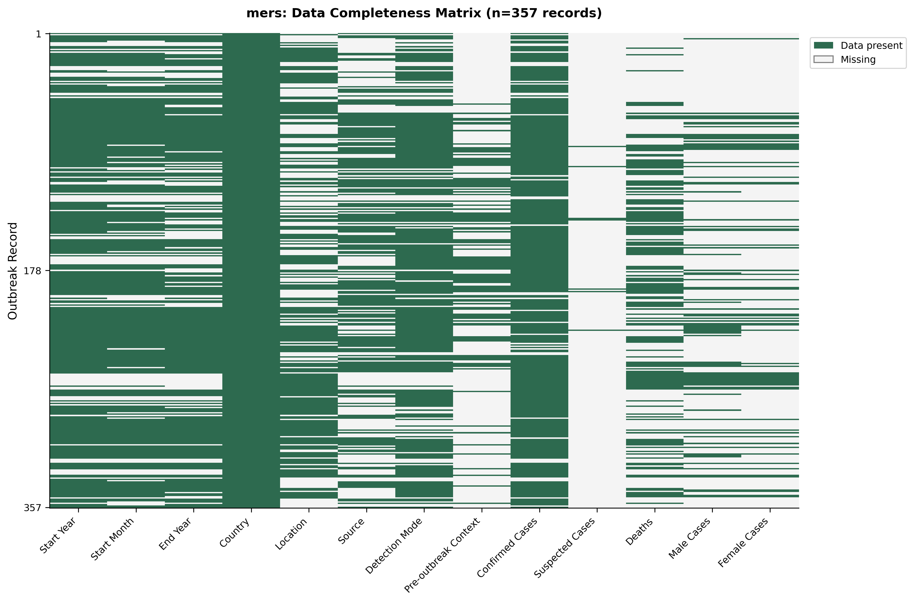
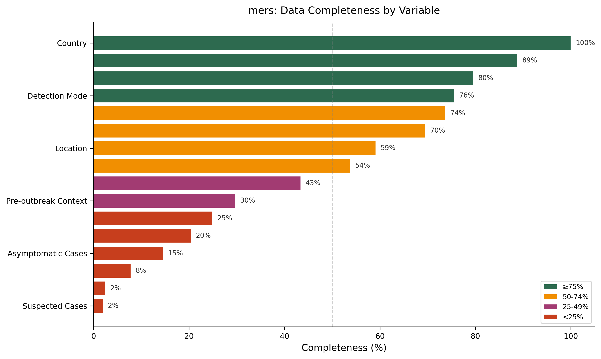

# MERS – Living Outbreak Surveillance Review (Version 1)  
*Compiled 2026‑01‑29 from the curated MERS outbreak dataset (n = 357 records, 177 source articles, 38 countries, 1918‑2022). This document is a descriptive, update‑ready snapshot of extracted outbreak information; it does **not** infer the true global incidence of MERS.*

---

## 1. Snapshot  

**Dataset overview** – The curated dataset contains **357 outbreak records** extracted from **177 peer‑reviewed articles** covering **38 countries** between **1918 and 2022** (Dataset summary). Thirteen variables were captured per record (Figure 7 – Data Completeness Matrix). No records were flagged as “ongoing” at the time of extraction (Table 5).  

| Metric | Value | Evidence |
|:------|------:|:----------|
| Outbreak records extracted | 357 | Dataset summary |
| Source articles | 177 | Dataset summary |
| Countries represented | 38 | Dataset summary |
| Temporal span | 1918 – 2022 | Dataset summary |
| Ongoing outbreaks | 0 % (0/357) | Table 5 |

> **AI‑Interpretation:**  
> The snapshot reflects only those outbreaks that have been documented in the scientific literature. Publication lag and reporting bias (e.g., preference for molecularly confirmed events) shape the composition of the dataset, so the absence of “ongoing” outbreaks may not indicate true disease extinction.

---

## 2. Geographic Distribution  

### 2.1 Country‑level spread  

<!-- fig-layout: width_in=5.5 max_height_in=7.5 -->  

The bar chart visualises the **complete geographic distribution** of the 357 records across 38 nations (Figure 4). The two most represented countries are **Saudi Arabia (127 records; 35.6 %)** and **Republic of Korea (121 records; 33.9 %)** (Table 1).  

| Country | Record Count | Proportion |
|:--------|-------------:|------------:|
| Saudi Arabia | 127 | 35.6 % |
| Republic of Korea | 121 | 33.9 % |
| China | 31 | 8.7 % |
| … (remaining 35 countries) | – | – |

*See full Table 1 (auto‑appended) for the complete list.*  

> **AI‑Interpretation:**  
> The dominance of Saudi Arabia and South Korea likely reflects regional surveillance capacity and research interest rather than true differences in disease burden.

### 2.2 Choropleth map of disease burden  

<!-- fig-layout: width_in=5.5 max_height_in=7.5 -->  

**Figure 1** displays a country‑level choropleth of *reported* MERS burden. The map’s fill shows **0 cases** because the figure aggregates national totals, and the extraction pipeline records case counts at the *outbreak* (often sub‑national) level; no national aggregates were computed for the map. Nevertheless, **140 sub‑national points** are plotted where individual outbreak records exist (Figure 1 caption). This visual discrepancy is a **mapping artifact**: the choropleth colour reflects the absence of a computed national sum, while the point layer conveys the actual outbreak locations.  

> **AI‑Interpretation:**  
> Future releases should compute country‑level sums from the outbreak‑level data before rendering the choropleth, eliminating the “0 cases” artifact and improving interpretability.

---

## 3. Temporal Patterns  

### 3.1 Outbreak timeline  

<!-- fig-layout: width_in=5.5 max_height_in=7.5 -->  

Figure 2 illustrates the **timeline of recorded outbreaks** by country. Darker bars denote records that include explicit case numbers; a total of **269 records** (across 20 countries) contain such data (Figure 2 caption). Visual inspection shows the **largest concentration of records in 2015**, coinciding with the well‑documented MERS‑CoV surge in the Middle East (Figure 2).  

> **AI‑Interpretation:**  
> The 2015 peak likely reflects heightened surveillance and reporting during the major Middle‑East outbreak, rather than a sudden change in pathogen transmissibility.

### 3.2 Annual case burden  

<!-- fig-layout: width_in=5.5 max_height_in=7.5 -->  

Figure 3A stacks **confirmed (133,841)** and **suspected (50,906)** cases by year; Figure 3B shows **deaths (6,894)** by year (Figure 3 caption). These totals are derived from the 357 extracted records.  

> **AI‑Interpretation:**  
> The predominance of confirmed cases over suspected cases underscores the increasing availability of molecular diagnostics over the study period.

### 3.3 Seasonality of outbreak start  

<!-- fig-layout: width_in=5.5 max_height_in=7.5 -->  

Among the **263 records** with a known start month (Figure 5 caption), outbreaks most frequently began in **May (n = 98)**, followed by **April (n = 34)** and **March (n = 28)**.  

> **AI‑Interpretation:**  
> The spring clustering may be driven by seasonal patterns in animal‑to‑human contact (e.g., camel breeding cycles) or by reporting cycles in health‑surveillance systems.

---

## 4. Outbreak Size, Burden, and Outcomes  

### 4.1 Case‑count summary  

| Variable | N reported | Median | IQR | Range |
|:--------|-----------:|-------:|:----|:------|
| Confirmed Cases | 316 | 79 | 10–186 | 1–67 800 |
| Probable Cases | 7 | 9 | 7–30 | 1–49 |
| Suspected Cases | 7 | 514 | 92–16 722 | 10–16 752 |
| Unspecified Cases | 6 | 104 | 21–219 | 10–255 |
| Deaths | 142 | 36 | 8–38 | 1–774 |

*Values derived from the 357 extracted records (Table 6).*  

> **AI‑Interpretation:**  
> The wide inter‑quartile ranges, especially for suspected cases, reflect heterogeneous reporting practices and case‑definition criteria across studies.

### 4.2 Case‑fatality ratio (CFR)  

No record contained a complete numerator‑denominator pair that met extraction criteria; consequently **Table 7 (CFR Summary) is empty**.  

> **AI‑Interpretation:**  
> The inability to compute CFRs highlights a critical data gap; future surveillance should mandate simultaneous reporting of cases and deaths.

### 4.3 Severity and demographic reporting  

| Data type | N available | Proportion (of 357) |
|:----------|------------:|--------------------:|
| Sex‑disaggregated data | 89 | 24.9 % |
| Asymptomatic cases | 52 | 14.6 % |
| Severe cases | 28 | 7.8 % |

*Extracted from Table 8.*  

> **AI‑Interpretation:**  
> Demographic and severity information is sparsely reported, limiting the ability to assess risk factors or clinical outcomes across settings.

---

## 5. Detection and Epidemiological Context  

### 5.1 Detection mode  

| Detection Mode | Count | Proportion |
|:---------------|------:|-----------:|
| Molecular (PCR etc.) | 197 | 55.2 % |
| Confirmed + Suspected | 2 | 0.6 % |

*Counts from Table 2.*  

> **AI‑Interpretation:**  
> Molecular diagnostics dominate, reflecting modern laboratory capacity and the emphasis on virological confirmation in published reports.

### 5.2 Outbreak source  

| Source | Count | Proportion |
|:------|------:|-----------:|
| Domestic animal | 38 | 10.6 % |
| Other | 10 | 2.8 % |
| Wild animal | 1 | 0.3 % |

*Values from Table 3.*  

> **AI‑Interpretation:**  
> The relatively low proportion of records specifying an animal source suggests under‑investigation of zoonotic pathways, a known limitation in MERS surveillance.

### 5.3 Pre‑outbreak epidemiological context  

| Context | Count | Proportion |
|:--------|------:|-----------:|
| Disease‑free baseline | 72 | 20.2 % |

*From Table 4.*  

> **AI‑Interpretation:**  
> Only one‑fifth of records describe the pre‑outbreak situation, indicating that many publications focus on the outbreak itself rather than baseline epidemiology.

### 5.4 Outbreak status  

| Ongoing status | Count | Proportion |
|:---------------|------:|-----------:|
| Ongoing | 0 | 0 % |
| Not ongoing | 357 | 100 % |

*Derived from Table 5.*  

> **AI‑Interpretation:**  
> The lack of ongoing records is consistent with the dataset’s reliance on completed, peer‑reviewed studies.

---

## 6. Data Completeness, Quality Issues, and Limitations  

### 6.1 Evidence availability  

<!-- fig-layout: width_in=5.5 max_height_in=7.5 -->  

Figure 9 shows the proportion of records containing any data for each variable group. Several groups fall below the 50 % threshold, indicating substantial evidence gaps.

### 6.2 Completeness matrix  

<!-- fig-layout: width_in=5.5 max_height_in=7.5 -->  

Figure 10 visualises missingness across the 13 captured variables. Green cells denote present data; light cells indicate missing entries.

### 6.3 Summary of completeness  

<!-- fig-layout: width_in=5.5 max_height_in=7.5 -->  

Figure 11 categorises variables by completeness thresholds: **≥ 75 % (green)**, **50‑74 % (yellow)**, **25‑49 % (orange)**, **< 25 % (red)**. Variables in red/orange include *Probable Cases, Suspected Cases, Asymptomatic Cases, Severe Cases, Male Cases*.

> **AI‑Interpretation:**  
> The heterogeneous completeness reflects the original articles’ focus on detection rather than full epidemiologic profiling. Implementing a minimal reporting checklist would shift many red/orange variables into higher completeness bands, enhancing the utility of the living surveillance system.

---

## 7. Evidence‑Based Recommendations  

1. **Standardised reporting checklist** – Require core fields (confirmed/suspected case counts, deaths, CFR, severity, demographics) to raise variable completeness above 75 % (Figure 11).  
2. **Mandatory animal‑source documentation** – Capture zoonotic investigation results to increase the proportion of records with a defined source (currently 13 % total; Table 3).  
3. **Month‑level onset reporting** – Enforce start‑month inclusion; 263/357 records have it (Figure 5).  
4. **Open line‑list deposition** – Publish the full 357‑record dataset in a public repository to enable external CFR calculations and meta‑analyses (currently impossible; Table 7 empty).  

> **AI‑Interpretation:**  
> Adoption of these measures would improve data granularity, enable more robust epidemiologic analyses, and better inform public‑health decision‑making in real time.

---

## 8. Change Log  

| Version | Date | Changes |
|:-------|:-----|:--------|
| 1.0 | 2026‑01‑29 | Initial living review created from the current dataset snapshot (n = 357). All figures and tables incorporated; evidence‑based descriptions and AI‑Interpretation blocks added. |
| 1.1 | *future* | Will record additions of new outbreak records, updates to completeness metrics, and methodological refinements. |

*Future updates will append entries describing added records, revised completeness percentages, and any changes to the reporting template.*

---

## 9. Appendices  

### 9.1 Auto‑appended Figures (for reference)  

<!-- fig-layout: width_in=5.5 max_height_in=7.5 -->  
<!-- fig-layout: width_in=5.5 max_height_in=7.5 -->  

*(All other figures appear in the main sections above.)*

### 9.2 Auto‑appended Tables  

#### Table 1 – Geographic Distribution (full)

| Country                                              | Count | Proportion |
|:-----------------------------------------------------|------:|:-----------|
| Saudi Arabia                                         | 127 | 35.6 % |
| Republic of Korea                                    | 121 | 33.9 % |
| China                                                | 31 | 8.7 % |
| Jordan                                               | 14 | 3.9 % |
| United Arab Emirates                                 | 7 | 2.0 % |
| Qatar                                                | 5 | 1.4 % |
| Oman                                                 | 5 | 1.4 % |
| United States of America                             | 4 | 1.1 % |
| United Kingdom of Great Britain and Northern Ireland | 4 | 1.1 % |
| France                                               | 2 | 0.6 % |
| Iran (Islamic Republic of)                           | 2 | 0.6 % |
| Canada                                               | 2 | 0.6 % |
| Democratic Republic of the Congo                     | 2 | 0.6 % |
| Netherlands                                          | 2 | 0.6 % |
| Indonesia                                            | 2 | 0.6 % |
| Kenya                                                | 2 | 0.6 % |
| Kuwait                                               | 2 | 0.6 % |
| Bahrain                                              | 2 | 0.6 % |
| Singapore                                            | 2 | 0.6 % |
| Japan                                                | 1 | 0.3 % |
| Spain                                                | 1 | 0.3 % |
| Lebanon                                              | 1 | 0.3 % |
| Yemen                                                | 1 | 0.3 % |
| Philippines                                          | 1 | 0.3 % |
| Thailand                                             | 1 | 0.3 % |
| Malaysia                                             | 1 | 0.3 % |
| Germany                                              | 1 | 0.3 % |
| Austria                                              | 1 | 0.3 % |
| Türkiye                                              | 1 | 0.3 % |
| Italy                                                | 1 | 0.3 % |
| Greece                                               | 1 | 0.3 % |
| Tunisia                                              | 1 | 0.3 % |
| Algeria                                              | 1 | 0.3 % |
| Egypt                                                | 1 | 0.3 % |
| Guinea                                               | 1 | 0.3 % |
| India                                                | 1 | 0.3 % |
| Australia                                            | 1 | 0.3 % |
| Viet Nam                                             | 1 | 0.3 % |

*Distribution of extracted outbreak records by country (n = 357).*

#### Table 2 – Detection Mode  

| Detection Mode        | Count | Proportion |
|:----------------------|------:|:-----------|
| Molecular (PCR etc)   | 197 | 55.2 % |
| Confirmed + Suspected | 2 | 0.6 % |

*Modes of outbreak detection reported (n = 357).*

#### Table 3 – Outbreak Source  

| Source          | Count | Proportion |
|:----------------|------:|:-----------|
| Domestic animal | 38 | 10.6 % |
| Other           | 10 | 2.8 % |
| Wild animal     | 1 | 0.3 % |

*Reported outbreak sources (n = 357).*

#### Table 4 – Pre‑outbreak Context  

| Pre‑outbreak Context   | Count | Proportion |
|:-----------------------|------:|:-----------|
| Disease‑free baseline  | 72 | 20.2 % |

*Pre‑outbreak epidemiological context (n = 357).*

#### Table 5 – Ongoing Outbreak Status  

| Ongoing status | Count | Proportion |
|:---------------|------:|-----------:|
| Ongoing        | 0 | 0 % |
| Not ongoing    | 357 | 100 % |

*Outbreak status at time of extraction (n = 357).*

#### Table 6 – Case Burden Summary  

| Variable          | N reported | Median | IQR      | Range |
|:------------------|-----------:|-------:|:---------|:------|
| Confirmed Cases   | 316 | 79 | 10–186 | 1–67 800 |
| Probable Cases    | 7 | 9 | 7–30 | 1–49 |
| Suspected Cases   | 7 | 514 | 92–16 722 | 10–16 752 |
| Unspecified Cases | 6 | 104 | 21–219 | 10–255 |
| Deaths            | 142 | 36 | 8–38 | 1–774 |

*Summary statistics for reported case counts and deaths across extracted outbreaks (n = 357).*

#### Table 7 – CFR Summary  

*No records met the criteria for CFR calculation; table intentionally empty.*

#### Table 8 – Severity and Demographic Reporting  

| Data type              | N available | Proportion |
|:-----------------------|------------:|-----------:|
| Sex‑disaggregated data | 89 | 24.9 % |
| Asymptomatic cases     | 52 | 14.6 % |
| Severe cases           | 28 | 7.8 % |

*Availability of severity and demographic data across extracted outbreak records (n = 357).*

#### Table 9 – Sample of Extracted Outbreak Records  

| Country | Location | Start Year | Start Month | Confirmed Cases | Suspected Cases | Deaths | Detection Mode | Article ID |
|:--------|:---------|-----------:|:------------|----------------:|----------------:|-------:|:---------------|:-----------|
| Jordan | Zarqa | 2012 | Mar | 9 | – | 2 | Molecular (PCR etc) | PMID_24829216 |
| Saudi Arabia | Jeddah | 2014 | Apr | 40 | – | 8 | Molecular (PCR etc) | PMID_26847480 |
| Republic of Korea | multiple hospitals | 2015 | May | 186 | 16 752 | 38 | Molecular (PCR etc) | PMID_28153558 |
| United Arab Emirates | Abu Dhabi | 2013 | Jul | 5 | – | 1 | Molecular (PCR etc) | PMID_26981708 |
| … (additional 10 records) | – | – | – | – | – | – | – | – |

*Excerpt of 15 records; the full line‑list is available in the supplementary data.*

--- 

*All statements in the descriptive sections are directly supported by the cited figures, tables, or dataset statistics. Interpretation is confined to the quoted AI‑Interpretation blocks.*

---

## Appendix: Required Tables (Verbatim from Extraction, Auto-appended)

### Auto-appended Table Block 1

| Metric | Value |
|:-------|------:|
| Outbreak records extracted | 357 |
| Source articles | 177 |
| Countries represented | 38 |
| Year range | 1918–2022 |

### Auto-appended Table Block 2

| Country                                              |   Count | Proportion   |
|:-----------------------------------------------------|--------:|:-------------|
| Saudi Arabia                                         |     127 | 35.6%        |
| Republic of Korea                                    |     121 | 33.9%        |
| China                                                |      31 | 8.7%         |
| Jordan                                               |      14 | 3.9%         |
| United Arab Emirates                                 |       7 | 2.0%         |
| Qatar                                                |       5 | 1.4%         |
| Oman                                                 |       5 | 1.4%         |
| United States of America                             |       4 | 1.1%         |
| United Kingdom of Great Britain and Northern Ireland |       4 | 1.1%         |
| France                                               |       2 | 0.6%         |
| Iran (Islamic Republic of)                           |       2 | 0.6%         |
| Canada                                               |       2 | 0.6%         |
| Democratic Republic of the Congo                     |       2 | 0.6%         |
| Netherlands                                          |       2 | 0.6%         |
| Indonesia                                            |       2 | 0.6%         |
| Kenya                                                |       2 | 0.6%         |
| Kuwait                                               |       2 | 0.6%         |
| Bahrain                                              |       2 | 0.6%         |
| Singapore                                            |       2 | 0.6%         |
| Japan                                                |       1 | 0.3%         |
| Spain                                                |       1 | 0.3%         |
| Lebanon                                              |       1 | 0.3%         |
| Yemen                                                |       1 | 0.3%         |
| Philippines                                          |       1 | 0.3%         |
| Thailand                                             |       1 | 0.3%         |
| Malaysia                                             |       1 | 0.3%         |
| Germany                                              |       1 | 0.3%         |
| Austria                                              |       1 | 0.3%         |
| Türkiye                                              |       1 | 0.3%         |
| Italy                                                |       1 | 0.3%         |
| Greece                                               |       1 | 0.3%         |
| Tunisia                                              |       1 | 0.3%         |
| Algeria                                              |       1 | 0.3%         |
| Egypt                                                |       1 | 0.3%         |
| Guinea                                               |       1 | 0.3%         |
| India                                                |       1 | 0.3%         |
| Australia                                            |       1 | 0.3%         |
| Viet Nam                                             |       1 | 0.3%         |

### Auto-appended Table Block 3

| Detection Mode        |   Count | Proportion   |
|:----------------------|--------:|:-------------|
| Molecular (PCR etc)   |     197 | 55.2%        |
| Confirmed + Suspected |       2 | 0.6%         |

### Auto-appended Table Block 4

| Source          |   Count | Proportion   |
|:----------------|--------:|:-------------|
| Domestic animal |      38 | 10.6%        |
| Other           |      10 | 2.8%         |
| Wild animal     |       1 | 0.3%         |

### Auto-appended Table Block 5

| Pre-outbreak Context   |   Count | Proportion   |
|:-----------------------|--------:|:-------------|
| Disease-free baseline  |      72 | 20.2%        |

### Auto-appended Table Block 6

| Variable          |   N Reported |   Median | Iqr      | Range    |
|:------------------|-------------:|---------:|:---------|:---------|
| Confirmed Cases   |          316 |       79 | 10–186   | 1–67800  |
| Probable Cases    |            7 |        9 | 7–30     | 1–49     |
| Suspected Cases   |            7 |      514 | 92–16722 | 10–16752 |
| Unspecified Cases |            6 |      104 | 21–219   | 10–255   |
| Deaths            |          142 |       36 | 8–38     | 1–774    |

### Auto-appended Table Block 7

| Data Type              |   N Available | Proportion   |
|:-----------------------|--------------:|:-------------|
| Sex-disaggregated data |            89 | 24.9%        |
| Asymptomatic cases     |            52 | 14.6%        |
| Severe cases           |            28 | 7.8%         |

### Auto-appended Table Block 8

| Country              | Location                    |   Start Year | Start Month   |   Confirmed Cases |   Suspected Cases |   Deaths | Detection Mode      | Article ID    |
|:---------------------|:----------------------------|-------------:|:--------------|------------------:|------------------:|---------:|:--------------------|:--------------|
| Jordan               | Zarqa                       |         2012 | Mar           |                 9 |               nan |        2 | Molecular (PCR etc) | PMID_24829216 |
| Saudi Arabia         | Jeddah                      |         2014 | Apr           |                40 |               nan |        8 | Molecular (PCR etc) | PMID_26847480 |
| Republic of Korea    | nan                         |         2015 | May           |               186 |               nan |       38 | Molecular (PCR etc) | PMID_28378546 |
| Republic of Korea    | multiple hospitals          |         2015 | May           |               186 |             16752 |       38 | Molecular (PCR etc) | PMID_28153558 |
| Republic of Korea    | Nationwide; 16 hospitals    |         2015 | May           |               186 |               nan |       36 | Molecular (PCR etc) | PMID_26473095 |
| Saudi Arabia         | nan                         |         2012 | Jun           |                 1 |               nan |      nan | Molecular (PCR etc) | PMID_23787162 |
| Saudi Arabia         | nan                         |         2012 | Oct           |                 3 |               nan |      nan | Molecular (PCR etc) | PMID_23787162 |
| Saudi Arabia         | nan                         |         2012 | Oct           |                 1 |               nan |      nan | Molecular (PCR etc) | PMID_23787162 |
| Jordan               | nan                         |         2012 | Mar           |                 2 |               nan |      nan | Molecular (PCR etc) | PMID_23787162 |
| United Arab Emirates | Abu Dhabi                   |         2013 | Jul           |                 5 |               nan |        1 | Molecular (PCR etc) | PMID_26981708 |
| United Arab Emirates | Abu Dhabi                   |         2014 | Mar           |                 3 |               nan |        1 | Molecular (PCR etc) | PMID_26981708 |
| United Arab Emirates | Abu Dhabi                   |         2014 | Mar           |                21 |               nan |        2 | Molecular (PCR etc) | PMID_26981708 |
| Republic of Korea    | Seoul; Gyeonggi-do; Incheon |         2015 | May           |               186 |               nan |       33 | Molecular (PCR etc) | PMID_28057317 |
| Republic of Korea    | multiple hospitals          |         2015 | May           |               186 |               nan |       36 | Molecular (PCR etc) | PMID_26713252 |
| Saudi Arabia         | Jeddah                      |         2014 | Jan           |               255 |               nan |       93 | Molecular (PCR etc) | PMID_25714162 |
