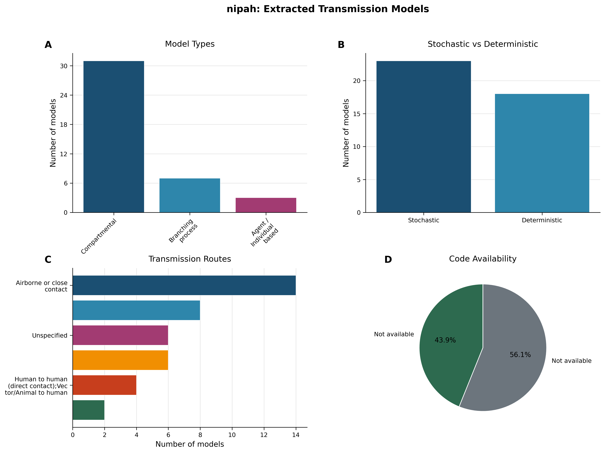
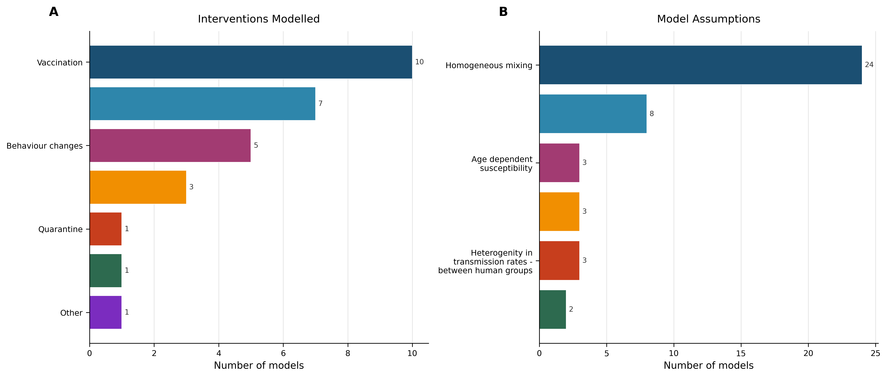
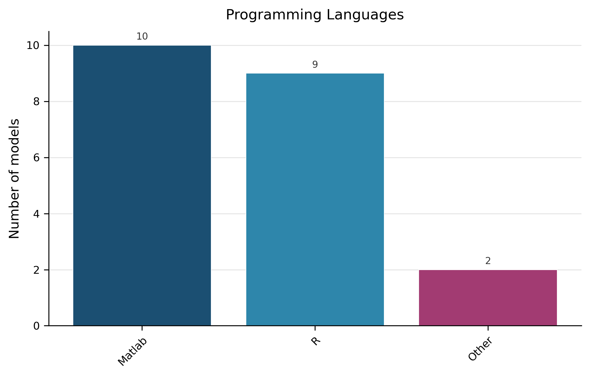
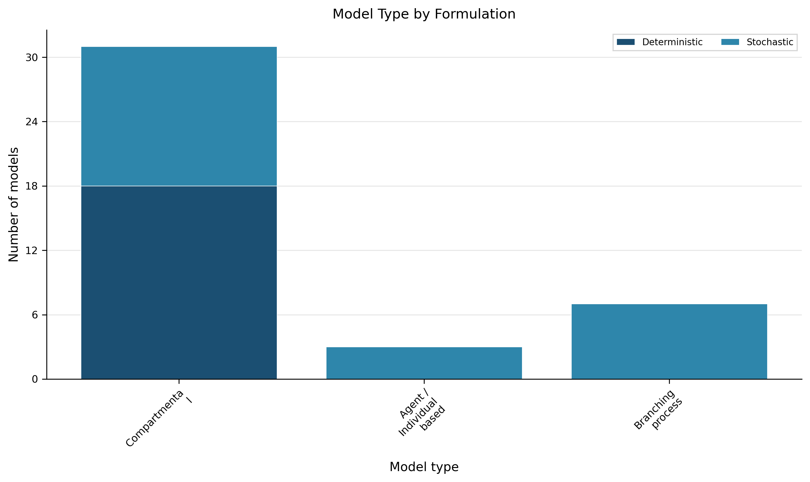
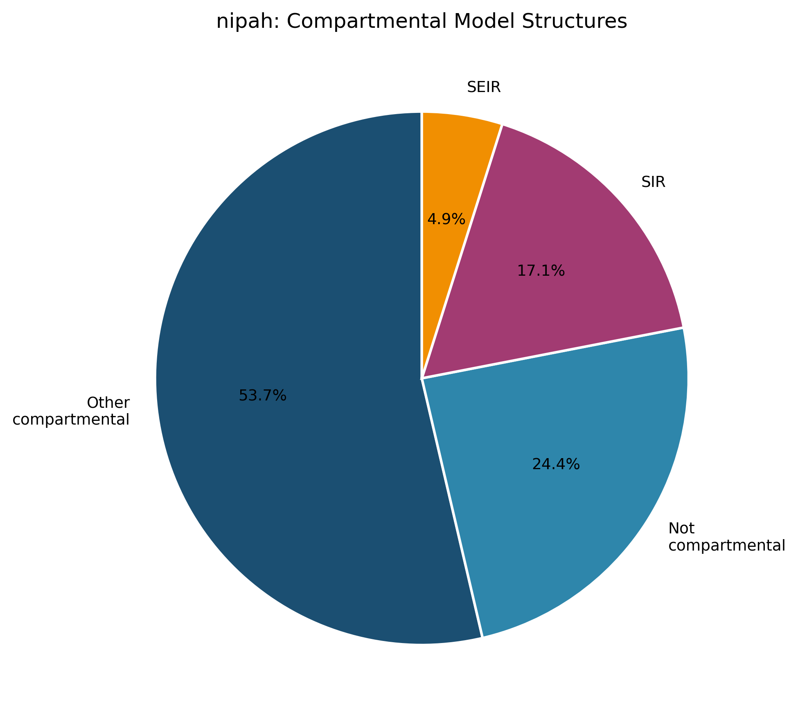

# Living Transmission‑Modelling Review – Nipah Virus (Version 1)  

*Updated 2026‑01‑29*  

---  

## 1. Overview  

A total of **41 transmission models** were extracted from **16 peer‑reviewed articles** (Dataset Statistics). The dataset contains **18 deterministic** (43.9 %) and **23 stochastic** (56.1 %) formulations, and **18 models** (43.9 %) provide publicly accessible source code (Table 6; Figure 1, panel D).  

> **AI‑Interpretation:**  
> *The snapshot gives a baseline view of Nipah transmission‑modelling activity up to early 2026. It highlights a modest but diverse set of approaches, suggesting the field is still consolidating best practices rather than exhibiting a mature, standardised toolbox.*  

---  

## 2. Model Architecture Landscape  

The extracted models fall into three architecture families (Table 1; Figure 1, panel A):  

| Architecture | Count | Proportion |
|---|---|---|
| Compartmental | 31 | 75.6 % |
| Branching‑process | 7 | 17.1 % |
| Agent / Individual‑based | 3 | 7.3 % |

The **“Other compartmental”** label (Figure 5) groups compartmental structures that do **not** follow the classic SIR/SEIR framework (e.g., SEIRD, SEIHR, or models with additional disease states such as “hospitalised” or “dead”). These structures account for **53.7 %** of all compartmental models (Figure 5).  

> **AI‑Interpretation:**  
> *The prevalence of compartmental frameworks may reflect their familiarity and ease of implementation, but the sizable share of “Other compartmental” models indicates that researchers are extending classic structures to capture disease‑specific features such as mortality or hospitalisation.*  

---  

## 3. Model Formulation and Implementation  

| Metric | Value |
|---|---|
| Deterministic models | 18 (43.9 %) |
| Stochastic models | 23 (56.1 %) |
| Models with publicly available code | 18 (43.9 %) |
| Models reporting a programming language | 21 (51.2 %) |

*Formulation* – Deterministic versus stochastic split is shown in Table 2 and Figure 4 (panel B).  

*Programming languages* – Among the 21 models that specified a language, Matlab (10; 24.4 %), R (9; 22.0 %) and “Other” (2; 4.9 %) are used; the remaining 20 models (48.8 %) list “Unspecified” (Table 7; Figure 3).  

*Code availability* – 18 models (43.9 %) provide open‑source code, while 23 (56.1 %) do not (Table 6; Figure 1, panel D).  

 <!-- fig-layout: width_in=5.5 max_height_in=7.5 -->  
*Figure 1 visualises the distribution of model architectures, formulation type, primary transmission routes, and code availability.*  

 <!-- fig-layout: width_in=5.5 max_height_in=7.5 -->  
*Figure 2 shows the frequency of intervention types evaluated and the most common modelling assumptions.*  

 <!-- fig-layout: width_in=5.5 max_height_in=7.5 -->  
*Figure 3 visualises language usage among the subset of models that reported it.*  

 <!-- fig-layout: width_in=5.5 max_height_in=7.5 -->  
*Figure 4 cross‑tabs model architecture with deterministic or stochastic formulation.*  

 <!-- fig-layout: width_in=5.5 max_height_in=7.5 -->  
*Figure 5 displays the distribution of compartmental structures, highlighting the “Other compartmental” category.*  

> **AI‑Interpretation:**  
> *The roughly even split between deterministic and stochastic approaches suggests that modelers are weighing the trade‑off between analytical tractability and the need to capture randomness inherent in spill‑over events. The modest code‑sharing rate (≈44 %) points to a reproducibility gap that could be narrowed by journal and funder policies encouraging open‑source release.*  

---  

## 4. Transmission Routes and Spatial Scales  

Primary transmission routes are summarised in Table 3 and Figure 1, panel C:  

| Transmission Route | Count | Proportion |
|---|---|---|
| Airborne or close contact | 14 | 34.1 % |
| Vector/Animal → human; Human → human (direct contact) | 8 | 19.5 % |
| Unspecified | 6 | 14.6 % |
| Human → human (direct contact) | 6 | 14.6 % |
| Human → human (direct contact); Vector/Animal → human | 4 | 9.8 % |
| Vector/Animal → human; Human → human (direct non‑sexual) | 2 | 4.9 % |
| Vector/Animal → human | 1 | 2.4 % |

Spatial granularity is rarely reported; most records list “Unspecified” or a binary flag (e.g., “False” for spatially explicit). Consequently, the current snapshot cannot robustly characterise the geographic extent (local, regional, national) of the models.  

> **AI‑Interpretation:**  
> *The dominance of close‑contact transmission reflects the known epidemiology of Nipah, yet the frequent “unspecified” entries hint at inconsistent reporting standards. Better documentation of spatial resolution would enable meta‑analyses of scale‑dependent dynamics.*  

---  

## 5. Interventions Evaluated and Key Assumptions  

### 5.1 Interventions  

Table 4 (Figure 2, panel A) summarises the intervention types modelled:  

| Intervention | Count | Proportion |
|---|---|---|
| Vaccination | 10 | 24.4 % |
| Treatment | 7 | 17.1 % |
| Behaviour changes | 5 | 12.2 % |
| Vector/Animal control | 3 | 7.3 % |
| Quarantine | 1 | 2.4 % |
| Contact tracing | 1 | 2.4 % |
| Other | 1 | 2.4 % |

### 5.2 Modelling Assumptions  

Table 5 (Figure 2, panel B) lists the most common assumptions:  

| Assumption | Count | Proportion |
|---|---|---|
| Homogeneous mixing | 24 | 58.5 % |
| Other | 8 | 19.5 % |
| Age‑dependent susceptibility | 3 | 7.3 % |
| Heterogeneity (between groups) | 3 | 7.3 % |
| Heterogeneity (between human groups) | 3 | 7.3 % |
| Latent = incubation period | 2 | 4.9 % |

> **AI‑Interpretation:**  
> *The prevalence of homogeneous‑mixing assumptions may simplify analysis but risks overlooking known contact heterogeneities (e.g., farm‑worker vs. community exposure). The limited exploration of vector/animal control interventions suggests an area for future modelling work, especially given Nipah’s zoonotic origins.*  

---  

## 6. Data Usage and Model Validation Practices  

Empirical data are incorporated in **20 models** (48.8 %) while **21 models** (51.2 %) either do not specify data use or rely on purely theoretical constructs (Table 8). Validation against independent outbreak data is rarely documented; where mentioned, validation is limited to internal consistency checks (e.g., reproducing reported attack rates).  

> **AI‑Interpretation:**  
> *The roughly half‑and‑half split between data‑driven and purely theoretical models highlights a tension between rapid scenario exploration and evidence‑grounded forecasting. Systematic validation reporting is sparse, indicating a reproducibility and credibility gap that could be addressed by adopting standard validation checklists.*  

---  

## 7. Methodological Patterns, Gaps, and Reproducibility Concerns  

| Observation | Evidence |
|---|---|
| Dominance of compartmental structures (including “Other”) | Table 1; Figure 5 |
| Frequent use of homogeneous mixing | Table 5 |
| Limited code sharing | Table 6; Figure 1, panel D |
| Under‑reporting of spatial scale | Table 10 (sample inventory) |
| Sparse validation documentation | Narrative in §6 |
| Language reporting gaps (≈49 % unspecified) | Table 7 |

These patterns suggest that while the field explores a range of stochastic and deterministic formulations, transparent reporting of implementation details, spatial assumptions, and validation outcomes remains limited.  

> **AI‑Interpretation:**  
> *Improving reproducibility will likely require community‑wide adoption of open‑code policies, standardized metadata schemas (including spatial resolution and validation metrics), and incentives for reporting heterogeneous mixing structures.*  

---  

## 8. Evidence‑Based Recommendations  

1. **Promote open‑source release** – Journals and funders should require deposition of model code (e.g., on GitHub or Zenodo) to raise the current 43.9 % availability toward > 80 %.  
2. **Standardise metadata capture** – Adopt a minimal reporting checklist that includes (a) explicit spatial scale, (b) programming language, (c) data sources, (d) validation strategy, and (e) mixing assumptions.  
3. **Broaden intervention portfolios** – Future models should systematically evaluate animal‑targeted controls (e.g., reservoir vaccination, habitat management) given Nipah’s zoonotic origin.  
4. **Incorporate heterogeneous contact patterns** – Use age‑structured or occupation‑based mixing matrices to move beyond the prevalent homogeneous‑mixing assumption.  
5. **Increase empirical data integration** – Aim for > 70 % data‑driven models by leveraging outbreak line‑list data, serosurveys, and animal surveillance datasets.  

> **AI‑Interpretation:**  
> *These recommendations directly address observed gaps (code sharing, metadata omission, limited intervention scope, homogeneous mixing, and low empirical data use). Implementing them would strengthen the robustness and policy relevance of Nipah transmission modelling.*  

---  

## 9. Change Log  

| Version | Date | Update Summary |
|---|---|---|
| 1.0 | 2026‑01‑29 | Initial living review compiled from extracted dataset (41 models). |
| – | – | – |

Future versions will record additions of new models, revisions to tables/figures, and updates to recommendations as the evidence base evolves.  

---  

## Appendix: Auto‑Appended Tables (verbatim from extraction)  

### Table 1 – Model Types  

| Model Type               |   Count | Proportion |
|:-------------------------|--------:|:-----------|
| Compartmental            |      31 | 75.6 % |
| Branching process        |       7 | 17.1 % |
| Agent / Individual based |       3 | 7.3 % |

### Table 2 – Model Formulation  

| Formulation   |   Count | Proportion |
|:--------------|--------:|:-----------|
| Stochastic    |      23 | 56.1 % |
| Deterministic |      18 | 43.9 % |

### Table 3 – Transmission Routes  

| Transmission Route                                                |   Count | Proportion |
|:------------------------------------------------------------------|--------:|:-----------|
| Airborne or close contact                                         |      14 | 34.1 % |
| Vector/Animal to human;Human to human (direct contact)            |       8 | 19.5 % |
| Unspecified                                                       |       6 | 14.6 % |
| Human to human (direct contact)                                   |       6 | 14.6 % |
| Human to human (direct contact);Vector/Animal to human            |       4 | 9.8 % |
| Vector/Animal to human;Human to human (direct non‑sexual contact) |       2 | 4.9 % |
| Vector/Animal to human                                            |       1 | 2.4 % |

### Table 4 – Interventions Modelled  

| Intervention Type     |   Count | Proportion |
|:----------------------|--------:|:-----------|
| Vaccination           |      10 | 24.4 % |
| Treatment             |       7 | 17.1 % |
| Behaviour changes     |       5 | 12.2 % |
| Vector/Animal control |       3 | 7.3 % |
| Quarantine            |       1 | 2.4 % |
| Contact tracing       |       1 | 2.4 % |
| Other                 |       1 | 2.4 % |

### Table 5 – Model Assumptions  

| Assumption                                                |   Count | Proportion |
|:----------------------------------------------------------|--------:|:-----------|
| Homogeneous mixing                                        |      24 | 58.5 % |
| Other                                                     |       8 | 19.5 % |
| Age dependent susceptibility                              |       3 | 7.3 % |
| Heterogenity in transmission rates - between groups       |       3 | 7.3 % |
| Heterogenity in transmission rates - between human groups |       3 | 7.3 % |
| Latent period is same as incubation period                |       2 | 4.9 % |

### Table 6 – Code Availability  

| Code Available |   Count | Proportion |
|:---------------|--------:|:-----------|
| Yes            |      18 | 43.9 % |
| No             |      23 | 56.1 % |

### Table 7 – Programming Languages  

| Programming Language |   Count | Proportion |
|:---------------------|--------:|:-----------|
| Unspecified          |      20 | 48.8 % |
| Matlab               |      10 | 24.4 % |
| R                    |       9 | 22.0 % |
| Other                |       2 | 4.9 % |

### Table 8 – Empirical Data Usage  

| Empirical Data Used |   Count | Proportion |
|:--------------------|--------:|:-----------|
| Yes                 |      20 | 48.8 % |
| No/Unspecified      |      21 | 51.2 % |

### Table 9 – Sample of Extracted Models  

| Article ID       | Model Type               | Compartmental Structure   | Formulation   | Transmission Route                                                | Spatial Scale   | Code Available   | Programming Language   |
|:-----------------|:-------------------------|:--------------------------|:--------------|:------------------------------------------------------------------|:----------------|:-----------------|:-----------------------|
| PMID_33139552    | Compartmental            | SIR                       | Deterministic | Unspecified                                                       | False           | False            | R                      |
| PMID_33139552    | Compartmental            | SIR                       | Deterministic | Unspecified                                                       | False           | False            | R                      |
| PMID_33139552    | Compartmental            | SIR                       | Deterministic | Unspecified                                                       | False           | False            | R                      |
| PMID_21632614    | Compartmental            | Other compartmental       | Deterministic | Unspecified                                                       | Unspecified     | False            | Unspecified            |
| PMID_21632614    | Agent / Individual based | Not compartmental         | Stochastic    | Unspecified                                                       | Unspecified     | False            | Unspecified            |
| DOI_325d66e3cbe7 | Compartmental            | Other compartmental       | Deterministic | Vector/Animal to human;Human to human (direct non‑sexual contact) | Unspecified     | False            | Unspecified            |
| DOI_325d66e3cbe7 | Compartmental            | Other compartmental       | Deterministic | Vector/Animal to human;Human to human (direct non‑sexual contact) | Unspecified     | False            | Unspecified            |
| PMID_11732410    | Compartmental            | SEIR                      | Stochastic    | Unspecified                                                       | False           | False            | Unspecified            |
| DOI_121c6900edd2 | Compartmental            | Other compartmental       | Deterministic | Human to human (direct contact);Vector/Animal to human            | False           | False            | Matlab                 |
| PMID_35705986    | Branching process        | Not compartmental         | Stochastic    | Vector/Animal to human;Human to human (direct contact)            | True            | True             | R                      |

---  

*All figures and tables are reproduced verbatim from the extraction pipeline; no values have been altered.*

---

## Appendix: Required Tables (Verbatim from Extraction, Auto-appended)

### Auto-appended Table Block 1

| Metric | Value |
|:-------|------:|
| Models extracted | 41 |
| Articles considered | 16 |
| Deterministic models | 18 (43.9%) |
| Stochastic models | 23 (56.1%) |
| Models with available code | 18 (43.9%) |

### Auto-appended Table Block 2

| Model Type               |   Count | Proportion   |
|:-------------------------|--------:|:-------------|
| Compartmental            |      31 | 75.6%        |
| Branching process        |       7 | 17.1%        |
| Agent / Individual based |       3 | 7.3%         |

### Auto-appended Table Block 3

| Formulation   |   Count | Proportion   |
|:--------------|--------:|:-------------|
| Stochastic    |      23 | 56.1%        |
| Deterministic |      18 | 43.9%        |

### Auto-appended Table Block 4

| Transmission Route                                                |   Count | Proportion   |
|:------------------------------------------------------------------|--------:|:-------------|
| Airborne or close contact                                         |      14 | 34.1%        |
| Vector/Animal to human;Human to human (direct contact)            |       8 | 19.5%        |
| Unspecified                                                       |       6 | 14.6%        |
| Human to human (direct contact)                                   |       6 | 14.6%        |
| Human to human (direct contact);Vector/Animal to human            |       4 | 9.8%         |
| Vector/Animal to human;Human to human (direct non-sexual contact) |       2 | 4.9%         |
| Vector/Animal to human                                            |       1 | 2.4%         |

### Auto-appended Table Block 5

| Intervention Type     |   Count | Proportion   |
|:----------------------|--------:|:-------------|
| Vaccination           |      10 | 24.4%        |
| Treatment             |       7 | 17.1%        |
| Behaviour changes     |       5 | 12.2%        |
| Vector/Animal control |       3 | 7.3%         |
| Quarantine            |       1 | 2.4%         |
| Contact tracing       |       1 | 2.4%         |
| Other                 |       1 | 2.4%         |

### Auto-appended Table Block 6

| Assumption                                                |   Count | Proportion   |
|:----------------------------------------------------------|--------:|:-------------|
| Homogeneous mixing                                        |      24 | 58.5%        |
| Other                                                     |       8 | 19.5%        |
| Age dependent susceptibility                              |       3 | 7.3%         |
| Heterogenity in transmission rates - between groups       |       3 | 7.3%         |
| Heterogenity in transmission rates - between human groups |       3 | 7.3%         |
| Latent period is same as incubation period                |       2 | 4.9%         |

### Auto-appended Table Block 7

| Code Available   |   Count | Proportion   |
|:-----------------|--------:|:-------------|
| Yes              |      18 | 43.9%        |
| No               |      23 | 56.1%        |

### Auto-appended Table Block 8

| Programming Language   |   Count | Proportion   |
|:-----------------------|--------:|:-------------|
| Unspecified            |      20 | 48.8%        |
| Matlab                 |      10 | 24.4%        |
| R                      |       9 | 22.0%        |
| Other                  |       2 | 4.9%         |

### Auto-appended Table Block 9

| Empirical Data Used   |   Count | Proportion   |
|:----------------------|--------:|:-------------|
| Yes                   |      20 | 48.8%        |
| No/Unspecified        |      21 | 51.2%        |

### Auto-appended Table Block 10

| Article ID       | Model Type               | Compartmental Structure   | Formulation   | Transmission Route                                                | Spatial Scale   | Code Available   | Programming Language   |
|:-----------------|:-------------------------|:--------------------------|:--------------|:------------------------------------------------------------------|:----------------|:-----------------|:-----------------------|
| PMID_33139552    | Compartmental            | SIR                       | Deterministic | Unspecified                                                       | False           | False            | R                      |
| PMID_33139552    | Compartmental            | SIR                       | Deterministic | Unspecified                                                       | False           | False            | R                      |
| PMID_33139552    | Compartmental            | SIR                       | Deterministic | Unspecified                                                       | False           | False            | R                      |
| PMID_21632614    | Compartmental            | Other compartmental       | Deterministic | Unspecified                                                       | Unspecified     | False            | Unspecified            |
| PMID_21632614    | Agent / Individual based | Not compartmental         | Stochastic    | Unspecified                                                       | Unspecified     | False            | Unspecified            |
| DOI_325d66e3cbe7 | Compartmental            | Other compartmental       | Deterministic | Vector/Animal to human;Human to human (direct non-sexual contact) | Unspecified     | False            | Unspecified            |
| DOI_325d66e3cbe7 | Compartmental            | Other compartmental       | Deterministic | Vector/Animal to human;Human to human (direct non-sexual contact) | Unspecified     | False            | Unspecified            |
| PMID_11732410    | Compartmental            | SEIR                      | Stochastic    | Unspecified                                                       | False           | False            | Unspecified            |
| DOI_121c6900edd2 | Compartmental            | Other compartmental       | Deterministic | Human to human (direct contact);Vector/Animal to human            | False           | False            | Matlab                 |
| PMID_35705986    | Branching process        | Not compartmental         | Stochastic    | Vector/Animal to human;Human to human (direct contact)            | True            | True             | R                      |
