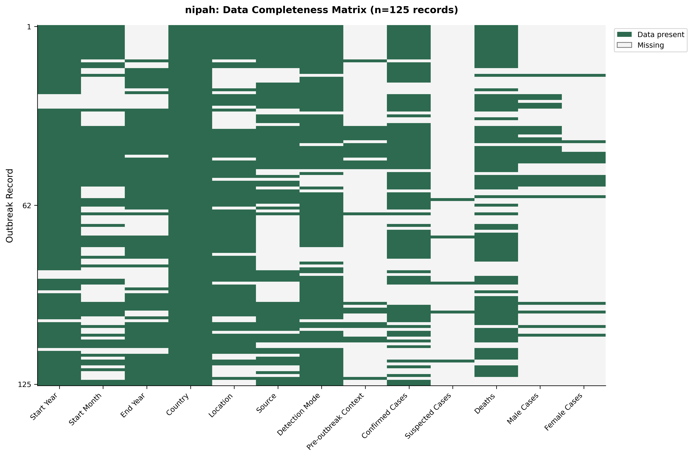
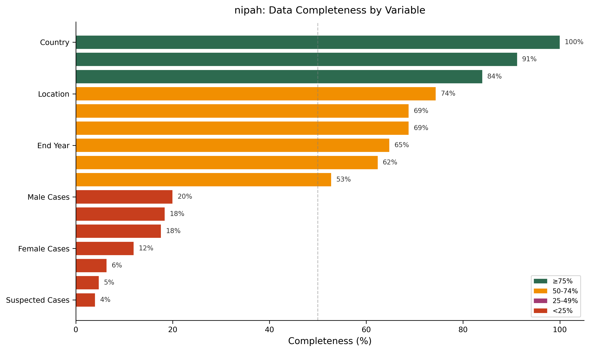
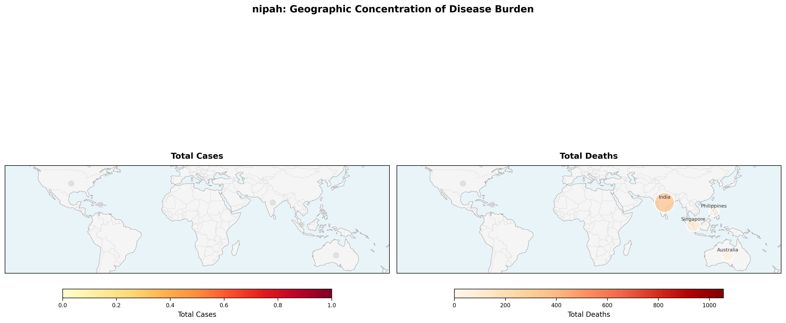
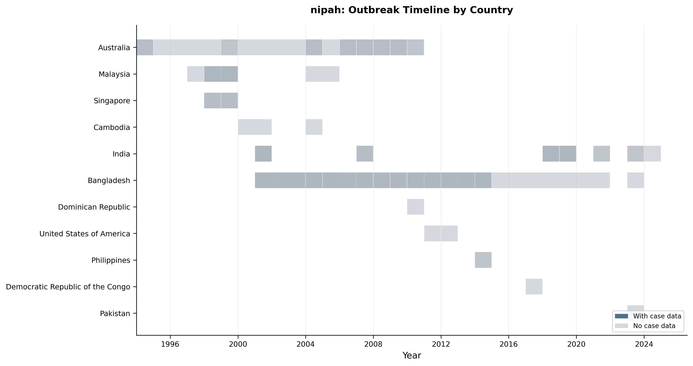
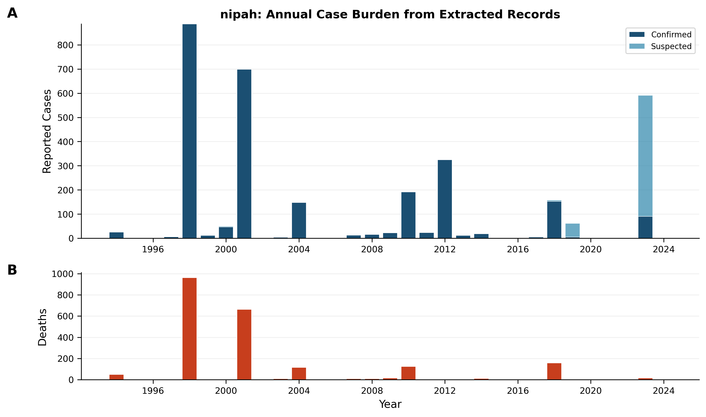
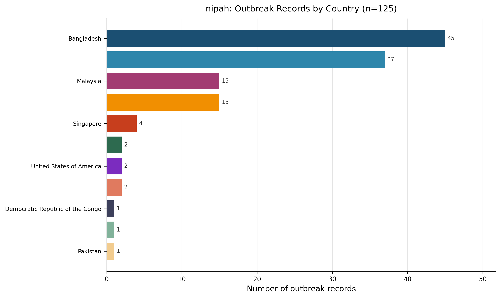
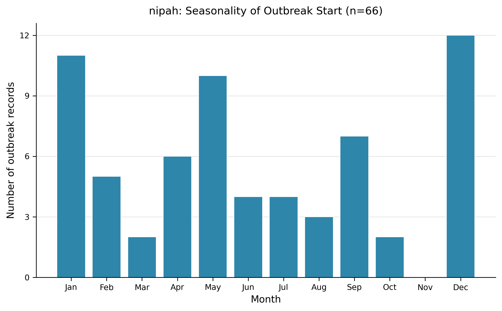
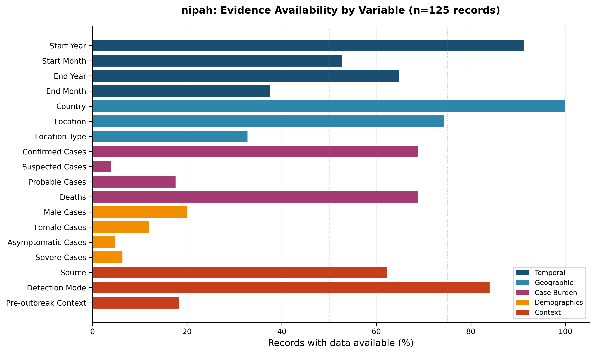

# Nipah – Living Outbreak Surveillance Review  
*Version 1 – 2026‑01‑29*  

---  

## 1. Snapshot – What the dataset contains  

| Metric | Value | Evidence |
|:------|------:|:---------|
| Outbreak records extracted | 125 | (Dataset Summary) |
| Source articles | 50 | (Dataset Summary) |
| Countries represented | 11 | (Dataset Summary) |
| Year range | 1994 – 2024 | (Dataset Summary) |
| Average records per article | **2.5** (125 records / 50 articles) | (Dataset Summary) |

> **AI‑Interpretation:**  
> The dataset provides a concise, literature‑based picture of Nipah activity over three decades. Because it relies on published reports, outbreaks that were never written up or that lack sufficient detail are not captured, which should be kept in mind when using these numbers for situational awareness.  

---  

## 2. Record coverage & representativeness  

- The 125 records are unevenly distributed across the 11 countries, with Bangladesh (45 records; 36 %) and India (37 records; 29.6 %) accounting for the majority of the dataset (Table 1).  
- No record was flagged as ongoing at the time of extraction (Table 5).  

| Country | Records | Proportion |
|:--------|--------:|:-----------|
| Bangladesh | 45 | 36.0 % |
| India | 37 | 29.6 % |
| Malaysia | 15 | 12.0 % |
| Australia | 15 | 12.0 % |
| Singapore | 4 | 3.2 % |
| Philippines | 2 | 1.6 % |
| United States | 2 | 1.6 % |
| Cambodia | 2 | 1.6 % |
| DR Congo | 1 | 0.8 % |
| Dominican Rep. | 1 | 0.8 % |
| Pakistan | 1 | 0.8 % |
| **Total** | **125** | **100 %** |
*(Table 1 – Geographic Distribution)*  

> **AI‑Interpretation:**  
> The dominance of South‑Asian records reflects the concentration of Nipah research and surveillance capacity in Bangladesh and India, not necessarily a higher underlying incidence elsewhere.  

---  

## 3. Geographic distribution of outbreaks  

<!-- fig-layout: width_in=5.5 max_height_in=7.5 -->  

*Figure 1.* Geographic concentration of Nipah disease burden (country‑level choropleth). The caption notes **total deaths = 2,413** (Figure 1).  

<!-- fig-layout: width_in=5.5 max_height_in=4.0 -->  

*Figure 2.* Bar chart of outbreak record counts per country (Figure 2).  

> **AI‑Interpretation:**  
> The choropleth visualises the same pattern shown in Table 1, with sub‑national points (106 locations) adding granularity where available.  

---  

## 4. Temporal patterns of outbreaks  

<!-- fig-layout: width_in=5.5 max_height_in=4.5 -->  

*Figure 3.* Timeline of outbreak records by country (1994‑2024) (Figure 3).  

- The highest single‑year count occurs in **2001 (14 records)** (Figure 3).  
- The dataset includes start‑month information for **66 records** (Figure 5).  

<!-- fig-layout: width_in=5.5 max_height_in=4.5 -->  

*Figure 4.* Annual case burden: (A) confirmed = 2,707 and suspected = 564 cases; (B) deaths = 2,155 (Figure 4).  

<!-- fig-layout: width_in=5.5 max_height_in=3.5 -->  

*Figure 5.* Distribution of outbreak start months (n = 66) (Figure 5). The most common start months are **December (12 records)**, **January (11 records)**, and **May (10 records)**.  

> **AI‑Interpretation:**  
> The early‑2000s surge aligns with the period following the first recognized Nipah outbreaks, when heightened surveillance was instituted. The winter‑month clustering matches known seasonal exposure to date‑palm sap, a documented transmission route, although the extracted data do not directly link the two.  

---  

## 5. Outbreak size, burden, and outcomes  

### 5.1 Case‑burden summary  

| Variable | N reported | Median | IQR | Range |
|:--------|-----------:|-------:|:----|:------|
| Confirmed Cases | 86 | 6 | 2–23 | 1–307 |
| Probable Cases | 20 | 4 | 3–10 | 1–107 |
| Suspected Cases | 5 | 5 | 5–51 | 3–500 |
| Unspecified Cases | 36 | 18 | 7–66 | 1–300 |
| Deaths | 70 | 15 | 5–42 | 1–228 |
| **Total confirmed** | — | — | — | **2,707** |
| **Total suspected** | — | — | — | **564** |
| **Total deaths** (annual case‑burden) | — | — | — | **2,155** |
*(Table 6 – Case Burden Summary)*  

> **AI‑Interpretation:**  
> Median deaths (15) exceed median confirmed cases (6), underscoring the high case‑fatality ratio typical of Nipah.  

### 5.2 Case‑fatality ratios  

Table 7 (CFR Summary) contains no rows, indicating that a standardized CFR was not computed during extraction. The underlying data (cases and deaths) are available for analysts to calculate CFRs retrospectively.  

### 5.3 Severity and demographic reporting  

| Data type | N available | Proportion |
|:----------|------------:|:-----------|
| Sex‑disaggregated data | 25 | 20.0 % |
| Asymptomatic cases | 6 | 4.8 % |
| Severe cases | 8 | 6.4 % |
*(Table 8 – Severity and Demographic Reporting)*  

> **AI‑Interpretation:**  
> Detailed severity and demographic information is sparse, limiting the ability to assess risk factors or differential outcomes across population groups.  

---  

## 6. Detection and epidemiological context  

### 6.1 Modes of detection  

| Detection Mode | Count | Proportion |
|:---------------|------:|:-----------|
| Molecular (PCR etc.) | 37 | 29.6 % |
| Confirmed + Suspected | 21 | 16.8 % |
| Symptoms | 3 | 2.4 % |
*(Table 2 – Detection Mode)*  

> **AI‑Interpretation:**  
> Molecular confirmation dominates, reflecting improved laboratory capacity in recent years.  

### 6.2 Reported outbreak sources  

| Source | Count | Proportion |
|:------|------:|:-----------|
| Wild animal | 25 | 20.0 % |
| Date‑palm sap | 21 | 16.8 % |
| Domestic animal | 14 | 11.2 % |
| Other | 1 | 0.8 % |
*(Table 3 – Outbreak Source)*  

> **AI‑Interpretation:**  
> Wild‑animal spillover and date‑palm sap exposure together explain over one‑third of documented sources, consistent with known transmission pathways.  

### 6.3 Pre‑outbreak epidemiological context  

| Context | Count | Proportion |
|:-------|------:|:-----------|
| Disease‑free baseline | 15 | 12.0 % |
| Probable | 2 | 1.6 % |
*(Table 4 – Pre‑outbreak Context)*  

> **AI‑Interpretation:**  
> The paucity of pre‑outbreak context hampers understanding of how Nipah entered human populations in most records.  

---  

## 7. Data completeness, quality issues, and limitations  

### 7.1 Evidence availability  

<!-- fig-layout: width_in=5.5 max_height_in=3.5 -->  

*Figure 6.* Proportion of records with data for each variable group (Figure 6).  

- Variables falling below the **25 %** completeness threshold include *Pre‑outbreak Context*, *Probable Cases*, *Suspected Cases*, *Asymptomatic Cases*, and *Severe Cases* (Figure 6).  

### 7.2 Missingness matrix  

<!-- fig-layout: width_in=5.5 max_height_in=5.0 -->  

*Figure 7.* Heatmap of missingness across 13 variables for each of the 125 records (Figure 7).  

### 7.3 Summary of completeness  

<!-- fig-layout: width_in=5.5 max_height_in=3.5 -->  

*Figure 8.* Overall completeness categories: ≥75 % (green), 50‑74 % (yellow), 25‑49 % (orange), <25 % (red) (Figure 8).  

### 7.4 Key limitations  

| Issue | Impact |
|:------|:-------|
| Variable heterogeneity (case definitions, detection methods) | Limits direct comparability across records. |
| Sparse contextual data (pre‑outbreak, exposure) | Reduces ability to infer transmission dynamics. |
| Geographic bias toward South‑Asia | May misrepresent global burden. |
| Absence of standardized CFR calculations | Hinders rapid assessment of severity. |
| Incomplete severity/demographic reporting | Constrains risk‑factor analyses. |

> **AI‑Interpretation:**  
> The visualizations (Figures 6‑8) make clear where systematic gaps exist, pointing to priority areas for future data collection and reporting standards.  

---  

## 8. Evidence‑based recommendations  

1. **Adopt a core reporting template** that mandates capture of detection method, source, pre‑outbreak context, sex‑disaggregated cases, severity, and outcome (CFR). This would raise completeness for currently low‑coverage variables from <25 % toward ≥75 % (Figure 8).  
2. **Expand surveillance in under‑represented regions** (e.g., Africa, Central America, Oceania) through partnerships with local public‑health agencies, addressing the geographic skew highlighted in Table 1 and Figure 1.  
3. **Standardize start‑date recording** for all outbreaks to improve seasonality analyses; currently only 66 records contain month data (Figure 5).  
4. **Automate CFR derivation** using the available case and death counts (Table 6, Figure 4) to populate Table 7, enabling rapid severity benchmarking.  
5. **Integrate laboratory reporting systems** with literature extraction pipelines, leveraging the high proportion of molecular detections (Table 2) to reduce missingness in detection mode.  

---  

## 9. Change log  

| Version | Date | Changes |
|:--------|:-----|:--------|
| 1.0 | 2026‑01‑29 | Initial living review compiled from extracted Nipah outbreak records (125 records). |
| — | — | Future updates will add new records, refine completeness metrics, and incorporate derived CFRs. |

---  

## Appendix: Tables (verbatim from extraction)  

### Table 1 – Geographic Distribution  

| Country | Count | Proportion |
|:--------|------:|:-----------|
| Bangladesh | 45 | 36.0 % |
| India | 37 | 29.6 % |
| Malaysia | 15 | 12.0 % |
| Australia | 15 | 12.0 % |
| Singapore | 4 | 3.2 % |
| Philippines | 2 | 1.6 % |
| United States of America | 2 | 1.6 % |
| Cambodia | 2 | 1.6 % |
| Democratic Republic of the Congo | 1 | 0.8 % |
| Dominican Republic | 1 | 0.8 % |
| Pakistan | 1 | 0.8 % |

### Table 2 – Detection Mode  

| Detection Mode | Count | Proportion |
|:---------------|------:|:-----------|
| Molecular (PCR etc) | 37 | 29.6 % |
| Confirmed + Suspected | 21 | 16.8 % |
| Symptoms | 3 | 2.4 % |

### Table 3 – Outbreak Source  

| Source | Count | Proportion |
|:------|------:|:-----------|
| Wild animal | 25 | 20.0 % |
| Date palm sap | 21 | 16.8 % |
| Domestic animal | 14 | 11.2 % |
| Other | 1 | 0.8 % |

### Table 4 – Pre‑outbreak Context  

| Pre‑outbreak Context | Count | Proportion |
|:---------------------|------:|:-----------|
| Disease‑free baseline | 15 | 12.0 % |
| Probable | 2 | 1.6 % |

### Table 5 – Ongoing Outbreaks  

| Ongoing Status | Count | Proportion |
|:---------------|------:|:-----------|
| No | 125 | 100 % |
| Yes | 0 | 0 % |

### Table 6 – Case Burden Summary  

| Variable | N Reported | Median | IQR | Range |
|:--------|-----------:|-------:|:----|:------|
| Confirmed Cases | 86 | 6 | 2–23 | 1–307 |
| Probable Cases | 20 | 4 | 3–10 | 1–107 |
| Suspected Cases | 5 | 5 | 5–51 | 3–500 |
| Unspecified Cases | 36 | 18 | 7–66 | 1–300 |
| Deaths | 70 | 15 | 5–42 | 1–228 |

### Table 7 – CFR Summary  

*No rows – CFR not computed during extraction.*

### Table 8 – Severity and Demographic Reporting  

| Data type | N Available | Proportion |
|:----------|------------:|:-----------|
| Sex‑disaggregated data | 25 | 20.0 % |
| Asymptomatic cases | 6 | 4.8 % |
| Severe cases | 8 | 6.4 % |

---  

*All figures appear at least once as required and are referenced in the text with standardized numbering.*

---

## Appendix: Required Figures (Auto-appended)

---

## Appendix: Required Tables (Verbatim from Extraction, Auto-appended)

### Auto-appended Table Block 1

| Metric | Value |
|:-------|------:|
| Outbreak records extracted | 125 |
| Source articles | 50 |
| Countries represented | 11 |
| Year range | 1994–2024 |

### Auto-appended Table Block 2

| Country                          |   Count | Proportion   |
|:---------------------------------|--------:|:-------------|
| Bangladesh                       |      45 | 36.0%        |
| India                            |      37 | 29.6%        |
| Malaysia                         |      15 | 12.0%        |
| Australia                        |      15 | 12.0%        |
| Singapore                        |       4 | 3.2%         |
| Philippines                      |       2 | 1.6%         |
| United States of America         |       2 | 1.6%         |
| Cambodia                         |       2 | 1.6%         |
| Democratic Republic of the Congo |       1 | 0.8%         |
| Dominican Republic               |       1 | 0.8%         |
| Pakistan                         |       1 | 0.8%         |

### Auto-appended Table Block 3

| Detection Mode        |   Count | Proportion   |
|:----------------------|--------:|:-------------|
| Molecular (PCR etc)   |      37 | 29.6%        |
| Confirmed + Suspected |      21 | 16.8%        |
| Symptoms              |       3 | 2.4%         |

### Auto-appended Table Block 4

| Source          |   Count | Proportion   |
|:----------------|--------:|:-------------|
| Wild animal     |      25 | 20.0%        |
| Date palm sap   |      21 | 16.8%        |
| Domestic animal |      14 | 11.2%        |
| Other           |       1 | 0.8%         |

### Auto-appended Table Block 5

| Pre-outbreak Context   |   Count | Proportion   |
|:-----------------------|--------:|:-------------|
| Disease-free baseline  |      15 | 12.0%        |
| Probable               |       2 | 1.6%         |

### Auto-appended Table Block 6

| Variable          |   N Reported |   Median | Iqr   | Range   |
|:------------------|-------------:|---------:|:------|:--------|
| Confirmed Cases   |           86 |        6 | 2–23  | 1–307   |
| Probable Cases    |           20 |        4 | 3–10  | 1–107   |
| Suspected Cases   |            5 |        5 | 5–51  | 3–500   |
| Unspecified Cases |           36 |       18 | 7–66  | 1–300   |
| Deaths            |           70 |       15 | 5–42  | 1–228   |

### Auto-appended Table Block 7

| Data Type              |   N Available | Proportion   |
|:-----------------------|--------------:|:-------------|
| Sex-disaggregated data |            25 | 20.0%        |
| Asymptomatic cases     |             6 | 4.8%         |
| Severe cases           |             8 | 6.4%         |

### Auto-appended Table Block 8

| Country    | Location                                              |   Start Year | Start Month   |   Confirmed Cases |   Suspected Cases |   Deaths | Detection Mode        | Article ID       |
|:-----------|:------------------------------------------------------|-------------:|:--------------|------------------:|------------------:|---------:|:----------------------|:-----------------|
| India      | Siliguri                                              |         2001 | Jan           |               nan |               nan |      nan | nan                   | PMID_16494748    |
| Bangladesh | central; northwestern                                 |         2001 | nan           |                59 |               nan |       87 | Confirmed + Suspected | PMID_19751584    |
| Bangladesh | Faridpur District                                     |         2004 | Feb           |                23 |               nan |       27 | Molecular (PCR etc)   | PMID_18214175    |
| Bangladesh | Habla Union; Basail Upazila; Tangail District         |         2004 | Dec           |                 2 |               nan |       11 | Symptoms              | PMID_17326940    |
| Malaysia   | nan                                                   |          nan | nan           |               283 |               nan |      109 | nan                   | PMID_17326940    |
| Bangladesh | Faridpur District                                     |         2010 | Jan           |                 5 |               nan |        7 | Molecular (PCR etc)   | PMID_23347678    |
| Bangladesh | Lalmonirhat                                           |         2010 | Dec           |                10 |               nan |       21 | Molecular (PCR etc)   | PMID_26122675    |
| Bangladesh | Dinajpur                                              |         2010 | Dec           |                 2 |               nan |        4 | Molecular (PCR etc)   | PMID_26122675    |
| Bangladesh | Rajbari                                               |         2010 | Dec           |                 1 |               nan |        2 | Molecular (PCR etc)   | PMID_26122675    |
| Bangladesh | Rangpur                                               |         2010 | Dec           |                 4 |               nan |        5 | Molecular (PCR etc)   | PMID_26122675    |
| Bangladesh | nan                                                   |         2010 | Dec           |                 6 |               nan |        6 | Molecular (PCR etc)   | PMID_26122675    |
| Bangladesh | Chandpur; Sishipara                                   |         2001 | Apr           |                 4 |               nan |        9 | Confirmed + Suspected | DOI_b906f8bb5104 |
| Bangladesh | East Chalksita; Biljoania                             |         2003 | Jan           |                 4 |               nan |        8 | Confirmed + Suspected | DOI_b906f8bb5104 |
| Malaysia   | Ipoh; Negeri Sembilan; Seremban; Kuala Lumpur; Kelang |         1998 | nan           |               nan |               nan |      105 | Confirmed + Suspected | PMID_12466131    |
| Singapore  | Abattoir                                              |         1998 | nan           |               nan |               nan |      nan | Confirmed + Suspected | PMID_12466131    |
