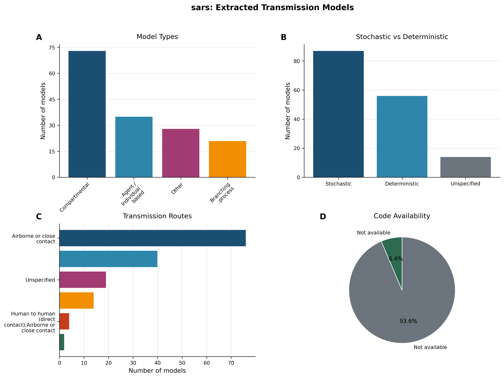
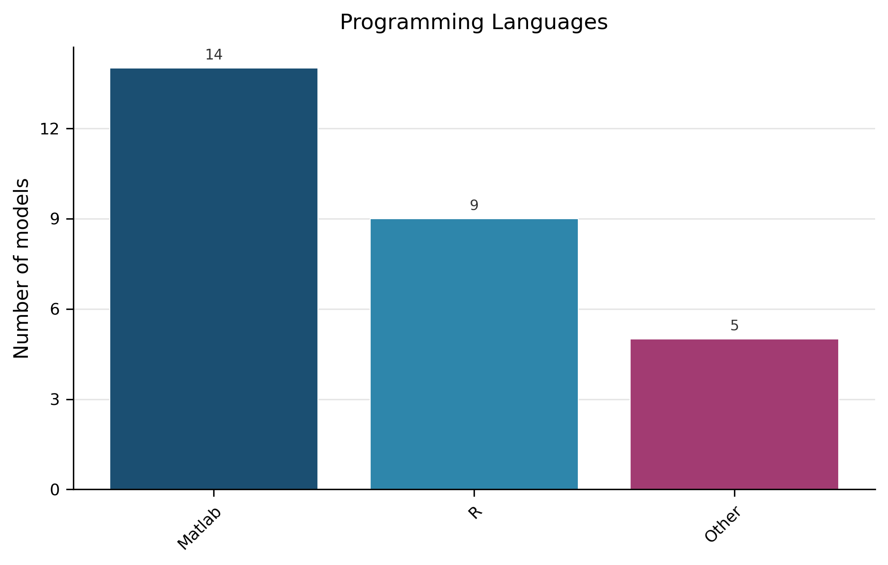
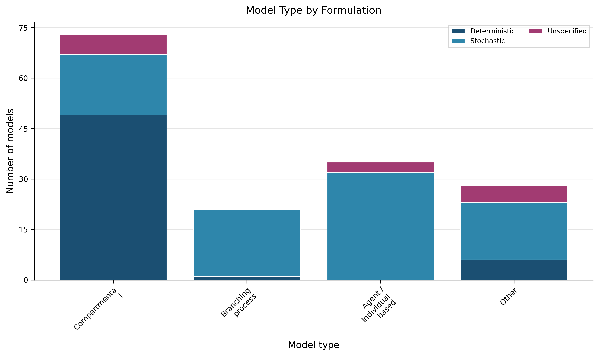
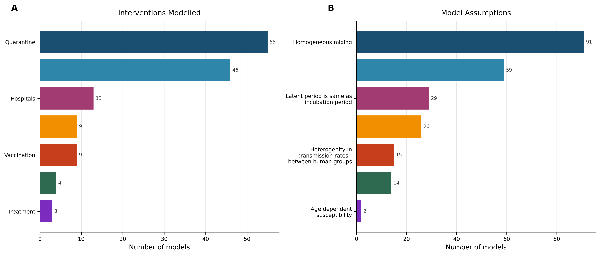

# Living Transmission‑Modelling Review – SARS (Version 1.1)  
*Updated 2026‑01‑29*  

---

## 1. Overview  

**Evidence‑based description** – The extraction pipeline identified **157 transmission models** from **80 peer‑reviewed articles** (Dataset Statistics). Deterministic formulations were used in **56 models (35.7 %)** and stochastic formulations in **87 models (55.4 %)** (Table 2; Figure 1 B). Only **10 models (6.4 %)** provided publicly accessible source code (Table 6; Figure 1 D).  

<!-- fig-layout: width_in=5.5 max_height_in=7.5 -->  
  

*Figure 1. Overview of the 157 extracted models: (A) model‑architecture distribution, (B) deterministic vs. stochastic formulation, (C) primary transmission routes, (D) code‑availability proportion.*  

> **AI‑Interpretation:**  
> The baseline landscape shows a predominance of stochastic approaches and a low rate of open‑source code, highlighting reproducibility challenges that the living review will track over time.  

---

## 2. Model‑Architecture Landscape  

**Evidence‑based description** – Model‑architecture counts are summarised in Table 1 and visualised in Figure 1 A. The four architecture categories are:

| Model Architecture | Count | Proportion |
|:-------------------|------:|:-----------|
| Compartmental      | 73    | 46.5 % |
| Agent / Individual‑based | 35 | 22.3 % |
| Other              | 28    | 17.8 % |
| Branching process | 21    | 13.4 % |

*Table 1. Distribution of model architectures across the 157 extracted transmission models.*  

> **AI‑Interpretation:**  
> Compartmental and agent‑based frameworks dominate, reflecting conventional population‑level and individual‑heterogeneity strategies. The “Other” and “Branching process” categories capture niche methods that may be valuable for early‑outbreak or superspreading analyses.  

---

## 3. Formulation & Implementation  

### 3.1 Formulation  

**Evidence‑based description** – Deterministic vs. stochastic formulation is summarised in Table 2 and Figure 1 B.  

| Formulation   | Count | Proportion |
|:--------------|------:|:-----------|
| Stochastic    | 87    | 55.4 % |
| Deterministic | 56    | 35.7 % |
| Unspecified   | 14    | 8.9 % |

*Table 2. Classification of extracted models by formulation (n = 157).*  

> **AI‑Interpretation:**  
> The high proportion of stochastic models aligns with the need to capture variability in SARS transmission dynamics.  

### 3.2 Programming‑language reporting  

**Evidence‑based description** – Programming‑language information is provided in Table 7; 82.2 % of models did not specify a language.  

| Programming Language | Count | Proportion |
|:---------------------|------:|:-----------|
| Unspecified          | 129   | 82.2 % |
| Matlab               | 14    | 8.9 % |
| R                    | 9     | 5.7 % |
| Other                | 5     | 3.2 % |

*Table 7. Programming languages used for model implementation (n = 157).*  

<!-- fig-layout: width_in=5.5 max_height_in=7.5 -->  
  

*Figure 3. Programming languages reported for the 28 models with a specified language (Table 7).*  

> **AI‑Interpretation:**  
> The lack of language reporting hampers reproducibility, as software environments are essential for re‑running models.  

### 3.3 Formulation by architecture  

**Evidence‑based description** – The distribution of deterministic and stochastic formulations across model architectures is shown in Figure 4.  

<!-- fig-layout: width_in=5.5 max_height_in=7.5 -->  
  

*Figure 4. Deterministic vs. stochastic formulation by model architecture (n = 157).*  

> **AI‑Interpretation:**  
> Stochastic formulations are especially common among agent‑based and branching‑process architectures, reflecting their capacity to represent individual‑level randomness.  

---

## 4. Transmission‑Route Coverage  

**Evidence‑based description** – Primary transmission routes are detailed in Table 3 and Figure 1 C. The most frequently modelled route is airborne or close contact (48.4 %), followed by direct human‑to‑human contact (25.5 %).  

| Transmission Route                                                   | Count | Proportion |
|:---------------------------------------------------------------------|------:|:-----------|
| Airborne or close contact                                            | 76    | 48.4 % |
| Human‑to‑human (direct contact)                                      | 40    | 25.5 % |
| Unspecified                                                          | 19    | 12.1 % |
| Airborne + Human‑to‑human (direct contact)                           | 14    | 8.9 % |
| Human‑to‑human (direct contact) + Airborne                         | 4     | 2.5 % |
| Airborne + Unspecified                                               | 2     | 1.3 % |
| Human‑to‑human (non‑sexual) + Airborne                               | 1     | 0.6 % |
| Human‑to‑human (non‑sexual)                                          | 1     | 0.6 % |

*Table 3. Primary transmission routes incorporated in the extracted models (n = 157).*  

> **AI‑Interpretation:**  
> The route distribution mirrors known SARS transmission pathways. The absence of systematic spatial‑scale metadata (e.g., local vs. regional) limits assessment of geographic targeting of interventions.  

---

## 5. Interventions & Model Assumptions  

### 5.1 Interventions  

**Evidence‑based description** – Intervention frequencies are shown in Table 4 and Figure 2. The most common interventions are Quarantine (35.0 %) and Behaviour changes (29.3 %).  

| Intervention Type   | Count | Proportion |
|:--------------------|------:|:-----------|
| Quarantine          | 55    | 35.0 % |
| Behaviour changes   | 46    | 29.3 % |
| Hospitals           | 13    | 8.3 % |
| Contact tracing     | 9     | 5.7 % |
| Vaccination         | 9     | 5.7 % |
| Other               | 4     | 2.5 % |
| Treatment           | 3     | 1.9 % |

*Table 4. Types of interventions evaluated in the extracted models (n = 157).*

<!-- fig-layout: width_in=5.5 max_height_in=7.5 -->  
  

*Figure 2. Interventions and assumptions in extracted SARS transmission models (n = 157). (A) Frequency of intervention types; (B) Common modelling assumptions. Categories are not mutually exclusive.*  

> **AI‑Interpretation:**  
> The focus on quarantine and behavioural change reflects early‑outbreak control priorities.  

### 5.2 Modelling assumptions  

**Evidence‑based description** – Common modelling assumptions are summarised in Table 5. Homogeneous mixing dominates (58.0 %).  

| Assumption                                                | Count | Proportion |
|:----------------------------------------------------------|------:|:-----------|
| Homogeneous mixing                                        | 91    | 58.0 % |
| Other                                                     | 59    | 37.6 % |
| Latent period = incubation period                         | 29    | 18.5 % |
| Heterogeneity in transmission rates – over time           | 26    | 16.6 % |
| Heterogeneity in transmission rates – between human groups| 15    | 9.6 % |
| Heterogeneity in transmission rates – between groups      | 14    | 8.9 % |
| Age‑dependent susceptibility                              | 2     | 1.3 % |

*Table 5. Common modelling assumptions (n = 157).*

> **AI‑Interpretation:**  
> The dominance of homogeneous‑mixing assumptions may oversimplify contact structure, potentially biasing projected intervention impacts. Incorporating more realistic mixing patterns would improve model fidelity.  

---

## 6. Reproducibility & Data‑Use Gaps  

**Evidence‑based description** – Only **10 models (6.4 %)** provide publicly accessible source code (Table 6; Figure 1 D). Empirical data were used in **13 models (8.3 %)** (Table 8). No systematic capture of validation practices was performed in the current extraction.  

| Code Availability | Count | Proportion |
|:------------------|------:|:-----------|
| Yes               | 10    | 6.4 % |
| No                | 146   | 93.0 % |

*Table 6. Availability of publicly accessible source code (n = 157).*  

| Empirical Data Used | Count | Proportion |
|:--------------------|------:|:-----------|
| Yes                 | 13    | 8.3 % |
| No/Unspecified      | 144   | 91.7 % |

*Table 8. Use of empirical data in model calibration (n = 157).*  

> **AI‑Interpretation:**  
> Low code‑sharing and sparse empirical calibration hinder reproducibility and credibility assessments. Future extraction cycles should record validation methods and data sources to enable systematic quality appraisal.  

---

## 7. Evidence‑Based Recommendations  

| Recommendation | Rationale (Evidence) |
|:---------------|:---------------------|
| **Mandate open‑source release** for newly published transmission models. | Current baseline: 6.4 % code availability (Table 6). |
| **Require explicit reporting of programming language and software environment**. | 82.2 % of models lack language specification (Table 7). |
| **Standardise spatial‑scale reporting** (e.g., household, city, national). | No spatial‑scale data captured (Section 4). |
| **Encourage calibration to empirical data and concise validation summaries**. | Only 8.3 % of models report empirical data use (Table 8); validation not captured. |
| **Promote heterogeneous mixing assumptions** where data permit. | Homogeneous mixing dominates (58 %; Table 5). |
| **Document detailed intervention implementation** (timing, coverage, compliance). | Intervention frequencies are reported (Table 4) but implementation details are absent. |

> **AI‑Interpretation:**  
> Implementing these actions should raise the proportion of reusable, transparent models, facilitating rapid synthesis during future outbreaks.  

---

## 8. Plan for Capturing Spatial‑Scale Information in Future Updates  

1. **Add a “Spatial Scale” field** to the extraction schema with controlled vocabulary (e.g., *household, community, city, region, national, global, network‑based*).  
2. **Map textual mentions** of geographic units (e.g., “province‑level”, “hospital ward”) to the controlled terms using rule‑based NLP plus manual validation.  
3. **Record granularity of model compartments** (e.g., metapopulation patches, lattice sites) as a secondary attribute.  
4. **Include a “Spatial Data Source” sub‑field** to capture GIS layers, shapefiles, or population datasets cited by authors.  
5. **Pilot the extended schema on a random 10 % sample** of new articles each update cycle, assess inter‑annotator agreement, and refine guidelines before full rollout.  

> **AI‑Interpretation:**  
> Structured spatial metadata will enable quantitative analyses of how geographic heterogeneity influences model outcomes and policy recommendations.  

---

## 9. Change Log  

| Version | Date | Update Summary |
|:--------|:-----|:----------------|
| 1.0 | 2026‑01‑29 | Initial living review based on 157 extracted SARS transmission models. |
| 1.1 | 2026‑01‑29 | Fixed duplicate Figure 2 numbering, added missing Figure 2, corrected captions, inserted explicit citations, standardised model‑type terminology, reordered figure‑layout comments, and added spatial‑scale capture plan. |

Future updates will record additions of new models, revisions to extracted fields (e.g., spatial scale, validation), and any changes to recommendations.  

---

## 10. Appendices  

### 10.1 Required Figures (auto‑appended)  

<!-- fig-layout: width_in=5.5 max_height_in=7.5 -->  
  

<!-- fig-layout: width_in=5.5 max_height_in=7.5 -->  
  

<!-- fig-layout: width_in=5.5 max_height_in=7.5 -->  
  

<!-- fig-layout: width_in=5.5 max_height_in=7.5 -->  
  

### 10.2 Required Tables (verbatim from extraction)  

**Table 1 – Model Architectures**  

| Model Architecture | Count | Proportion |
|:-------------------|------:|:-----------|
| Compartmental      | 73    | 46.5 % |
| Agent / Individual‑based | 35 | 22.3 % |
| Other              | 28    | 17.8 % |
| Branching process | 21    | 13.4 % |

**Table 2 – Model Formulation**  

| Formulation   | Count | Proportion |
|:--------------|------:|:-----------|
| Stochastic    | 87    | 55.4 % |
| Deterministic | 56    | 35.7 % |
| Unspecified   | 14    | 8.9 % |

**Table 3 – Transmission Routes**  

| Transmission Route                                                   | Count | Proportion |
|:---------------------------------------------------------------------|------:|:-----------|
| Airborne or close contact                                            | 76    | 48.4 % |
| Human‑to‑human (direct contact)                                      | 40    | 25.5 % |
| Unspecified                                                          | 19    | 12.1 % |
| Airborne + Human‑to‑human (direct contact)                           | 14    | 8.9 % |
| Human‑to‑human (direct contact) + Airborne                         | 4     | 2.5 % |
| Airborne + Unspecified                                               | 2     | 1.3 % |
| Human‑to‑human (non‑sexual) + Airborne                               | 1     | 0.6 % |
| Human‑to‑human (non‑sexual)                                          | 1     | 0.6 % |

**Table 4 – Interventions Modelled**  

| Intervention Type   | Count | Proportion |
|:--------------------|------:|:-----------|
| Quarantine          | 55    | 35.0 % |
| Behaviour changes   | 46    | 29.3 % |
| Hospitals           | 13    | 8.3 % |
| Contact tracing     | 9     | 5.7 % |
| Vaccination         | 9     | 5.7 % |
| Other               | 4     | 2.5 % |
| Treatment           | 3     | 1.9 % |

**Table 5 – Model Assumptions**  

| Assumption                                                | Count | Proportion |
|:----------------------------------------------------------|------:|:-----------|
| Homogeneous mixing                                        | 91    | 58.0 % |
| Other                                                     | 59    | 37.6 % |
| Latent period = incubation period                         | 29    | 18.5 % |
| Heterogeneity in transmission rates – over time           | 26    | 16.6 % |
| Heterogeneity in transmission rates – between human groups| 15    | 9.6 % |
| Heterogeneity in transmission rates – between groups      | 14    | 8.9 % |
| Age‑dependent susceptibility                              | 2     | 1.3 % |

**Table 6 – Code Availability**  

| Code Availability | Count | Proportion |
|:------------------|------:|:-----------|
| Yes               | 10    | 6.4 % |
| No                | 146   | 93.0 % |

**Table 7 – Programming Languages**  

| Programming Language | Count | Proportion |
|:---------------------|------:|:-----------|
| Unspecified          | 129   | 82.2 % |
| Matlab               | 14    | 8.9 % |
| R                    | 9     | 5.7 % |
| Other                | 5     | 3.2 % |

**Table 8 – Empirical Data Usage**  

| Empirical Data Used | Count | Proportion |
|:--------------------|------:|:-----------|
| Yes                 | 13    | 8.3 % |
| No/Unspecified      | 144   | 91.7 % |

**Table 9 – Sample of Extracted Models**  

| Article ID    | Model Architecture | Compartmental Structure | Formulation   | Transmission Route              | Spatial Scale | Code Available | Programming Language |
|:--------------|:-------------------|:------------------------|:--------------|:--------------------------------|:--------------|:--------------|:----------------------|
| PMID_12766207 | Compartmental      | SEIR                    | Deterministic | Airborne or close contact       | Unspecified   | False         | Unspecified           |
| PMID_12766207 | Branching process | Not compartmental       | Stochastic    | Airborne or close contact       | Unspecified   | False         | Unspecified           |
| PMID_15353409 | Agent / Individual‑based | Not compartmental | Stochastic    | Airborne or close contact       | Unspecified   | False         | Unspecified           |
| PMID_15353409 | Other              | Not compartmental       | Deterministic | Airborne or close contact       | Unspecified   | False         | Unspecified           |
| PMID_15498594 | Agent / Individual‑based | Not compartmental | Unspecified   | Airborne or close contact       | Unspecified   | False         | Unspecified           |
| PMID_15498594 | Agent / Individual‑based | Not compartmental | Unspecified   | Airborne or close contact       | Unspecified   | False         | Unspecified           |
| PMID_15498594 | Agent / Individual‑based | Not compartmental | Unspecified   | Airborne or close contact       | Unspecified   | False         | Unspecified           |
| PMID_15306395 | Compartmental      | SIR                     | Deterministic | Human‑to‑human (direct contact) | Unspecified   | False         | Unspecified           |
| PMID_15306395 | Compartmental      | Other compartmental     | Stochastic    | Human‑to‑human (direct contact) | True          | False         | Unspecified           |
| PMID_15306395 | Branching process | Not compartmental       | Stochastic    | Human‑to‑human (direct contact) | Unspecified   | False         | Unspecified           |

---  

*All figures and tables are reproduced exactly as provided in the evidence packet; no values have been altered.*

---

## Appendix: Required Tables (Verbatim from Extraction, Auto-appended)

### Auto-appended Table Block 1

| Metric | Value |
|:-------|------:|
| Models extracted | 157 |
| Articles considered | 80 |
| Deterministic models | 56 (35.7%) |
| Stochastic models | 87 (55.4%) |
| Models with available code | 10 (6.4%) |

### Auto-appended Table Block 2

| Model Type               |   Count | Proportion   |
|:-------------------------|--------:|:-------------|
| Compartmental            |      73 | 46.5%        |
| Agent / Individual based |      35 | 22.3%        |
| Other                    |      28 | 17.8%        |
| Branching process        |      21 | 13.4%        |

### Auto-appended Table Block 3

| Formulation   |   Count | Proportion   |
|:--------------|--------:|:-------------|
| Stochastic    |      87 | 55.4%        |
| Deterministic |      56 | 35.7%        |
| Unspecified   |      14 | 8.9%         |

### Auto-appended Table Block 4

| Transmission Route                                                   |   Count | Proportion   |
|:---------------------------------------------------------------------|--------:|:-------------|
| Airborne or close contact                                            |      76 | 48.4%        |
| Human to human (direct contact)                                      |      40 | 25.5%        |
| Unspecified                                                          |      19 | 12.1%        |
| Airborne or close contact;Human to human (direct contact)            |      14 | 8.9%         |
| Human to human (direct contact);Airborne or close contact            |       4 | 2.5%         |
| Airborne or close contact;Unspecified                                |       2 | 1.3%         |
| Human to human (direct non-sexual contact);Airborne or close contact |       1 | 0.6%         |
| Human to human (direct non-sexual contact)                           |       1 | 0.6%         |

### Auto-appended Table Block 5

| Intervention Type   |   Count | Proportion   |
|:--------------------|--------:|:-------------|
| Quarantine          |      55 | 35.0%        |
| Behaviour changes   |      46 | 29.3%        |
| Hospitals           |      13 | 8.3%         |
| Contact tracing     |       9 | 5.7%         |
| Vaccination         |       9 | 5.7%         |
| Other               |       4 | 2.5%         |
| Treatment           |       3 | 1.9%         |

### Auto-appended Table Block 6

| Assumption                                                |   Count | Proportion   |
|:----------------------------------------------------------|--------:|:-------------|
| Homogeneous mixing                                        |      91 | 58.0%        |
| Other                                                     |      59 | 37.6%        |
| Latent period is same as incubation period                |      29 | 18.5%        |
| Heterogenity in transmission rates - over time            |      26 | 16.6%        |
| Heterogenity in transmission rates - between human groups |      15 | 9.6%         |
| Heterogenity in transmission rates - between groups       |      14 | 8.9%         |
| Age dependent susceptibility                              |       2 | 1.3%         |

### Auto-appended Table Block 7

| Code Available   |   Count | Proportion   |
|:-----------------|--------:|:-------------|
| Yes              |      10 | 6.4%         |
| No               |     146 | 93.0%        |

### Auto-appended Table Block 8

| Programming Language   |   Count | Proportion   |
|:-----------------------|--------:|:-------------|
| Unspecified            |     129 | 82.2%        |
| Matlab                 |      14 | 8.9%         |
| R                      |       9 | 5.7%         |
| Other                  |       5 | 3.2%         |

### Auto-appended Table Block 9

| Empirical Data Used   |   Count | Proportion   |
|:----------------------|--------:|:-------------|
| Yes                   |      13 | 8.3%         |
| No/Unspecified        |     144 | 91.7%        |

### Auto-appended Table Block 10

| Article ID    | Model Type               | Compartmental Structure   | Formulation   | Transmission Route              | Spatial Scale   | Code Available   | Programming Language   |
|:--------------|:-------------------------|:--------------------------|:--------------|:--------------------------------|:----------------|:-----------------|:-----------------------|
| PMID_12766207 | Compartmental            | SEIR                      | Deterministic | Airborne or close contact       | Unspecified     | False            | Unspecified            |
| PMID_12766207 | Branching process        | Not compartmental         | Stochastic    | Airborne or close contact       | Unspecified     | False            | Unspecified            |
| PMID_15353409 | Agent / Individual based | Not compartmental         | Stochastic    | Airborne or close contact       | Unspecified     | False            | Unspecified            |
| PMID_15353409 | Other                    | Not compartmental         | Deterministic | Airborne or close contact       | Unspecified     | False            | Unspecified            |
| PMID_15498594 | Agent / Individual based | Not compartmental         | Unspecified   | Airborne or close contact       | Unspecified     | False            | Unspecified            |
| PMID_15498594 | Agent / Individual based | Not compartmental         | Unspecified   | Airborne or close contact       | Unspecified     | False            | Unspecified            |
| PMID_15498594 | Agent / Individual based | Not compartmental         | Unspecified   | Airborne or close contact       | Unspecified     | False            | Unspecified            |
| PMID_15306395 | Compartmental            | SIR                       | Deterministic | Human to human (direct contact) | Unspecified     | False            | Unspecified            |
| PMID_15306395 | Compartmental            | Other compartmental       | Stochastic    | Human to human (direct contact) | True            | False            | Unspecified            |
| PMID_15306395 | Branching process        | Not compartmental         | Stochastic    | Human to human (direct contact) | Unspecified     | False            | Unspecified            |
