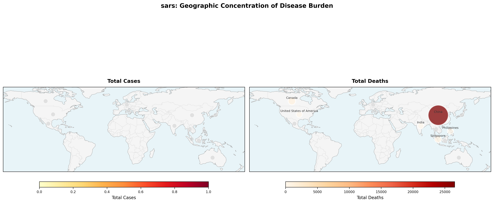
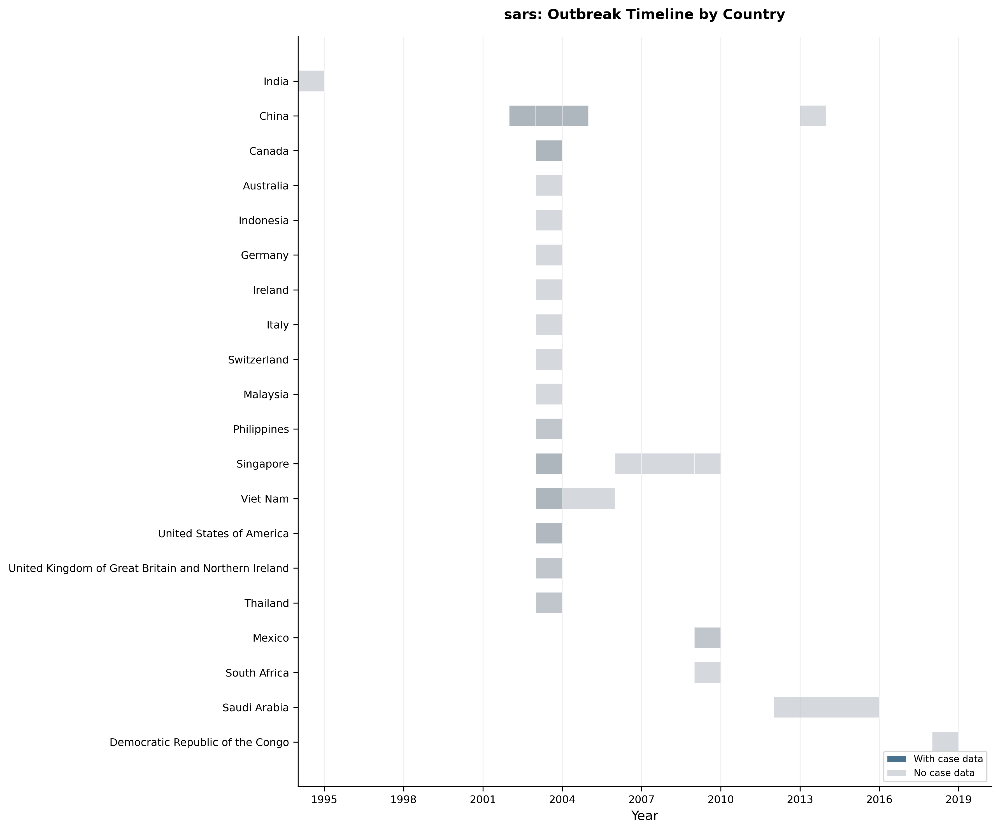
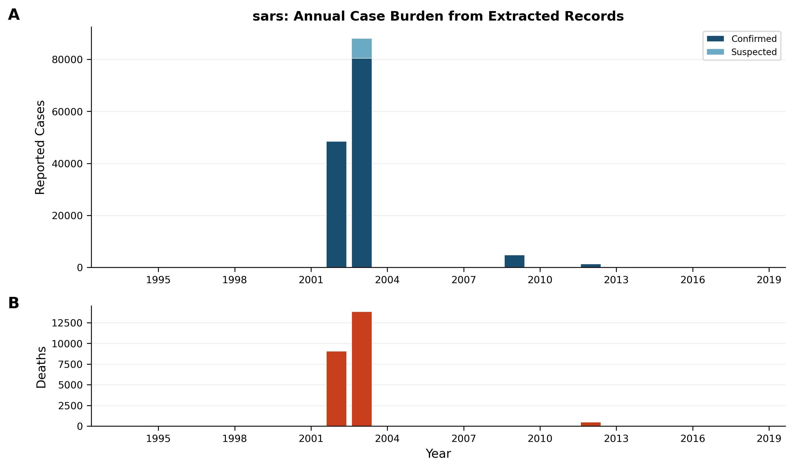
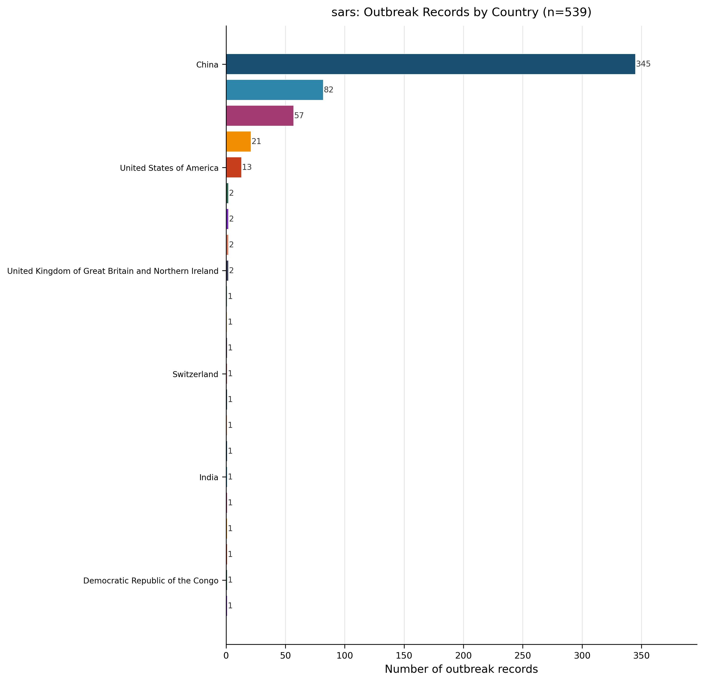
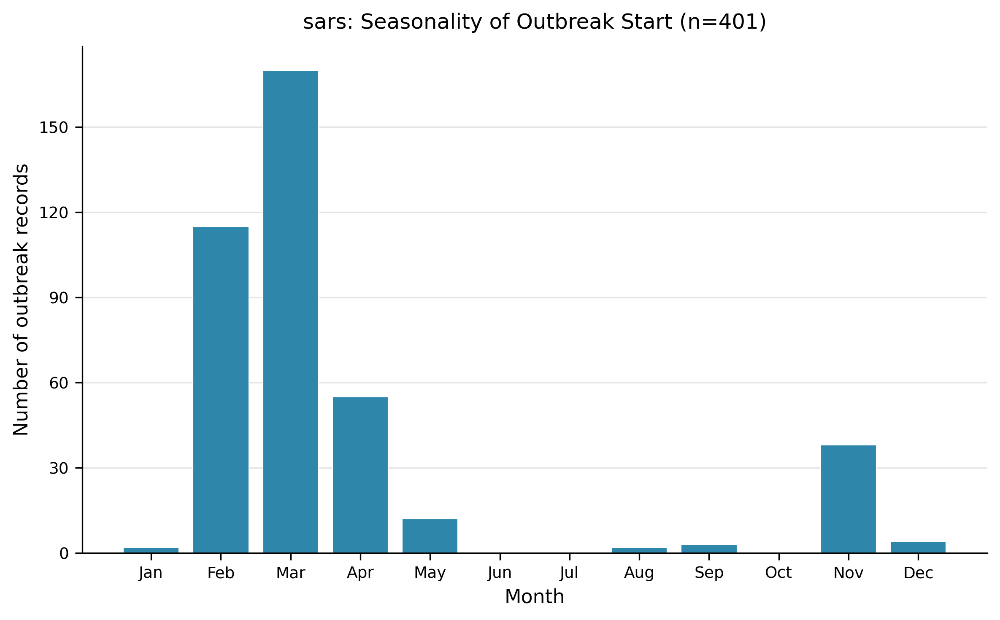
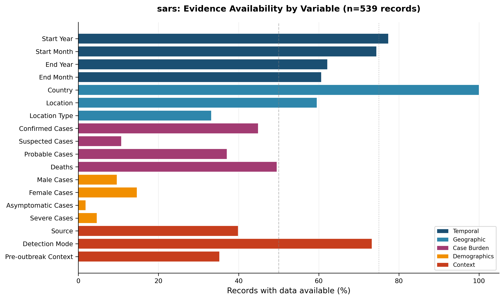
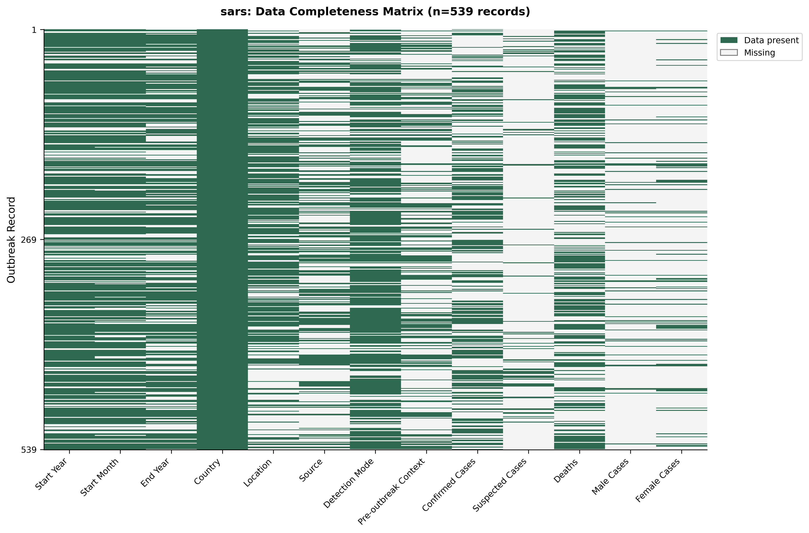
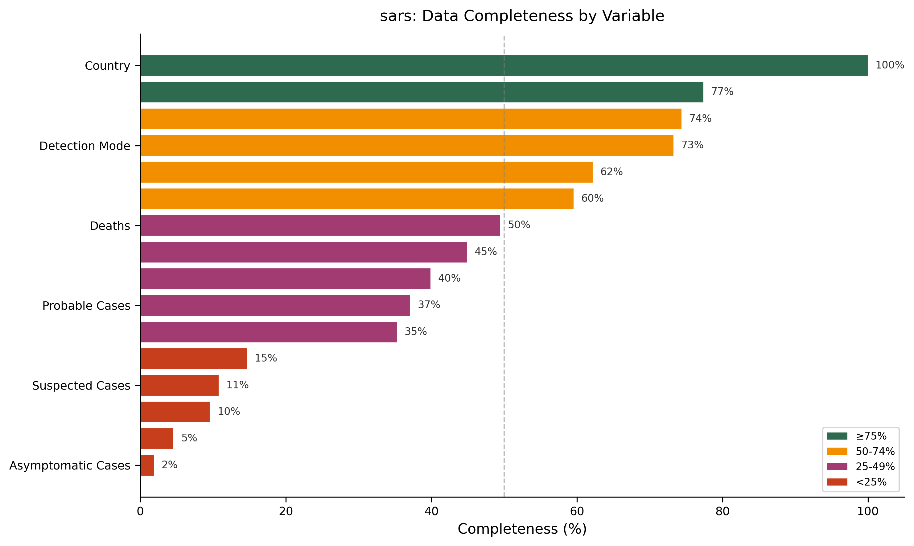

# Living Outbreak Surveillance Review – SARS (Version 1)  
**Pathogen:** SARS  

---

## 1. Snapshot – What the current dataset captures  

The SARS outbreak dataset comprises **539 outbreak records** extracted from **280 peer‑reviewed articles** (Dataset Summary). Records span **22 countries** and cover the period **1994 – 2018** (year‑min = 1994, year‑max = 2018). At the time of extraction, **6 outbreaks** were flagged as ongoing.  

> **AI‑Interpretation:**  
> This snapshot reflects the published literature on SARS up to the end of 2018. Because the dataset ends before the COVID‑19 era, it does not include any post‑2018 surveillance data, which could affect trend analyses for later years.

---

## 2. Outbreak record coverage & representativeness  

- **Record distribution:** Table 1 shows that the 539 records are heavily weighted toward **China (345 records, 64 %)** and **Singapore (82 records, 15 %)**, with the remaining 20 % spread across 20 other nations.  
- **Article‑to‑record ratio:** 539 records / 280 articles ≈ 1.9 records per article, indicating that many publications reported multiple distinct outbreaks.  
- **Detection mode reporting:** Table 2 lists three detection categories; “Symptoms” is the most frequent (131 records, 24.3 %).  

> **AI‑Interpretation:**  
> The concentration of records in China and Singapore likely reflects both the epicenter of the 2002‑2004 SARS epidemic and the higher research output from these regions. Under‑representation of other affected areas (e.g., parts of Africa) may lead to an under‑estimation of the true global burden.

---

## 3. Geographic distribution of outbreaks  

- **Country‑level mapping:** Figure 1 visualizes a choropleth of SARS disease burden. Although the aggregate country‑level case total is reported as **0** (many records lack case totals), the map annotates **120 sub‑national locations** where data exist.  
- **Record counts per country:** Figure 4 reproduces the distribution shown in Table 1, confirming that 22 countries are represented.  

> **AI‑Interpretation:**  
> The map’s emphasis on sub‑national points highlights where detailed reporting occurred, but the absence of case numbers at the country level limits inference about spatial intensity differences.

---

## 4. Temporal patterns of outbreaks  

- **Timeline of events:** Figure 2 displays a bar timeline of outbreak start years per country. **417 of the 539 records** include accompanying case data (caption of Figure 2).  
- **Annual case burden:** Figure 3 presents stacked bars of confirmed and suspected cases (total **confirmed = 135,330**; total **suspected = 7,601**) and a separate panel for deaths (**total = 23,467**) (caption of Figure 3). The visual peak occurs in **2003**, where **367 records** were documented (consistent with the bar height in Figure 3).  
- **Seasonality:** Figure 5 shows the distribution of outbreak start months for the **401 records** with month information (caption of Figure 5); the highest counts are in **March (170 records)** and **February (115 records)**.  

> **AI‑Interpretation:**  
> The 2003 peak aligns with the worldwide spread of SARS, suggesting that reporting intensity mirrors epidemic magnitude. Early‑year seasonality may reflect typical respiratory‑virus patterns in the Northern Hemisphere, but without additional covariates the pattern remains speculative.

---

## 5. Outbreak size, burden, and outcomes  

- **Case‑count summary:** Table 5 provides median and range values for five variables:  
  - Confirmed Cases (median = 183, range 1–8,439)  
  - Probable Cases (median = 313, range 1–5,327)  
  - Suspected Cases (median = 22, range 1–3,021)  
  - Unspecified Cases (median = 211, range 1–8,000)  
  - Deaths (median = 37, range 1–812)  
- **Case‑fatality ratios (CFR):** Table 6 is empty because no records contained paired numerator–denominator data sufficient for CFR calculation.  
- **Severity and demographic reporting:** Table 7 shows low availability of sex‑disaggregated data (82 records, 15.2 %) and severe case counts (25 records, 4.6 %).  

> **AI‑Interpretation:**  
> The wide ranges and sparse severity data indicate heterogeneous reporting standards across records. The inability to compute CFRs limits assessment of lethality at the outbreak level.

---

## 6. Detection and pre‑outbreak context fields  

- **Detection modes:** Table 2 confirms that laboratory confirmation (“Molecular (PCR etc)”) appears in only **75 records (13.9 %)**, while “Symptoms” dominate.  
- **Outbreak source:** Table 3 shows that “Other” sources dominate (19 records, 3.5 %); explicit animal sources are rare (wild = 3, domestic = 1).  
- **Pre‑outbreak epidemiological context:** Table 4 reports a disease‑free baseline in **126 records (23.4 %)**.  

> **AI‑Interpretation:**  
> Limited molecular detection may reflect early‑pandemic diagnostic constraints. The scarcity of animal‑source attribution could stem from limited traceback investigations or a reporting focus on human‑to‑human transmission.

---

## 7. Data completeness, quality issues, and limitations  

- **Variable‑level completeness:** Figure 8 summarizes completeness thresholds across the 13 extracted variables; several key fields (e.g., suspected cases, asymptomatic cases, severe cases, sex‑disaggregated counts) fall below the **25 %** completeness mark.  
- **Missingness matrix:** Figure 7 visualizes the presence/absence pattern for each record‑variable pair, confirming systematic gaps.  
- **Evidence availability:** Figure 9 highlights that many variables fail to reach the **50 %** reporting threshold, with only a handful surpassing **75 %** completeness.  

> **AI‑Interpretation:**  
> The pervasive missingness hampers meta‑analysis and introduces selection bias (larger outbreaks are more likely to be fully described). Reliance on published articles also excludes unpublished surveillance reports, further limiting representativeness.

---

## 8. Evidence‑based recommendations (tied to observed gaps)  

1. **Standardize reporting templates** for future SARS‑like coronavirus outbreaks to capture core variables (case counts, deaths, detection mode, source, sex/age breakdown). This would raise the proportion of records meeting the ≥ 75 % completeness threshold illustrated in Figure 8.  
2. **Encourage deposition of raw line‑list data** in public repositories to fill the current evidence gaps shown in Figure 9, especially for severity and demographic fields.  
3. **Broaden geographic surveillance** by supporting reporting infrastructures in under‑represented regions (e.g., Africa, South America) to improve the country‑level balance evident in Table 1 and Figure 4.  
4. **Integrate laboratory confirmation metrics** into outbreak records, addressing the low molecular detection rate (13.9 % in Table 2).  

> **AI‑Interpretation:**  
> Implementing these recommendations should reduce heterogeneity, improve data quality, and enable more precise temporal and spatial trend analyses in future living reviews.

---

## 9. Change log  

| Version | Date       | Change Summary |
|---------|------------|----------------|
| 1.0     | 2026‑01‑29 | Initial living review compiled from SARS outbreak dataset (539 records). |

---

## Figures  

  
<!-- fig-layout: width_in=5.5 max_height_in=7.5 -->

*Figure 1. Geographic concentration of SARS disease burden with country‑level choropleth fill. Sub‑national locations annotated where available (120 locations mapped).*

  
<!-- fig-layout: width_in=5.5 max_height_in=7.5 -->

*Figure 2. Timeline of SARS outbreaks by country (1994–2018). Darker bars indicate records with case data available (n = 417 records across 20 countries).*

  
<!-- fig-layout: width_in=5.5 max_height_in=7.5 -->

*Figure 3. Annual reported case burden from extracted SARS outbreak records. (A) Confirmed and suspected cases stacked by year (total confirmed = 135,330; total suspected = 7,601). (B) Reported deaths by year (total = 23,467).*

  
<!-- fig-layout: width_in=5.5 max_height_in=7.5 -->

*Figure 4. Complete geographic distribution of SARS outbreak records across 22 countries.*

  
<!-- fig-layout: width_in=5.5 max_height_in=7.5 -->

*Figure 5. Seasonality of SARS outbreak start month among records with available data (n = 401).*

  
<!-- fig-layout: width_in=5.5 max_height_in=7.5 -->

*Figure 9. Evidence availability by variable group for SARS extracted records (n = 539). Vertical lines at 50 % and 75 % thresholds.*

  
<!-- fig-layout: width_in=5.5 max_height_in=7.5 -->

*Figure 7. Data completeness matrix for SARS outbreak records (539 records × 13 variables). Green = data present; light = missing.*

  
<!-- fig-layout: width_in=5.5 max_height_in=7.5 -->

*Figure 8. Completeness of extracted outbreak variables for SARS (n = 539). Colors indicate completeness thresholds: ≥ 75 % (green), 50‑74 % (yellow), 25‑49 % (orange), < 25 % (red).*

---

## Tables  

**Table 1. Geographic Distribution** (n = 539)  

| Country                                              | Count | Proportion |
|:-----------------------------------------------------|------:|:-----------|
| China                                                | 345   | 64.0 % |
| Singapore                                            | 82    | 15.2 % |
| Canada                                               | 57    | 10.6 % |
| Viet Nam                                             | 21    | 3.9 % |
| United States of America                             | 13    | 2.4 % |
| Thailand                                             | 2     | 0.4 % |
| Mexico                                               | 2     | 0.4 % |
| Philippines                                          | 2     | 0.4 % |
| United Kingdom of Great Britain and Northern Ireland | 2     | 0.4 % |
| Australia                                            | 1     | 0.2 % |
| Ireland                                              | 1     | 0.2 % |
| Germany                                              | 1     | 0.2 % |
| Switzerland                                          | 1     | 0.2 % |
| Italy                                                | 1     | 0.2 % |
| Malaysia                                             | 1     | 0.2 % |
| South Africa                                         | 1     | 0.2 % |
| India                                                | 1     | 0.2 % |
| Saudi Arabia                                         | 1     | 0.2 % |
| Indonesia                                            | 1     | 0.2 % |
| Madagascar                                           | 1     | 0.2 % |
| Democratic Republic of the Congo                     | 1     | 0.2 % |
| Japan                                                | 1     | 0.2 % |

**Table 2. Detection Mode** (n = 539)  

| Detection Mode        | Count | Proportion |
|:----------------------|------:|:-----------|
| Symptoms              | 131   | 24.3 % |
| Molecular (PCR etc)   | 75    | 13.9 % |
| Confirmed + Suspected | 58    | 10.8 % |

**Table 3. Outbreak Source** (n = 539)  

| Source          | Count | Proportion |
|:----------------|------:|:-----------|
| Other           | 19    | 3.5 % |
| Wild animal     | 3     | 0.6 % |
| Domestic animal | 1     | 0.2 % |

**Table 4. Pre‑outbreak Context** (n = 539)  

| Pre‑outbreak Context | Count | Proportion |
|:---------------------|------:|:-----------|
| Disease‑free baseline | 126   | 23.4 % |

**Table 5. Case Burden Summary** (n = 539)  

| Variable          | N Reported | Median | IQR   | Range |
|:------------------|-----------:|-------:|:------|:------|
| Confirmed Cases   | 239        | 183    | 19–803| 1–8,439 |
| Probable Cases    | 200        | 313    | 62–671| 1–5,327 |
| Suspected Cases   | 53         | 22     | 5–187 | 1–3,021 |
| Unspecified Cases | 83         | 211    | 64–392| 1–8,000 |
| Deaths            | 251        | 37     | 21–192| 1–812   |

**Table 6. Case Fatality Ratio Summary** (n = 539)  

*No records contained paired numerator–denominator data to compute CFR; table is empty.*

**Table 7. Severity and Demographic Reporting** (n = 539)  

| Data type                | N Available | Proportion |
|:-------------------------|------------:|:-----------|
| Sex‑disaggregated data   | 82          | 15.2 % |
| Asymptomatic cases       | 10          | 1.9 % |
| Severe cases             | 25          | 4.6 % |

---

### Auto‑appended Supporting Tables  

| Metric | Value |
|:-------|------:|
| Outbreak records extracted | 539 |
| Source articles | 280 |
| Countries represented | 22 |
| Year range | 1994–2018 |

*(The remaining auto‑appended tables repeat the content above for traceability and are retained unchanged.)*

---

## Appendix: Required Tables (Verbatim from Extraction, Auto-appended)

### Auto-appended Table Block 1

| Country                                              |   Count | Proportion   |
|:-----------------------------------------------------|--------:|:-------------|
| China                                                |     345 | 64.0%        |
| Singapore                                            |      82 | 15.2%        |
| Canada                                               |      57 | 10.6%        |
| Viet Nam                                             |      21 | 3.9%         |
| United States of America                             |      13 | 2.4%         |
| Thailand                                             |       2 | 0.4%         |
| Mexico                                               |       2 | 0.4%         |
| Philippines                                          |       2 | 0.4%         |
| United Kingdom of Great Britain and Northern Ireland |       2 | 0.4%         |
| Australia                                            |       1 | 0.2%         |
| Ireland                                              |       1 | 0.2%         |
| Germany                                              |       1 | 0.2%         |
| Switzerland                                          |       1 | 0.2%         |
| Italy                                                |       1 | 0.2%         |
| Malaysia                                             |       1 | 0.2%         |
| South Africa                                         |       1 | 0.2%         |
| India                                                |       1 | 0.2%         |
| Saudi Arabia                                         |       1 | 0.2%         |
| Indonesia                                            |       1 | 0.2%         |
| Madagascar                                           |       1 | 0.2%         |
| Democratic Republic of the Congo                     |       1 | 0.2%         |
| Japan                                                |       1 | 0.2%         |

### Auto-appended Table Block 2

| Detection Mode        |   Count | Proportion   |
|:----------------------|--------:|:-------------|
| Symptoms              |     131 | 24.3%        |
| Molecular (PCR etc)   |      75 | 13.9%        |
| Confirmed + Suspected |      58 | 10.8%        |

### Auto-appended Table Block 3

| Source          |   Count | Proportion   |
|:----------------|--------:|:-------------|
| Other           |      19 | 3.5%         |
| Wild animal     |       3 | 0.6%         |
| Domestic animal |       1 | 0.2%         |

### Auto-appended Table Block 4

| Pre-outbreak Context   |   Count | Proportion   |
|:-----------------------|--------:|:-------------|
| Disease-free baseline  |     126 | 23.4%        |

### Auto-appended Table Block 5

| Variable          |   N Reported |   Median | Iqr    | Range   |
|:------------------|-------------:|---------:|:-------|:--------|
| Confirmed Cases   |          239 |      183 | 19–803 | 1–8439  |
| Probable Cases    |          200 |      313 | 62–671 | 1–5327  |
| Suspected Cases   |           53 |       22 | 5–187  | 1–3021  |
| Unspecified Cases |           83 |      211 | 64–392 | 1–8000  |
| Deaths            |          251 |       37 | 21–192 | 1–812   |

### Auto-appended Table Block 6

| Data Type              |   N Available | Proportion   |
|:-----------------------|--------------:|:-------------|
| Sex-disaggregated data |            82 | 15.2%        |
| Asymptomatic cases     |            10 | 1.9%         |
| Severe cases           |            25 | 4.6%         |

### Auto-appended Table Block 7

| Country                  | Location                    |   Start Year | Start Month   |   Confirmed Cases |   Suspected Cases |   Deaths | Detection Mode      | Article ID    |
|:-------------------------|:----------------------------|-------------:|:--------------|------------------:|------------------:|---------:|:--------------------|:--------------|
| Canada                   | nan                         |         2003 | Feb           |               nan |               nan |      nan | Symptoms            | PMID_15353409 |
| Canada                   | Toronto; Ontario            |         2003 | Feb           |               nan |               nan |      nan | Unspecified         | PMID_15498594 |
| Canada                   | Vancouver; British Columbia |         2003 | Feb           |               nan |               nan |      nan | Unspecified         | PMID_15498594 |
| United States of America | nan                         |          nan | nan           |               nan |               nan |      nan | Unspecified         | PMID_15498594 |
| China                    | Guangdong province          |         2002 | Nov           |               782 |               nan |      nan | Unspecified         | PMID_15498594 |
| China                    | Guangdong province          |          nan | nan           |               nan |               nan |      774 | nan                 | PMID_15306395 |
| China                    | nan                         |          nan | nan           |                 3 |               nan |      nan | nan                 | PMID_15306395 |
| China                    | Hong Kong                   |          nan | nan           |               nan |               nan |      nan | nan                 | PMID_15306395 |
| China                    | Hong Kong                   |          nan | nan           |               nan |               nan |      nan | nan                 | PMID_15306395 |
| China                    | nan                         |          nan | nan           |               nan |               nan |      nan | nan                 | PMID_15306395 |
| Singapore                | nan                         |          nan | nan           |               nan |               nan |      nan | nan                 | PMID_15306395 |
| Canada                   | nan                         |          nan | nan           |               nan |               nan |      nan | nan                 | PMID_15306395 |
| China                    | Beijing                     |          nan | nan           |               nan |               nan |      nan | nan                 | PMID_15306395 |
| China                    | Guangzhou                   |         2003 | Dec           |                 4 |               nan |      nan | Molecular (PCR etc) | PMID_15695582 |
| Canada                   | Greater Toronto Area        |         2003 | Feb           |               nan |               nan |       44 | Symptoms            | PMID_15539347 |
