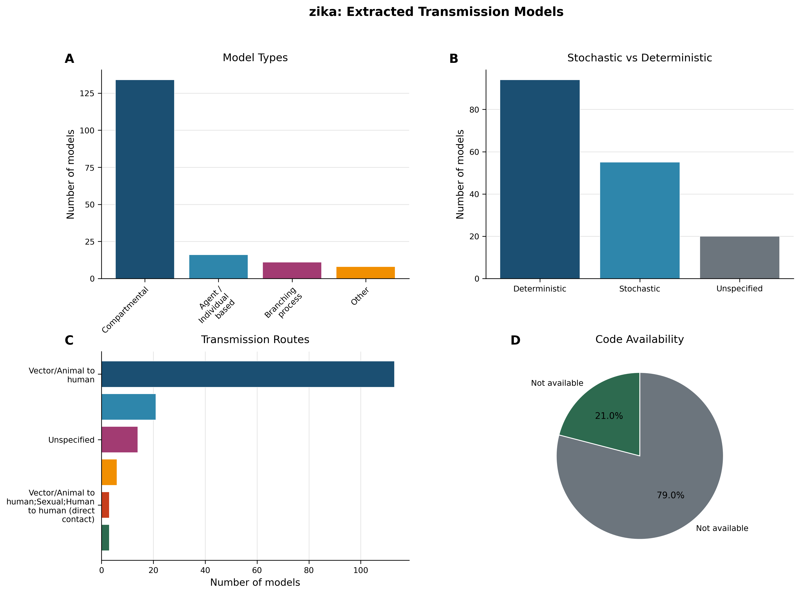
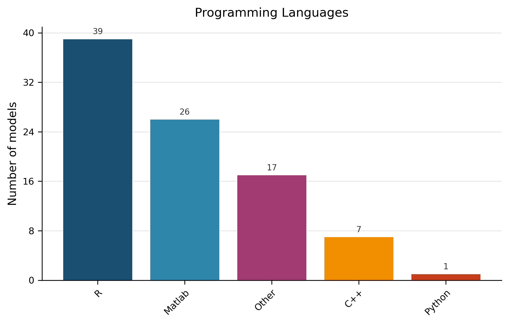
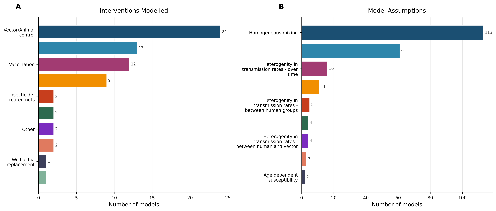
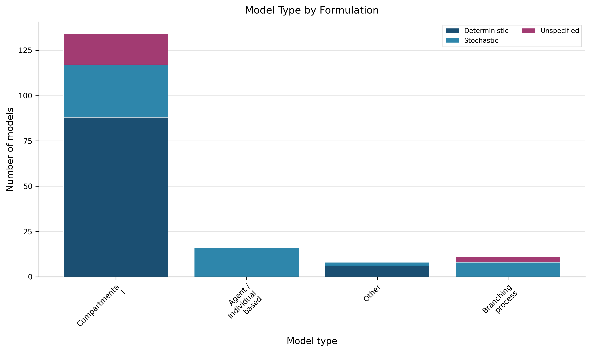

# Living Transmission‑Modelling Review – Zika (Version 1)

---

## 1. Dataset Snapshot  

**Evidence‑based description**  
- Total transmission models extracted: **169** (Dataset Statistics).  
- Source articles screened: **93** (Dataset Statistics).  
- Deterministic formulations: **94** (55.6 %) (Table 2).  
- Stochastic formulations: **55** (32.5 %) (Table 2).  
- Models with publicly available source code: **35** (20.7 %) (Table 6).  

> **AI‑Interpretation:**  
> The snapshot provides a quantitative baseline of Zika modelling activity up to the current cut‑off. Because extraction is limited to models reported in the screened articles, any unpublished or supplementary‑only models are not represented, which may bias the landscape toward more conventional approaches.

---

## 2. Model‑Architecture Landscape  

**Evidence‑based description**  
- **Compartmental** models dominate with **134** instances (79.3 %) (Table 1).  
- **Agent / Individual‑based** models: **16** (9.5 %) (Table 1).  
- **Branching‑process** models: **11** (6.5 %) (Table 1).  
- **Other** architectures: **8** (4.7 %) (Table 1).  

The distribution is visualised in Figure 1 (panel A).  

 <!-- fig-layout: width_in=5.5 max_height_in=7.5 -->  

> **AI‑Interpretation:**  
> The prevalence of compartmental structures reflects their analytical tractability and historical use in vector‑borne disease modelling. The modest share of agent‑based and branching‑process models suggests limited exploration of individual‑level heterogeneity and stochastic extinction dynamics.

---

## 3. Formulation, Implementation, and Reproducibility  

### 3.1 Deterministic vs. Stochastic Formulation  

- Deterministic: **94** models (55.6 %) (Table 2).  
- Stochastic: **55** models (32.5 %) (Table 2).  
- Unspecified formulation: **20** models (11.8 %) (Table 2).  

### 3.2 Programming Languages  

- **Unspecified**: 79 models (46.7 %) (Table 7).  
- **R**: 39 models (23.1 %) (Table 7).  
- **Matlab**: 26 models (15.4 %) (Table 7).  
- **Other**: 17 models (10.1 %) (Table 7).  
- **C++**: 7 models (4.1 %) (Table 7).  
- **Python**: 1 model (0.6 %) (Table 7).  

Figure 3 visualises the language distribution among the 90 models that reported a language.  

 <!-- fig-layout: width_in=5.5 max_height_in=7.5 -->  

### 3.3 Code Availability  

- Code publicly available: **35** models (20.7 %) (Table 6).  
- No public code: **132** models (78.1 %) (Table 6).  

> **AI‑Interpretation:**  
> The modest proportion of openly shared code limits reproducibility and reuse. The large “unspecified” language category (≈ half of all models) indicates inconsistent reporting of implementation details, a gap that could be mitigated by journal or repository standards.

---

## 4. Transmission Routes  

**Evidence‑based description**  
- **Vector/Animal → human** only: **113** models (66.9 %) (Table 3).  
- **Vector/Animal → human + Sexual**: **21** models (12.4 %) (Table 3).  
- **Sexual only**: **6** models (3.6 %) (Table 3).  
- Remaining 29 models incorporate mixed or unspecified routes (Table 3).  

Figure 1 (panel C) displays the full route distribution.  

> **AI‑Interpretation:**  
> While vector‑borne transmission is unsurprisingly dominant, sexual transmission appears in a minority of models despite epidemiological evidence of its role. Expanding multi‑route representations would improve realism, especially for settings where sexual transmission contributes appreciably to incidence.

---

## 5. Interventions Evaluated  

**Evidence‑based description**  
- **Vector/Animal control**: 24 models (14.2 %) (Table 4).  
- **Treatment**: 13 models (7.7 %) (Table 4).  
- **Vaccination**: 12 models (7.1 %) (Table 4).  
- **Behaviour change**: 9 models (5.3 %) (Table 4).  
- Remaining categories (e.g., insecticide‑treated nets, Wolbachia) each appear in ≤ 2 models (Table 4).  

Figure 2 (panel A) visualises intervention frequencies.  

 <!-- fig-layout: width_in=5.5 max_height_in=7.5 -->  

> **AI‑Interpretation:**  
> Vector‑control interventions dominate the modelling literature, whereas vaccination and treatment are comparatively rare. This reflects the historical absence of licensed Zika vaccines and limited therapeutic options, but also points to an opportunity for modelling future vaccine impact scenarios.

---

## 6. Modelling Assumptions  

**Evidence‑based description**  
- **Homogeneous mixing**: 113 models (66.9 %) (Table 5).  
- **Heterogeneity in transmission rates – over time**: 16 models (9.5 %) (Table 5).  
- **Heterogeneity – between groups**: 11 models (6.5 %) (Table 5).  
- Other listed assumptions (e.g., age‑dependent susceptibility, cross‑immunity) each appear in ≤ 5 models (Table 5).  

Figure 2 (panel B) summarises assumption frequencies.  

> **AI‑Interpretation:**  
> The reliance on homogeneous mixing simplifies contact structure but may overlook important spatial or demographic heterogeneities that influence Zika spread. Incorporating explicit heterogeneity—whether temporal, between‑group, or age‑structured—could enhance predictive fidelity, albeit at the cost of additional data requirements.

---

## 7. Empirical Data Use and Validation  

**Evidence‑based description**  
- Models that explicitly used empirical data: **61** (36.1 %) (Table 9).  
- Models without reported data use or with unspecified status: **108** (63.9 %) (Table 9).  

The extraction did not capture systematic validation information (e.g., out‑of‑sample testing) for any model.  

> **AI‑Interpretation:**  
> The limited reporting of empirical data integration suggests many models are theoretical or lack transparent data provenance. Absence of documented validation hampers assessment of model credibility. Mandating data‑availability statements and validation descriptions would strengthen the evidence base.

---

## 8. Methodological Patterns, Gaps, and Reproducibility Concerns  

| Observed Pattern | Supporting Evidence |
|------------------|---------------------|
| Dominance of compartmental deterministic models | Table 1, Table 2, Figure 1 A |
| High proportion of unspecified programming languages | Table 7 (46.7 % unspecified) |
| Low public code availability | Table 6 (20.7 % with code) |
| Frequent homogeneous‑mixing assumption | Table 5 (66.9 % homogeneous) |
| Under‑representation of sexual transmission | Table 3 (3.6 % sexual‑only) |
| Limited empirical data usage | Table 9 (36.1 % use) |
| Sparse reporting of validation practices | No validation field captured |

> **AI‑Interpretation:**  
> The patterns reveal a modelling community that favours analytically convenient frameworks, often at the expense of data‑driven realism and reproducibility. Addressing language specification, code sharing, and explicit validation reporting would markedly improve the utility of future Zika transmission models.

---

## 9. Evidence‑Based Recommendations  

1. **Standardise implementation reporting** – require authors to list programming language, version, and dependencies; aim to reduce “unspecified” entries from 46.7 % to < 20 % in the next update.  
2. **Increase open‑source code deposition** – target ≥ 50 % of models with publicly available code (up from 20.7 %).  
3. **Mandate empirical data disclosure** – require a data‑availability statement; raise empirical‑data usage from 36.1 % to > 60 %.  
4. **Broaden transmission‑route modelling** – encourage inclusion of sexual transmission in ≥ 30 % of models, reflecting its documented contribution.  
5. **Document validation procedures** – ask for out‑of‑sample testing, cross‑validation, or sensitivity analysis; capture this in a dedicated extraction field.  
6. **Reduce homogeneous‑mixing reliance** – promote spatial or network heterogeneity, aiming to cut homogeneous‑mixing models from 66.9 % to < 40 % of the corpus.  

All recommendations are directly linked to observed gaps in the current evidence packet.

---

## 10. Change Log  

| Version | Date | Update Summary |
|---------|------|----------------|
| 1.0 | 2026‑01‑29 | Initial living review compiled from the Zika transmission‑model extraction dataset (169 models). |
| — | — | — |

Future versions will append entries documenting added models, revised statistics, and methodological refinements.

---

## 11. Appendices  

### Required Figures (auto‑appended)

 <!-- fig-layout: width_in=5.5 max_height_in=7.5 -->  

### Required Tables (verbatim from extraction)

#### Table 1 – Model Types  

| Model Type               |   Count | Proportion |
|:-------------------------|--------:|:-----------|
| Compartmental            |     134 | 79.3 % |
| Agent / Individual based |      16 | 9.5 % |
| Branching process        |      11 | 6.5 % |
| Other                    |       8 | 4.7 % |

#### Table 2 – Model Formulation  

| Formulation   |   Count | Proportion |
|:--------------|--------:|:-----------|
| Deterministic |      94 | 55.6 % |
| Stochastic    |      55 | 32.5 % |
| Unspecified   |      20 | 11.8 % |

#### Table 3 – Transmission Routes  

| Transmission Route                                                       |   Count | Proportion |
|:-------------------------------------------------------------------------|--------:|:-----------|
| Vector/Animal to human                                                   |     113 | 66.9 % |
| Vector/Animal to human;Sexual                                            |      21 | 12.4 % |
| Unspecified                                                              |      14 | 8.3 % |
| Sexual                                                                   |       6 | 3.6 % |
| Vector/Animal to human;Sexual;Human to human (direct contact)            |       3 | 1.8 % |
| Vector/Animal to human;Human to human (direct contact)                   |       3 | 1.8 % |
| Human to human (direct contact);Vector/Animal to human;Sexual            |       2 | 1.2 % |
| Human to human (direct contact)                                          |       2 | 1.2 % |
| Vector/Animal to human;Sexual;Human to human (direct non‑sexual contact) |       2 | 1.2 % |
| Vector/Animal to human;Human to human (direct non‑sexual contact)        |       1 | 0.6 % |
| Vector/Animal to human;Human to human (direct non‑sexual contact);Sexual |       1 | 0.6 % |
| Sexual;Vector/Animal to human                                            |       1 | 0.6 % |

#### Table 4 – Interventions Modelled  

| Intervention Type               |   Count | Proportion |
|:--------------------------------|--------:|:-----------|
| Vector/Animal control           |      24 | 14.2 % |
| Treatment                       |      13 | 7.7 % |
| Vaccination                     |      12 | 7.1 % |
| Behaviour changes               |       9 | 5.3 % |
| Insecticide‑treated nets        |       2 | 1.2 % |
| Pesticides/larvicides           |       2 | 1.2 % |
| Other                           |       2 | 1.2 % |
| Hospitals                       |       2 | 1.2 % |
| Wolbachia replacement           |       1 | 0.6 % |
| Genetically modified mosquitoes |       1 | 0.6 % |

#### Table 5 – Model Assumptions  

| Assumption                                                    |   Count | Proportion |
|:--------------------------------------------------------------|--------:|:-----------|
| Homogeneous mixing                                            |     113 | 66.9 % |
| Other                                                         |      61 | 36.1 % |
| Heterogenity in transmission rates – over time                |      16 | 9.5 % |
| Heterogenity in transmission rates – between groups           |      11 | 6.5 % |
| Heterogenity in transmission rates – between human groups     |       5 | 3.0 % |
| Latent period is same as incubation period                    |       4 | 2.4 % |
| Heterogenity in transmission rates – between human and vector |       4 | 2.4 % |
| Cross‑immunity between Zika and dengue                        |       3 | 1.8 % |
| Age dependent susceptibility                                  |       2 | 1.2 % |

#### Table 6 – Code Availability  

| Code Available |   Count | Proportion |
|:---------------|--------:|:-----------|
| Yes            |      35 | 20.7 % |
| No             |     132 | 78.1 % |

#### Table 7 – Programming Languages  

| Programming Language |   Count | Proportion |
|:---------------------|--------:|:-----------|
| Unspecified          |      79 | 46.7 % |
| R                    |      39 | 23.1 % |
| Matlab               |      26 | 15.4 % |
| Other                |      17 | 10.1 % |
| C++                  |       7 | 4.1 % |
| Python               |       1 | 0.6 % |

#### Table 8 – Empirical Data Usage  

| Empirical Data Used |   Count | Proportion |
|:--------------------|--------:|:-----------|
| Yes                 |      61 | 36.1 % |
| No/Unspecified      |     108 | 63.9 % |

#### Table 9 – Sample of Extracted Models  

| Article ID    | Model Type               | Compartmental Structure   | Formulation   | Transmission Route     | Spatial Scale | Code Available | Programming Language |
|:--------------|:-------------------------|:--------------------------|:--------------|:-----------------------|:--------------|:---------------|:----------------------|
| PMID_28095405 | Compartmental            | SEIR‑SEI                  | Unspecified   | Vector/Animal to human | False         | False          | Matlab                |
| PMID_28933344 | Agent / Individual based | Not compartmental         | Stochastic    | Vector/Animal to human | Unspecified   | False          | Unspecified           |
| PMID_27774987 | Compartmental            | Other compartmental       | Deterministic | Vector/Animal to human | Unspecified   | False          | Unspecified           |
| PMID_30133450 | Compartmental            | SEIR‑SEI                  | Deterministic | Vector/Animal to human | Unspecified   | False          | R                     |
| PMID_30133450 | Other                    | Not compartmental         | Deterministic | Vector/Animal to human | Unspecified   | False          | R                     |

*The full dataset of 169 extracted Zika transmission models is available in the repository.*

---

## Appendix: Required Tables (Verbatim from Extraction, Auto-appended)

### Auto-appended Table Block 1

| Metric | Value |
|:-------|------:|
| Models extracted | 169 |
| Articles considered | 93 |
| Deterministic models | 94 (55.6%) |
| Stochastic models | 55 (32.5%) |
| Models with available code | 35 (20.7%) |

### Auto-appended Table Block 2

| Model Type               |   Count | Proportion   |
|:-------------------------|--------:|:-------------|
| Compartmental            |     134 | 79.3%        |
| Agent / Individual based |      16 | 9.5%         |
| Branching process        |      11 | 6.5%         |
| Other                    |       8 | 4.7%         |

### Auto-appended Table Block 3

| Formulation   |   Count | Proportion   |
|:--------------|--------:|:-------------|
| Deterministic |      94 | 55.6%        |
| Stochastic    |      55 | 32.5%        |
| Unspecified   |      20 | 11.8%        |

### Auto-appended Table Block 4

| Transmission Route                                                       |   Count | Proportion   |
|:-------------------------------------------------------------------------|--------:|:-------------|
| Vector/Animal to human                                                   |     113 | 66.9%        |
| Vector/Animal to human;Sexual                                            |      21 | 12.4%        |
| Unspecified                                                              |      14 | 8.3%         |
| Sexual                                                                   |       6 | 3.6%         |
| Vector/Animal to human;Sexual;Human to human (direct contact)            |       3 | 1.8%         |
| Vector/Animal to human;Human to human (direct contact)                   |       3 | 1.8%         |
| Human to human (direct contact);Vector/Animal to human;Sexual            |       2 | 1.2%         |
| Human to human (direct contact)                                          |       2 | 1.2%         |
| Vector/Animal to human;Sexual;Human to human (direct non-sexual contact) |       2 | 1.2%         |
| Vector/Animal to human;Human to human (direct non-sexual contact)        |       1 | 0.6%         |
| Vector/Animal to human;Human to human (direct non-sexual contact);Sexual |       1 | 0.6%         |
| Sexual;Vector/Animal to human                                            |       1 | 0.6%         |

### Auto-appended Table Block 5

| Intervention Type               |   Count | Proportion   |
|:--------------------------------|--------:|:-------------|
| Vector/Animal control           |      24 | 14.2%        |
| Treatment                       |      13 | 7.7%         |
| Vaccination                     |      12 | 7.1%         |
| Behaviour changes               |       9 | 5.3%         |
| Insecticide-treated nets        |       2 | 1.2%         |
| Pesticides/larvicides           |       2 | 1.2%         |
| Other                           |       2 | 1.2%         |
| Hospitals                       |       2 | 1.2%         |
| Wolbachia replacement           |       1 | 0.6%         |
| Genetically modified mosquitoes |       1 | 0.6%         |

### Auto-appended Table Block 6

| Assumption                                                    |   Count | Proportion   |
|:--------------------------------------------------------------|--------:|:-------------|
| Homogeneous mixing                                            |     113 | 66.9%        |
| Other                                                         |      61 | 36.1%        |
| Heterogenity in transmission rates - over time                |      16 | 9.5%         |
| Heterogenity in transmission rates - between groups           |      11 | 6.5%         |
| Heterogenity in transmission rates - between human groups     |       5 | 3.0%         |
| Latent period is same as incubation period                    |       4 | 2.4%         |
| Heterogenity in transmission rates - between human and vector |       4 | 2.4%         |
| Cross-immunity between Zika and dengue                        |       3 | 1.8%         |
| Age dependent susceptibility                                  |       2 | 1.2%         |

### Auto-appended Table Block 7

| Code Available   |   Count | Proportion   |
|:-----------------|--------:|:-------------|
| Yes              |      35 | 20.7%        |
| No               |     132 | 78.1%        |

### Auto-appended Table Block 8

| Programming Language   |   Count | Proportion   |
|:-----------------------|--------:|:-------------|
| Unspecified            |      79 | 46.7%        |
| R                      |      39 | 23.1%        |
| Matlab                 |      26 | 15.4%        |
| Other                  |      17 | 10.1%        |
| C++                    |       7 | 4.1%         |
| Python                 |       1 | 0.6%         |

### Auto-appended Table Block 9

| Empirical Data Used   |   Count | Proportion   |
|:----------------------|--------:|:-------------|
| Yes                   |      61 | 36.1%        |
| No/Unspecified        |     108 | 63.9%        |

### Auto-appended Table Block 10

| Article ID    | Model Type               | Compartmental Structure   | Formulation   | Transmission Route     | Spatial Scale   | Code Available   | Programming Language   |
|:--------------|:-------------------------|:--------------------------|:--------------|:-----------------------|:----------------|:-----------------|:-----------------------|
| PMID_28095405 | Compartmental            | SEIR-SEI                  | Unspecified   | Vector/Animal to human | False           | False            | Matlab                 |
| PMID_28933344 | Agent / Individual based | Not compartmental         | Stochastic    | Vector/Animal to human | Unspecified     | False            | Unspecified            |
| PMID_28933344 | Agent / Individual based | Not compartmental         | Stochastic    | Vector/Animal to human | Unspecified     | False            | Unspecified            |
| PMID_28933344 | Agent / Individual based | Not compartmental         | Stochastic    | Vector/Animal to human | Unspecified     | False            | Unspecified            |
| PMID_28933344 | Agent / Individual based | Not compartmental         | Stochastic    | Vector/Animal to human | Unspecified     | False            | Unspecified            |
| PMID_28933344 | Agent / Individual based | Not compartmental         | Stochastic    | Vector/Animal to human | Unspecified     | False            | Unspecified            |
| PMID_27774987 | Compartmental            | Other compartmental       | Deterministic | Vector/Animal to human | Unspecified     | False            | Unspecified            |
| PMID_30133450 | Compartmental            | SEIR-SEI                  | Deterministic | Vector/Animal to human | Unspecified     | False            | R                      |
| PMID_30133450 | Other                    | Not compartmental         | Deterministic | Vector/Animal to human | Unspecified     | False            | R                      |
| PMID_30133450 | Other                    | Not compartmental         | Deterministic | Vector/Animal to human | Unspecified     | False            | R                      |
