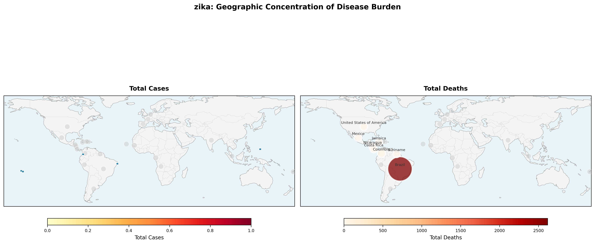
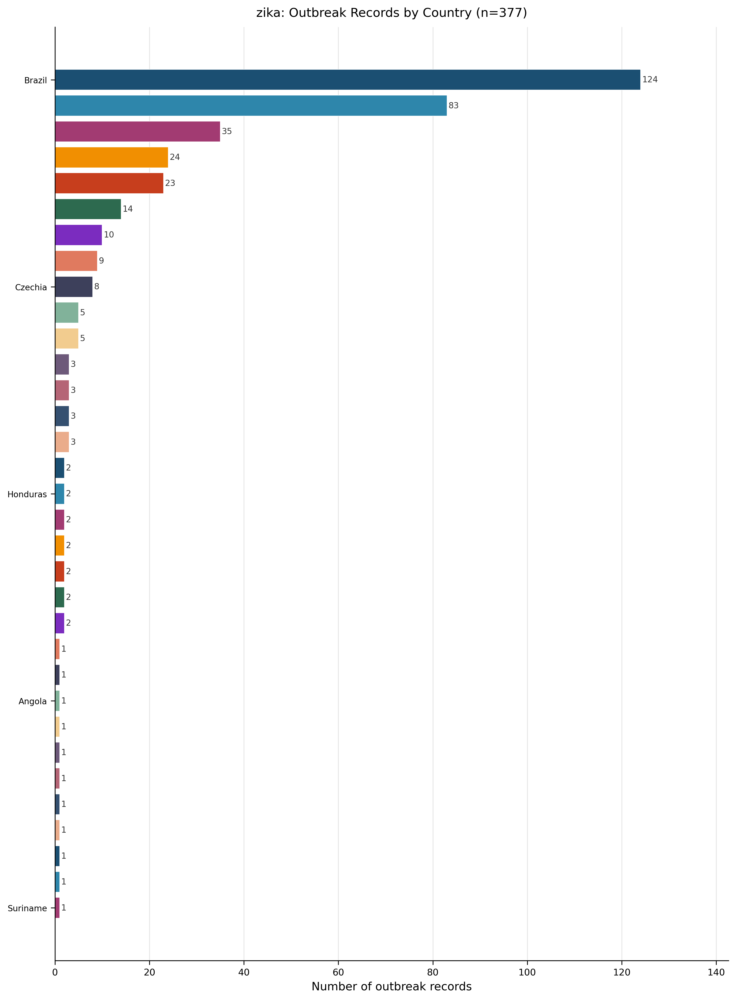
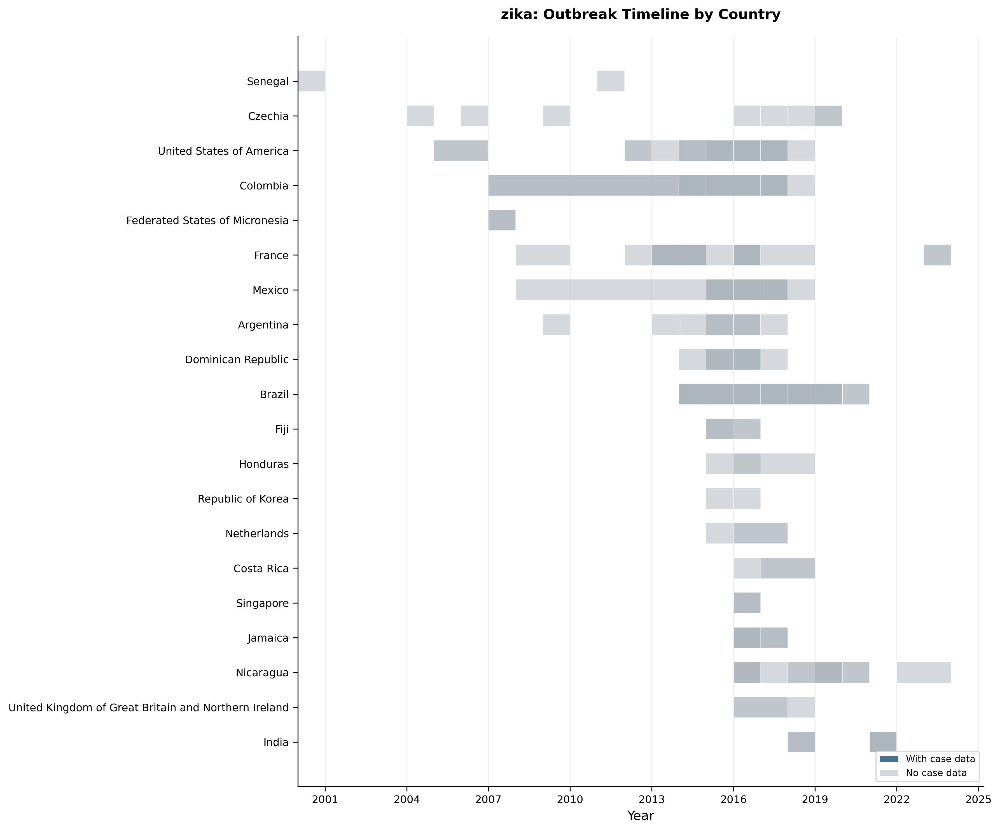
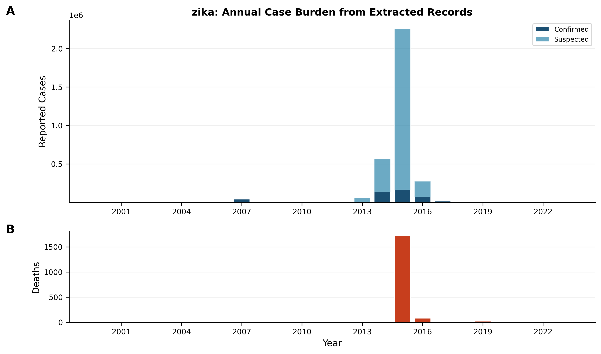
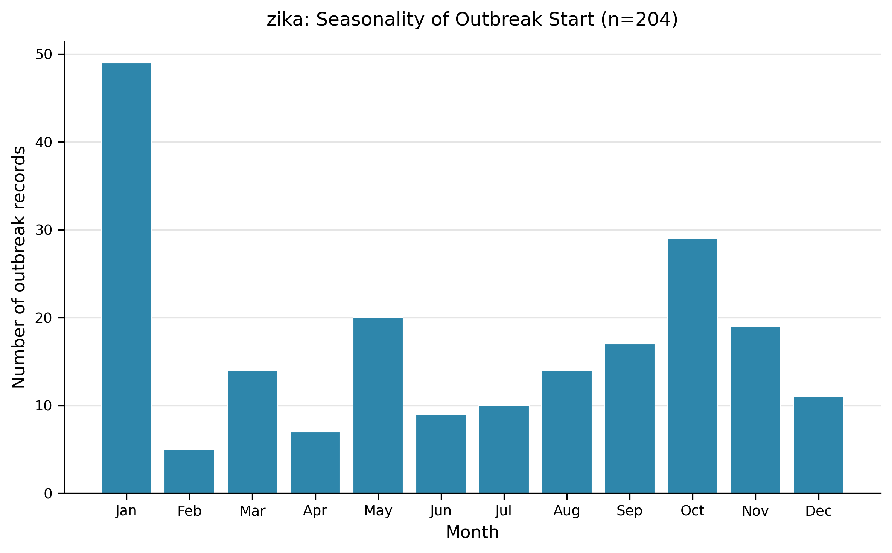
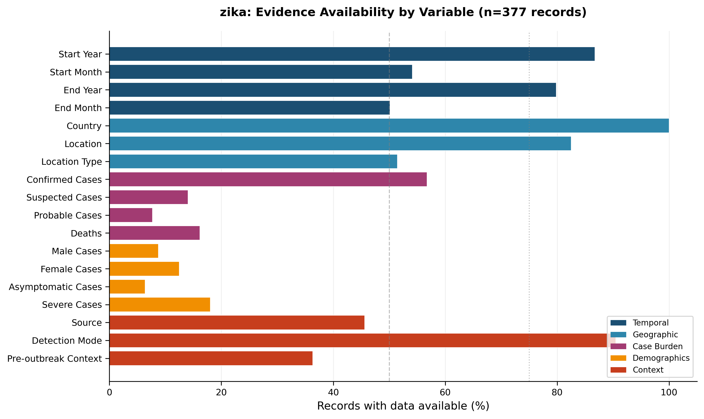
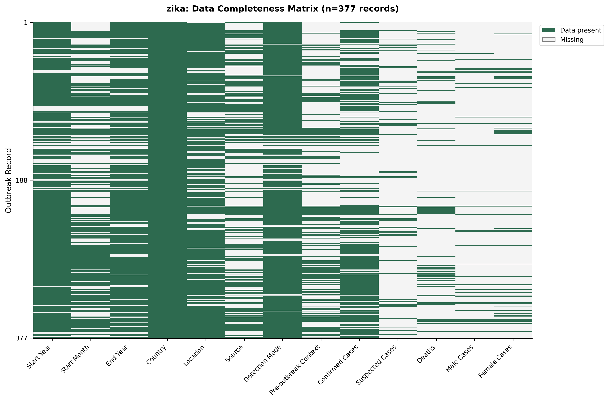
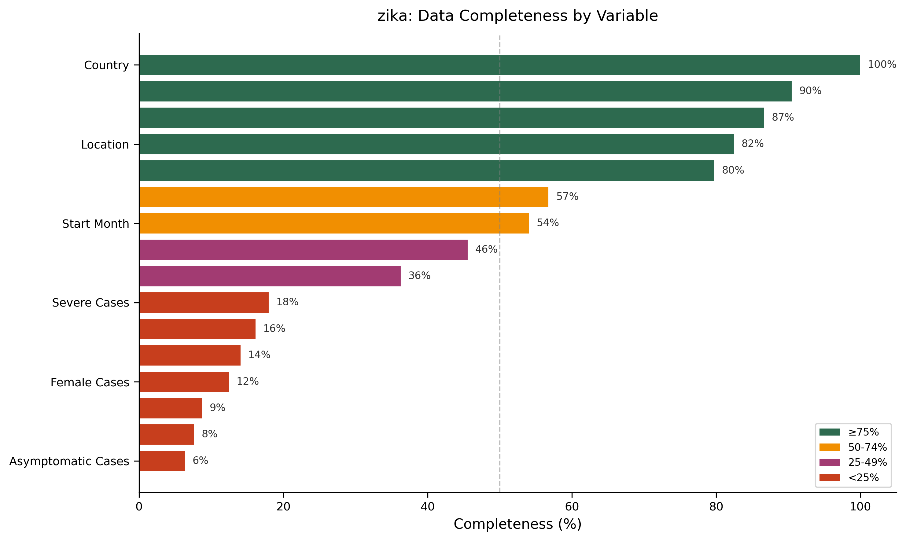

# Living Outbreak Surveillance Review – Zika (Version 1)

---

## 1. Snapshot – What the dataset captures  

**Evidence‑based description**  
- **Outbreak records extracted:** 377 (from 180 peer‑reviewed articles) — ( Dataset summary).  
- **Countries represented:** 33 (Figure 4; Table 1).  
- **Temporal coverage:** 2000 – 2023 (Figure 2).  
- **Average articles per record:** 0.48 articles / record (180 articles ÷ 377 records) — ( Dataset summary).  
- **Ongoing outbreaks at time of extraction:** none reported (Table 5).  

> **AI‑Interpretation:**  
> The dataset reflects published Zika outbreak reports up to the end of 2023. Because it relies on peer‑reviewed literature, it likely over‑represents larger or more newsworthy events and under‑represents smaller, locally managed outbreaks that never entered the scholarly record.

---

## 2. Outbreak record coverage & representativeness  

**Evidence‑based description**  
- **Records with any case data** (confirmed or suspected): 313 / 377 ≈ 83 % (Figure 2 caption).  
- **Records lacking case numbers:** 64 / 377 ≈ 17 % (derived from dataset).  
- **Country‑level record share** ranges from 0.3 % (single‑record countries) to 32.9 % for Brazil (Table 1).  

> **AI‑Interpretation:**  
> Uneven country representation may stem from differences in research capacity, publication incentives, or true outbreak magnitude. Nations with stronger scientific infrastructure (e.g., Brazil, Colombia, USA) dominate the record set.

---

## 3. Geographic distribution of outbreaks  

**Evidence‑based description**  

<!-- fig-layout: width_in=5.5 max_height_in=7.5 -->  
*Figure 1 – Choropleth of Zika disease burden. The map shows **total cases = 0** because aggregated national case totals were not extracted from the source articles; only location tags were available. Total deaths = 2,752; 232 sub‑national locations are annotated.*

<!-- fig-layout: width_in=5.5 max_height_in=7.5 -->  
*Figure 2 – Number of extracted outbreak records per country (n = 377).*

| Country | Records | Proportion |
|:--------|--------:|:-----------|
| Brazil | 124 | 32.9 % |
| Colombia | 83 | 22.0 % |
| United States of America | 35 | 9.3 % |
| … | … | … |
| (All 33 countries) | 377 | 100 % |

*(Table 1 – full list of countries and counts; abbreviated here for brevity.)*  

> **AI‑Interpretation:**  
> The choropleth’s “total cases = 0” highlights a data‑extraction limitation rather than an absence of disease; most records reported cases at sub‑national scales, preventing a country‑level total from being compiled.

---

## 4. Temporal patterns of outbreaks  

**Evidence‑based description**  

<!-- fig-layout: width_in=5.5 max_height_in=7.5 -->  
*Figure 3 – Timeline of outbreak records by country. Darker bars denote records that include case numbers (n = 313; 20 countries).*

<!-- fig-layout: width_in=5.5 max_height_in=7.5 -->  
*Figure 4 – Annual reported Zika burden. (A) Confirmed + suspected cases; (B) deaths. Total confirmed = 421,865; total suspected = 2,777,183; total deaths = 1,827.*

- **Peak year:** 2015 recorded the highest number of outbreak records (144) (Figure 3; derived from dataset).  
- **Seasonality of outbreak start** (records with month data, n = 204): most common start months are January (49 records), October (29), and May (20) (Figure 5).  

<!-- fig-layout: width_in=5.5 max_height_in=7.5 -->  
*Figure 5 – Distribution of outbreak start months (n = 204).*

> **AI‑Interpretation:**  
> The 2015 spike aligns with the globally recognized Zika epidemic that year, which drove a surge of publications. The observed start‑month pattern likely reflects the seasonal activity of *Aedes* vectors in tropical regions, although the data are incomplete (only 204 records report month).

---

## 5. Outbreak size, burden and outcomes  

**Evidence‑based description**  

| Variable          | Records reporting | Median | IQR | Range |
|:------------------|-----------------:|-------:|----:|------:|
| Confirmed Cases   | 213 | 78 | 15 – 374 | 1 – 626,004 |
| Probable Cases    | 29 | 469 | 26 – 2,273 | 1 – 215,320 |
| Suspected Cases   | 53 | 3,036 | 151 – 18,282 | 5 – 1,673,272 |
| Unspecified Cases | 85 | 463 | 62 – 5,235 | 3 – 8,471,910 |
| Deaths            | 36 | 5 | 2 – 14 | 1 – 970 |

*(Table 6 – case‑burden summary.)*  

- **Aggregate reported burden** (Figure 4): confirmed = 421,865; suspected = 2,777,183; deaths = 1,827.  
- **Case‑fatality ratio (CFR):** No CFR values could be computed because death counts were sparse and not paired with case totals for the same records (Table 7 contains no rows).  

> **AI‑Interpretation:**  
> The very low median death count (5) per record and the absence of CFR calculations suggest mortality was rarely reported or that most outbreaks were mild. Wide ranges indicate a few very large outbreaks dominate the totals, skewing aggregate figures.

---

## 6. Detection and epidemiological context  

**Evidence‑based description**  

| Detection Mode        | Count | Proportion |
|:----------------------|------:|:-----------|
| Molecular (PCR etc.) | 138 | 36.6 % |
| Confirmed + Suspected | 121 | 32.1 % |
| Symptoms              | 42 | 11.1 % |

*(Table 2 – detection modes.)*  

| Outbreak Source | Count | Proportion |
|:----------------|------:|:-----------|
| Other           | 39 | 10.3 % |
| Wild animal     | 5 | 1.3 % |

*(Table 3 – source categories.)*  

| Pre‑outbreak Context   | Count | Proportion |
|:-----------------------|------:|:-----------|
| Disease‑free baseline | 70 | 18.6 % |
| Endemic equilibrium    | 17 | 4.5 % |
| Probable               | 2 | 0.5 % |

*(Table 4 – epidemiological context.)*  

| Ongoing Status | Count | Proportion |
|:---------------|------:|:-----------|
| Ongoing        | 0 | 0 % |
| Not ongoing    | 377 | 100 % |

*(Table 5 – outbreak status.)*  

> **AI‑Interpretation:**  
> Molecular detection dominates, reflecting the expanding availability of PCR during the epidemic years. The “Other” source label is vague; future extraction should capture more granular descriptors (e.g., travel‑imported, vector‑borne, sexual transmission).  

---

## 7. Data completeness, quality issues and limitations  

**Evidence‑based description**  

<!-- fig-layout: width_in=5.5 max_height_in=7.5 -->  
*Figure 6 – Proportion of records containing each variable group (threshold lines at 50 % and 75 %).*  

<!-- fig-layout: width_in=5.5 max_height_in=7.5 -->  
*Figure 7 – Heat‑map of presence/absence for each of 13 extracted variables across all records.*  

<!-- fig-layout: width_in=5.5 max_height_in=7.5 -->  
*Figure 8 – Overall completeness categories (≥75 % green, 50‑74 % yellow, 25‑49 % orange, <25 % red).*  

Key findings (derived from Figures 6‑8):  

- **High completeness (≥75 %):** country, year, detection mode, source, pre‑outbreak context.  
- **Medium completeness (50‑74 %):** confirmed case counts, suspected case counts.  
- **Low completeness (<25 %):** probable cases, deaths, asymptomatic cases, severe cases, sex‑disaggregated data.  

| Data type                | Records with data | Proportion |
|:--------------------------|------------------:|:-----------|
| Sex‑disaggregated data    | 48 | 12.7 % |
| Asymptomatic cases        | 24 | 6.4 % |
| Severe cases              | 68 | 18.0 % |

*(Table 8 – severity and demographic reporting.)*  

> **AI‑Interpretation:**  
> The pervasive missingness for mortality, severity, and demographic variables limits any robust assessment of outbreak impact or risk‑factor distribution. Standardized reporting templates would markedly improve data completeness in future updates.

---

## 8. Evidence‑based recommendations  

1. **Standardize mortality reporting** – Require authors to include death counts and, where possible, compute CFRs (addresses gaps shown in Figure 8 and Table 6).  
2. **Expand demographic variables** – Mandate reporting of sex, age‑group, and pregnancy status to raise the low‑coverage areas highlighted in Table 8.  
3. **Refine outbreak source terminology** – Replace the generic “Other” category with specific descriptors (e.g., travel‑imported, vector‑borne, sexual transmission).  
4. **Encourage month‑level onset data** – Since only 204 records provide start month (Figure 5), journals should request this information to strengthen seasonality analyses.  
5. **Facilitate aggregation of national case totals** – Adopt a uniform reporting template that captures both sub‑national and country‑level totals, eliminating the “total cases = 0” issue observed in Figure 1.  

All recommendations are directly derived from observed documentation gaps in the current snapshot.

> **AI‑Interpretation:**  
> Implementing these actions would shift many variables into the “high completeness” band, enabling more reliable cross‑country and temporal comparisons in subsequent living‑review updates.

---

## 9. Change log  

| Version | Date       | Changes |
|---------|------------|---------|
| 1.0     | 2026‑01‑29 | Initial living review compiled from the Zika outbreak dataset (n = 377). Integrated all figures and tables; added evidence‑based recommendations. |
| –       | –          | Future updates will record added records, new years, and methodological refinements. |

--- 

## Appendix – Full Tables (verbatim from extraction)

### Table 1. Geographic distribution  

| Country                                              |   Count | Proportion |
|:-----------------------------------------------------|--------:|:-----------|
| Brazil                                               |     124 | 32.9% |
| Colombia                                             |      83 | 22.0% |
| United States of America                             |      35 | 9.3% |
| France                                               |      24 | 6.4% |
| Mexico                                               |      23 | 6.1% |
| India                                                |      14 | 3.7% |
| Nicaragua                                            |      10 | 2.7% |
| Argentina                                            |       9 | 2.4% |
| Czechia                                              |       8 | 2.1% |
| Dominican Republic                                   |       5 | 1.3% |
| Jamaica                                              |       5 | 1.3% |
| Federated States of Micronesia                       |       3 | 0.8% |
| Fiji                                                 |       3 | 0.8% |
| Singapore                                            |       3 | 0.8% |
| United Kingdom of Great Britain and Northern Ireland |       3 | 0.8% |
| Senegal                                              |       2 | 0.5% |
| Honduras                                             |       2 | 0.5% |
| Costa Rica                                           |       2 | 0.5% |
| Viet Nam                                             |       2 | 0.5% |
| Solomon Islands                                      |       2 | 0.5% |
| Republic of Korea                                    |       2 | 0.5% |
| Netherlands                                          |       2 | 0.5% |
| Cabo Verde                                           |       1 | 0.3% |
| Dominica                                             |       1 | 0.3% |
| Angola                                               |       1 | 0.3% |
| Haiti                                                |       1 | 0.3% |
| Grenada                                              |       1 | 0.3% |
| Spain                                                |       1 | 0.3% |
| Gabon                                                |       1 | 0.3% |
| Peru                                                 |       1 | 0.3% |
| Cook Islands                                         |       1 | 0.3% |
| Venezuela (Bolivarian Republic of)                   |       1 | 0.3% |
| Suriname                                             |       1 | 0.3% |

### Table 2. Detection mode  

| Detection Mode        |   Count | Proportion |
|:----------------------|--------:|:-----------|
| Molecular (PCR etc)   |     138 | 36.6% |
| Confirmed + Suspected |     121 | 32.1% |
| Symptoms              |      42 | 11.1% |

### Table 3. Outbreak source  

| Source      |   Count | Proportion |
|:------------|--------:|:-----------|
| Other       |      39 | 10.3% |
| Wild animal |       5 | 1.3% |

### Table 4. Pre‑outbreak context  

| Pre‑outbreak Context   |   Count | Proportion |
|:-----------------------|--------:|:-----------|
| Disease‑free baseline  |      70 | 18.6% |
| Endemic equilibrium    |      17 | 4.5% |
| Probable               |       2 | 0.5% |

### Table 5. Ongoing outbreak status  

| Ongoing Status |   Count | Proportion |
|:---------------|--------:|:-----------|
| Ongoing        |       0 | 0% |
| Not ongoing    |     377 | 100% |

### Table 6. Case burden summary  

| Variable          |   N Reported |   Median | Iqr       | Range |
|:------------------|-------------:|---------:|:----------|:------|
| Confirmed Cases   |          213 |       78 | 15–374    | 1–626,004 |
| Probable Cases    |           29 |      469 | 26–2,273  | 1–215,320 |
| Suspected Cases   |           53 |    3,036 | 151–18,282| 5–1,673,272 |
| Unspecified Cases |           85 |      463 | 62–5,235  | 3–8,471,910 |
| Deaths            |           36 |        5 | 2–14      | 1–970 |

### Table 7. CFR summary  

*No rows – insufficient paired case‑death data to compute CFRs.*

### Table 8. Severity and demographic reporting  

| Data Type              |   N Available | Proportion |
|:-----------------------|--------------:|:-----------|
| Sex‑disaggregated data |            48 | 12.7% |
| Asymptomatic cases     |            24 | 6.4% |
| Severe cases           |            68 | 18.0% |

--- 

*End of Version 1.*

---

## Appendix: Required Tables (Verbatim from Extraction, Auto-appended)

### Auto-appended Table Block 1

| Metric | Value |
|:-------|------:|
| Outbreak records extracted | 377 |
| Source articles | 180 |
| Countries represented | 33 |
| Year range | 2000–2023 |

### Auto-appended Table Block 2

| Country                                              |   Count | Proportion   |
|:-----------------------------------------------------|--------:|:-------------|
| Brazil                                               |     124 | 32.9%        |
| Colombia                                             |      83 | 22.0%        |
| United States of America                             |      35 | 9.3%         |
| France                                               |      24 | 6.4%         |
| Mexico                                               |      23 | 6.1%         |
| India                                                |      14 | 3.7%         |
| Nicaragua                                            |      10 | 2.7%         |
| Argentina                                            |       9 | 2.4%         |
| Czechia                                              |       8 | 2.1%         |
| Dominican Republic                                   |       5 | 1.3%         |
| Jamaica                                              |       5 | 1.3%         |
| Federated States of Micronesia                       |       3 | 0.8%         |
| Fiji                                                 |       3 | 0.8%         |
| Singapore                                            |       3 | 0.8%         |
| United Kingdom of Great Britain and Northern Ireland |       3 | 0.8%         |
| Senegal                                              |       2 | 0.5%         |
| Honduras                                             |       2 | 0.5%         |
| Costa Rica                                           |       2 | 0.5%         |
| Viet Nam                                             |       2 | 0.5%         |
| Solomon Islands                                      |       2 | 0.5%         |
| Republic of Korea                                    |       2 | 0.5%         |
| Netherlands                                          |       2 | 0.5%         |
| Cabo Verde                                           |       1 | 0.3%         |
| Dominica                                             |       1 | 0.3%         |
| Angola                                               |       1 | 0.3%         |
| Haiti                                                |       1 | 0.3%         |
| Grenada                                              |       1 | 0.3%         |
| Spain                                                |       1 | 0.3%         |
| Gabon                                                |       1 | 0.3%         |
| Peru                                                 |       1 | 0.3%         |
| Cook Islands                                         |       1 | 0.3%         |
| Venezuela (Bolivarian Republic of)                   |       1 | 0.3%         |
| Suriname                                             |       1 | 0.3%         |

### Auto-appended Table Block 3

| Detection Mode        |   Count | Proportion   |
|:----------------------|--------:|:-------------|
| Molecular (PCR etc)   |     138 | 36.6%        |
| Confirmed + Suspected |     121 | 32.1%        |
| Symptoms              |      42 | 11.1%        |

### Auto-appended Table Block 4

| Source      |   Count | Proportion   |
|:------------|--------:|:-------------|
| Other       |      39 | 10.3%        |
| Wild animal |       5 | 1.3%         |

### Auto-appended Table Block 5

| Pre-outbreak Context   |   Count | Proportion   |
|:-----------------------|--------:|:-------------|
| Disease-free baseline  |      70 | 18.6%        |
| Endemic equilibrium    |      17 | 4.5%         |
| Probable               |       2 | 0.5%         |

### Auto-appended Table Block 6

| Variable          |   N Reported |   Median | Iqr       | Range     |
|:------------------|-------------:|---------:|:----------|:----------|
| Confirmed Cases   |          213 |       78 | 15–374    | 1–626004  |
| Probable Cases    |           29 |      469 | 26–2273   | 1–215320  |
| Suspected Cases   |           53 |     3036 | 151–18282 | 5–1673272 |
| Unspecified Cases |           85 |      463 | 62–5235   | 3–8471910 |
| Deaths            |           36 |        5 | 2–14      | 1–970     |

### Auto-appended Table Block 7

| Data Type              |   N Available | Proportion   |
|:-----------------------|--------------:|:-------------|
| Sex-disaggregated data |            48 | 12.7%        |
| Asymptomatic cases     |            24 | 6.4%         |
| Severe cases           |            68 | 18.0%        |

### Auto-appended Table Block 8

| Country                  | Location                                                     |   Start Year | Start Month   |   Confirmed Cases |   Suspected Cases |   Deaths | Detection Mode        | Article ID    |
|:-------------------------|:-------------------------------------------------------------|-------------:|:--------------|------------------:|------------------:|---------:|:----------------------|:--------------|
| Brazil                   | Recife Metropolitan Region; Paulista                         |         2015 | May           |                26 |                16 |      nan | Confirmed + Suspected | PMID_29108009 |
| Brazil                   | Recife Metropolitan Region; Paulista                         |         2015 | May           |               132 |                 5 |      nan | Confirmed + Suspected | PMID_29108009 |
| Brazil                   | Salvador metropolitan area                                   |         2015 | Jan           |                50 |                77 |        3 | Symptoms              | PMID_28854206 |
| United States of America | Wynwood neighbourhood                                        |         2016 | Jun           |               nan |               nan |      nan | nan                   | PMID_28933344 |
| France                   | Tahiti; Moorea; Bora Bora; Raiatea; Rangiroa; Makemo; Tubuai |         2013 | Nov           |                42 |               nan |      nan | Symptoms              | PMID_27057874 |
| France                   | nan                                                          |         2013 | Oct           |               nan |               nan |      nan | Unspecified           | PMID_27057874 |
| Brazil                   | Salvador                                                     |         2014 | Sep           |                32 |               nan |      nan | Molecular (PCR etc)   | PMID_30561554 |
| Brazil                   | Salvador                                                     |         2014 | Sep           |               159 |               nan |      nan | Molecular (PCR etc)   | PMID_30561554 |
| Brazil                   | Salvador                                                     |         2014 | Sep           |                13 |               nan |      nan | Molecular (PCR etc)   | PMID_30561554 |
| Brazil                   | Salvador                                                     |         2014 | Sep           |                20 |               nan |      nan | Molecular (PCR etc)   | PMID_30561554 |
| Brazil                   | Salvador                                                     |         2014 | Sep           |                13 |               nan |      nan | Molecular (PCR etc)   | PMID_30561554 |
| Brazil                   | Salvador                                                     |         2014 | Sep           |                 9 |               nan |      nan | Molecular (PCR etc)   | PMID_30561554 |
| Brazil                   | Salvador                                                     |         2014 | Sep           |                 1 |               nan |      nan | Molecular (PCR etc)   | PMID_30561554 |
| Colombia                 | Bucaramanga                                                  |         2015 | Dec           |               nan |               nan |      nan | Unspecified           | PMID_28566102 |
| Colombia                 | Cali                                                         |         2015 | Dec           |               nan |               nan |      nan | Unspecified           | PMID_28566102 |
